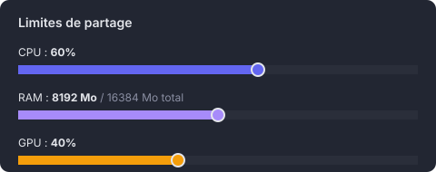

🇫🇷 [Version française](README.md)

# PartaGPU

Application that shares compute power (CPU/GPU/RAM) between the computers of a classroom, built with [Tauri](https://tauri.app/) (Rust + React/TypeScript).

Each station can choose to expose all or part of its resources. A dedicated `partagpu` user account is created on every machine, so anyone can sit at a free computer (even an absent classmate's) to enable sharing.

On the code side, a Python package (`partagpu`) lets you run a command on a peer (`partagpu.run_remote`) or **launch a PyTorch DDP training in parallel across every GPU in the room** (`partagpu.distribute`).

**Companion documentation**:
- [docs/ARCHITECTURE.en.md](docs/ARCHITECTURE.en.md) — how it works internally (the two HTTP servers, HMAC auth, sandbox, DDP orchestration)
- [docs/TROUBLESHOOTING.en.md](docs/TROUBLESHOOTING.en.md) — diagnosis of common errors (HMAC auth mismatch, NCCL hang, sandbox crash, etc.)
- [SECURITY.en.md](SECURITY.en.md) — detailed security model

---

## Table of contents

- [Big picture](#big-picture)
- [Installation](#installation)
- [Create or join a room](#create-or-join-a-room)
- [First-time station setup](#first-time-station-setup)
- [Daily usage](#daily-usage)
- [Enabling sharing on an absent classmate's computer](#enabling-sharing-on-an-absent-classmates-computer)
- [Network discovery](#network-discovery)
- [Technical architecture](#technical-architecture)
- [Python package — distributed training](#python-package--distributed-training)
- [Available scripts](#available-scripts)
- [Security](#security)
- [Requirements](#requirements)

---

## Big picture


- Every station runs PartaGPU and announces itself automatically on the LAN
- Every user picks **what to share** and **how much** through red sliders directly on the resource gauges
- Incoming compute tasks run as a dedicated system account (`partagpu`) inside a **bubblewrap** sandbox (read-only FS, /workspace tmpfs, opt-in network)
- A classmate is absent? Power on their PC, log in as `partagpu`, their resources become available
- A **virtual room** protected by an access code guarantees that only authorized stations can communicate (HMAC auth on a shared secret)
- On the code side, a Python package (`partagpu`) lets you train with PyTorch DDP across **every GPU in the room** with a single `partagpu.distribute("train.py")`

---

## Installation

### Option A: install the .deb (Ubuntu/Debian, recommended)

Download the latest version from the [releases page](https://github.com/cesar-lizurey/partagpu/releases):

```bash
# Download the .deb from the releases page, then:
sudo dpkg -i partagpu_*_amd64.deb
```

The `.deb` installs everything automatically: the application, the helper, and the PolicyKit rule. PartaGPU shows up in the application menu.

### Option B: AppImage (any Linux distribution)

Download the `.AppImage` from the [releases page](https://github.com/cesar-lizurey/partagpu/releases):

```bash
chmod +x PartaGPU-*.AppImage
./PartaGPU-*.AppImage
```

No install needed — the AppImage is a self-contained executable.

### Option C: from source (development)

```bash
git clone https://github.com/cesar-lizurey/partagpu.git
cd partagpu
npm install
npm run tauri:dev      # development mode
npm run tauri:build    # production build (generates a .deb)
```

---

## Create or join a room

### Why a room?

When PartaGPU starts, every station announces itself on the LAN over mDNS. **Without protection, anyone connected to the same network could pose as a peer and submit malicious tasks.**

The room system solves this: it generates a **shared secret** that produces an authentication proof (a truncated HMAC-SHA256 over the current 30-s window). Each station proves room membership by showing the right proof, which is recomputed and constant-time compared. Stations whose proof doesn't match are marked **unverified** in the UI.

### Create a room (one student does it)

1. At the top of the app, click **"Create a room"**
2. Enter a name (e.g. `Room B204`)
3. The app shows a **4-word access code**, masked by default:

```
*****-*****-****-*****
```

4. **Hold the eye icon** next to it to reveal it just long enough to read it aloud (`apple-tiger-blue-ocean`). The code re-masks the moment you let go — so it never stays visible in clear by accident.

### Join a room (everyone else)

1. Click **"Join a room"**
2. Enter the same room name (e.g. `Room B204`)
3. Type the access code as dictated: `apple-tiger-blue-ocean`
4. You're in the room

### How it works under the hood

- The 4-word code encodes a cryptographic secret (each word = 1 byte from 256 options, so 4 billion combinations)
- This secret is HKDF-SHA256-expanded into a 32-byte `auth_key`
- Each station broadcasts an **8-hex-char HMAC proof** in its mDNS TXT record, valid for the current 30-s window
- Other stations check that code — if it matches, the peer is marked **OK** (verified)
- A station that doesn't know the secret can't produce the right code and shows up as **unverified**

### Verified, unverified, and unknown peers

PartaGPU distinguishes three categories:

#### Verified peer

A machine visible on the network via mDNS **and** whose HMAC auth proof matches yours (same room, same access code).

- Each station in the room has the same secret (derived from the 4-word code)
- From this secret, every station computes a **truncated HMAC-SHA256** over the current 30-s window (8 hex chars). Same idea as a time-based code but without the TOTP / RFC 6238 machinery.
- The proof is broadcast automatically to other stations over the LAN
- Other stations verify: if they recompute the same proof with their own secret, the peer is **verified**

#### Unverified peer

A machine visible on the network via mDNS (running PartaGPU) **but** whose HMAC proof doesn't match. Possible causes:
- Hasn't joined any room
- Is in a different room
- Entered a wrong access code

#### Unknown peer

A machine that wasn't **discovered via mDNS** but tries to send a task directly (e.g. with a request to port 7654). Potentially malicious — the task is refused and a security event is logged.

**Concrete consequences:**

| | Verified peer | Unverified peer | Unknown peer |
|---|---|---|---|
| Visible in the list | Yes | Yes (greyed out) | No |
| Can submit tasks | Yes | **No** — refused | **No** — refused |
| Can receive tasks | Yes | Yes (its choice) | n/a |
| Indicator in the table | **OK** (green) | **?** (red) | — |
| Security log | Info | Alert | Alert |

If unverified machines are detected, an orange warning banner appears above the table.

**Without a configured room**: every machine is accepted (no verification). The room is optional but strongly recommended.

### Machine table in the "My usage" tab

| Machine | IP | Auth | Sharing | CPU | RAM | GPU |
|-|-|-|-|-|-|-|
| César (pc-room-201) | 192.168.1.42 | **OK** | Active | 60% | 8192 MB | 40% |
| Corinne (pc-room-203) | 192.168.1.44 | **OK** | Active | 80% | — | 0% |
| ??? (pc-unknown) | 192.168.1.99 | **?** | Active | 100% | — | 0% |

The **Auth** column lets you spot a suspicious station immediately. The third machine is greyed out and can't submit tasks.

---

## First-time station setup

To do **once** on every classroom computer:

### Step 1: Enable sharing

Open the **"My sharing"** tab and click **"Enable sharing"**.

A password prompt (PolicyKit) shows up — enter the machine's administrator password. This creates the `partagpu` account with a login shell.

### Step 2: Set the `partagpu` account password

A form appears under the activation button:


Pick a password **shared by the whole class** (e.g. `partagpu2024`). It's the password used to log in at any PC's display manager.

### Step 3: Name the instance

In the top-right corner of the app, click the machine name to customize it:


This name shows up in the available-machines list for everyone else.

### Step 4: Set sharing limits

On every resource gauge (*My sharing* → *Resources of this machine*), a **draggable red slider** marks the limit you share. Drag it with the mouse to adjust:



- **CPU**: maximum percentage of cores granted to shared tasks (5% steps)
- **RAM**: maximum amount in MB (256 MB steps, 0 = unlimited)
- **GPU**: maximum percentage of the GPU (visible only when an NVIDIA GPU is detected)

The slider only appears when sharing is *Active* — without sharing, there's nothing to limit. Changes are debounced at 300 ms and applied via the kernel's [cgroups v2](https://docs.kernel.org/admin-guide/cgroup-v2.html), without asking for a password (only the first activation does).

---

## Daily usage

The application has **4 tabs**:

### "My sharing" tab

*What others use on my machine.*

- **Status**: Active / Paused / Disabled. Three distinct actions:
  - **Pause** (from Active): **temporary** stop. Closes the firewall, refuses incoming tasks. The `partagpu` account, cgroup, managed venv, everything stays in place. Click **Resume** to restart instantly, no pkexec.
  - **Disable** (from Active or Paused): **full cleanup**. Asks for confirmation, then kills running tasks, removes the `partagpu` account, deletes the managed venv (~3 GB), frees the cgroup, removes the SSH/sudo deny rules, closes the firewall. To use again later, you'll need to click **Enable** again (re-pkexec + re-install the venv if wanted).
  - **Enable** (from Disabled): creates the account, sets up the cgroup, opens the firewall. Asks pkexec.
- **partagpu account**: account status, password form
- **Resource gauges**: CPU, RAM, GPU live, with a draggable red slider on each gauge to set the sharing limit (only shows up when sharing is Active)
- **Per-user breakdown**: stacked colored bars showing each peer's consumption
  

  Each segment uses the user's color. Hover for details.
- **Detailed table**: command, source (peer's display_name), status, **live progress + CPU/RAM/GPU** (1-second refresh, aggregated over the entire process subtree of the sandbox; per-task GPU is sampled with `nvidia-smi pmon`), **Stop** button to cancel an incoming task in progress (useful when a classmate is pushing nonsense).
- **Maximum concurrent tasks**: numeric field to cap how many tasks can run at once on this machine. Beyond the cap, new arrivals stay queued.

### "My usage" tab

*What I use on the others' machines.*

- **Detected machines**: single table with every station seen over mDNS, their capacity, and authentication status (column **Auth**). Sorted: usable (Auth OK + Sharing Active) on top, the rest below.
- **Run a command on a peer**: form to dispatch a command on a peer without going through Python (peer selection, command with shell-style parsing or uploaded file, timeout, opt-in network access, **workspace file upload** through a file picker, result panel with stdout/stderr **streaming live** during execution).
- **Multi-machine DDP training**: dedicated panel to launch a PyTorch DDP script without Python — tick the target peers (with a field for how many GPUs to use on each), upload the script + companion files, pick the backend (NCCL/Gloo) and master port. Live progress table per rank, **Cancel all** button that propagates the stop to every rank when something fails.
- **My running tasks**: live progress of what I submitted. **Stop** button on Queued/Running tasks to cancel cleanly (SIGTERM on the peer side, propagation to sibling ranks in DDP).
- **Desktop notifications**: when a dispatch finishes (Completed / Failed / Cancelled), a native system toast pops up, even if the app isn't focused. Handy for stepping away during a long DDP training. Permission asked once on first trigger.

### "Fleet view" tab

*Aggregate dashboard of every machine in the room.*

Global stats up top (visible peers, usable peers, GPUs in the room, my active tasks + my total CPU/RAM/GPU usage), then one card per peer showing its offered capacity (CPU/RAM/GPU limits and GPU count) and the list of tasks **you** are currently running on it. Handy for supervising the room at a glance — a teacher, for example. The view only shows your own tasks per peer (an aggregated `/peer/v1/status` route would be needed to also see what other classmates dispatch — see TODO.md).

### "Guide" tab

Built-in tutorial available at all times, with the same explanations as this README.

### Bilingual FR ↔ EN

A **flag** button in the header (right after the computer name) toggles the whole app between French and English. The default language is French; the choice is persisted locally (localStorage `partagpu.lang`).

---

## Enabling sharing on an absent classmate's computer

This is the main use-case for the `partagpu` account:

1. **Power on** the absent classmate's computer
2. At the login screen (GDM, LightDM…), pick the **`partagpu`** user
3. Enter the **shared password** set during configuration
4. PartaGPU **launches automatically** (autostart configured)
5. **Join the room** by entering the access code (read it aloud from your station if needed)
6. Click **"Enable sharing"** — no admin password needed and no reconfiguration, the account and cgroup are already in place from the initial setup

The `partagpu` account, its password, and the sharing settings survive reboots.

---

## Network discovery

Machines find each other automatically via **mDNS** (Multicast DNS, port 5353 UDP). No manual network configuration — being on the same subnet is enough.

To check manually which machines are visible:

```bash
# With nmap (install via: sudo apt install nmap)
nmap -sn 192.168.1.0/24

# Without nmap
for i in $(seq 1 254); do
  ping -c 1 -W 1 192.168.1.$i &>/dev/null && echo "192.168.1.$i UP" &
done
wait
```

If a machine doesn't appear, check the firewall allows the necessary ports.

### Firewall rules

PartaGPU manages the firewall automatically via `ufw` or `iptables` (open on enable, close on pause/disable). For environments that need manual configuration:

| Port | Protocol | Direction | Use | When |
|------|-----------|-----------|-------|-------|
| 5353 | UDP | In + Out | mDNS (peer discovery) | Always |
| 7654 | TCP | In (loopback) | Local HTTP API (Python clients, dispatch) | Always |
| 7655 | TCP | In | Peer-to-peer API (receiving tasks from other machines) | When sharing is active |
| 29500–29510 | TCP | In | DDP rendezvous (NCCL/Gloo) between peers | When sharing is active |

With `ufw`:
```bash
sudo ufw allow 5353/udp comment "PartaGPU mDNS"
sudo ufw allow 7654/tcp comment "PartaGPU local API"
sudo ufw allow 7655/tcp comment "PartaGPU peer API"
sudo ufw allow 29500:29510/tcp comment "PartaGPU DDP"
```

With `iptables`:
```bash
sudo iptables -A INPUT -p udp --dport 5353 -m comment --comment "PartaGPU mDNS" -j ACCEPT
sudo iptables -A INPUT -p tcp --dport 7654 -m comment --comment "PartaGPU local" -j ACCEPT
sudo iptables -A INPUT -p tcp --dport 7655 -m comment --comment "PartaGPU peer" -j ACCEPT
sudo iptables -A INPUT -p tcp -m multiport --dports 29500:29510 -m comment --comment "PartaGPU DDP" -j ACCEPT
```

---

## Technical architecture

```
partagpu/
├── src-tauri/                   # Rust backend (Tauri)
│   ├── src/
│   │   ├── main.rs              # Binary entry point
│   │   ├── lib.rs               # Tauri init, HTTP server boot
│   │   ├── auth.rs              # Rooms: HMAC auth_key, 4-word passphrase, verification
│   │   ├── discovery.rs         # mDNS discovery + gpu_count + HMAC proof check
│   │   ├── user_manager.rs      # User creation, pkexec, cgroups
│   │   ├── resource.rs          # CPU/RAM (sysinfo) + GPU (multi-device nvidia-smi)
│   │   ├── sharing.rs           # Sharing state (Active/Paused/Disabled) + limits
│   │   ├── sandbox.rs           # bubblewrap: GPU passthrough, opt-in network, workspace
│   │   ├── task_runner.rs       # Incoming/outgoing task queues + create_and_run
│   │   ├── http_api.rs          # Local HTTP API 127.0.0.1:7654 + POST /api/dispatch
│   │   ├── peer_api.rs          # Peer-to-peer HTTP API 0.0.0.0:7655 (HMAC header auth)
│   │   ├── api.rs               # Tauri commands exposed to the frontend
│   │   └── security_log.rs      # Security event journal (ring buffer)
│   ├── helper/                  # Separate crate: Rust binary executed via pkexec
│   │   └── src/main.rs          # create-user, set-password, setup-cgroup, open-port…
│   └── Cargo.toml
├── scripts/
│   ├── install-helper.sh        # sudo: install helper + PolicyKit policy
│   └── uninstall-helper.sh      # sudo: uninstall helper + policy
├── src/                         # React/TypeScript frontend
│   ├── main.tsx, App.tsx        # React entry + header + tabs
│   ├── pages/                   # MySharing, MyUsage, Guide
│   ├── components/              # RoomSetup, gauges, sliders, tables
│   └── lib/api.ts               # Types + invoke() calls
├── python/                      # partagpu package for Python clients
│   └── src/partagpu/
│       ├── __init__.py          # Exports discover, run_remote, distribute, TaskResult
│       ├── discover.py          # GPUResource (host, ip, device_index) + Peer
│       ├── remote.py            # run_remote(peer, args, network=, workspace=, …)
│       └── distributed.py       # distribute() multi-GPU multi-host DDP orchestrator
├── examples/                    # Notebook + example scripts + smoke tests
│   ├── decouverte_gpu.ipynb
│   ├── ddp_train_demo.py
│   └── smoke_*.py
├── docs/
│   ├── ARCHITECTURE.md          # Detailed inner workings
│   └── images/                  # SVG diagrams
├── package.json, tsconfig.json, vite.config.ts
├── SECURITY.md                  # Detailed security measures
├── TODO.md                      # Remaining security plan
└── README.md
```

### Data flow


### When is pkexec called?

`pkexec` (password prompt) is asked only for **4 actions**:

| Action | When |
|--------|-------|
| `create-user` | First sharing activation on a station |
| `set-password` | Set/modify the partagpu password |
| `setup-cgroup` | First cgroup creation (afterwards, direct write) |
| `remove-user` | Full removal of the partagpu account |

Slider adjustments, status reads, and monitoring **never call pkexec** — everything happens by direct writes to cgroup files or by reading `/etc/passwd`.

---

## Available scripts

| Command | Description |
|----------|-------------|
| `npm run dev` | Frontend only (Vite, port 1420) |
| `npm run tauri:dev` | Full Tauri app in development |
| `npm run tauri:build` | Production build (generates a .deb) |
| `npm run test` | Unit tests (vitest) |
| `npm run test:watch` | Tests in watch mode |
| `npm run test:coverage` | Tests with coverage |
| `npm run check` | TypeScript + ESLint |
| `npm run format` | Prettier formatting |
| `npm run clean` | Removes dist/, node_modules/, target/ |

---

## Security

- **Room authentication**: a 4-word access code generates a shared secret from which an AES `room_key` and an HMAC `auth_key` are derived. Every peer-to-peer request carries an `X-PartaGPU-AUTH: <ts>:<HMAC>` header that binds the auth to the request body + a timestamp inside a 30-s window (anti-replay). Unverified stations are clearly identified.
- **Peer-to-peer encryption** (since 1.6.0): HTTP bodies between peers (port 7655) are encrypted with AES-256-GCM, key derived via HKDF from the room secret. Confidentiality + integrity against passive LAN sniffing. Every peer must be `>= 1.6.0`.
- **Forward secrecy** (since 1.7.0): the AES key is now derived from a per-request ephemeral X25519 Diffie-Hellman exchange. The server's ephemeral key stays **in RAM only**, regenerated at every app start and rotated every 10 minutes. An attacker who captures traffic and steals the passphrase later can no longer decrypt sessions older than 10 minutes.
- **Isolation**: the `partagpu` account is dedicated to sharing, with no access to other users' personal files
- **Cgroups v2**: tasks cannot exceed the CPU/RAM limits set with the sliders
- **PolicyKit**: root operations go through `pkexec` with an explicit policy, no hardcoded sudo. The password transits via stdin, never as a CLI argument.
- **Input validation**: every input passed to the root helper is validated (integers, length, forbidden characters)
- **Local control**: each machine keeps full control — *Pause* (suspend temporarily) or *Disable* (clean everything as if PartaGPU had never been installed) in one click; remote tasks in progress are stopped immediately

For the full detail of every mechanism (diagrams, files involved, attack scenarios), see [SECURITY.en.md](SECURITY.en.md).

For the full list of remaining measures, see [TODO.en.md](TODO.en.md).

---

## CI/CD

The project uses GitHub Actions. Two workflows:

| Workflow | Trigger | Steps |
|---|---|---|
| `.github/workflows/release.yml` | tag `vX.Y.Z` | **test** (`cargo test --all-targets --locked`) then **build** (helper + `.deb` + AppImage) then GitHub Release creation |
| `.github/workflows/pypi.yml` | tag `python-vX.Y.Z` | Python package build + PyPI publish via trusted publishing |

### Cutting a new version

See [docs/RELEASING.en.md](docs/RELEASING.en.md) for the complete procedure and the list of files to keep in sync. In short:

```bash
# 1. Bump in Cargo.toml + tauri.conf.json + package.json (3 places)
# 2. Commit + tag + push:
git commit -am "Bump version to X.Y.Z"
git tag vX.Y.Z
git push origin main vX.Y.Z
```

CI runs `cargo test` before bundling; a failing test blocks the release.

---

## Python package — distributed training

PartaGPU ships a Python package (`partagpu`) that turns the application into a distributed compute platform. Everything goes through the local app (`localhost:7654`): it computes the HMAC auth header and forwards each request, encrypted, to the peer. You have **nothing to set up on the network side** — no SSH, no keys.

### Installation

```bash
pip install partagpu
```

To develop against a local checkout of the repo (editable mode, the package follows the source):

```bash
git clone https://github.com/cesar-lizurey/partagpu.git
cd partagpu
python3 -m venv venv && source venv/bin/activate
pip install -e python/
```

For the [examples/](examples/) folder, there's a full `requirements.txt` + Jupyter kernel setup — see [examples/decouverte_gpu.ipynb](examples/decouverte_gpu.ipynb).

### Four APIs, in order of use

| API | When to use |
|---|---|
| `partagpu.discover()` | List GPUs available in the room (local + verified sharing peers). One entry per CUDA device. |
| `partagpu.run_remote(peer, args, …)` | Run **one command** on **one peer** (the local app brokers it). Blocking, returns `TaskResult`. |
| `partagpu.distribute(script, args=, …)` | Train with **PyTorch DDP** across **every GPU in the room**. Multi-GPU **per machine** handled automatically. |
| `partagpu.cancel(local_id)` | Cancel a running task programmatically (e.g. from another notebook). The `local_id` comes from `TaskResult.id`. `Ctrl+C` in `run_remote`/`distribute` propagates the cancel to the peer automatically. |

### GPU discovery

```python
import partagpu

gpus = partagpu.discover()
# One entry per physical GPU. A 4-GPU PC produces 4 entries.
# [GPU('local',   ip='192.168.70.103', dev=0, limit=100%, verified),
#  GPU('local',   ip='192.168.70.103', dev=1, limit=100%, verified),
#  GPU('César 2', ip='192.168.70.105', dev=0, limit=50%,  verified)]
```

### Remote execution (`run_remote`)

```python
import partagpu

peer = next(g for g in partagpu.discover() if g.host != "local")

result = partagpu.run_remote(
    peer,
    ["python3", "-c", "import torch; print(torch.cuda.get_device_name(0))"],
    timeout=30,
)
print(result.stdout)
result.check()  # raises RemoteTaskError if exit != 0
```

Useful options:
- `network=True`: the peer's sandbox keeps network access (required for DDP rendezvous).
- `workspace={"train.py": "<content>"}` or `workspace=[Path("./train.py")]`: push files into the sandbox `/workspace` (up to 16 MB total).
- `timeout=int`: seconds (default 300).

### DDP training (`distribute`)

```python
import partagpu

results = partagpu.distribute(
    "train.py",
    args=["--epochs", "10"],
    extra_files=["config.yaml", "model.py"],
    timeout=1800,
)
for r in results:
    print(r.target_machine, "exit", r.exit_code)
    print(r.stdout[-500:])
```

`distribute`:
- discovers every GPU in the room (unless you pass `gpus=`);
- handles **multi-GPU per machine**: a 4-GPU PC contributes 4 workers;
- pushes `train.py` (and `extra_files`) into each peer's sandbox;
- sets `MASTER_ADDR`, `MASTER_PORT`, `RANK`, `WORLD_SIZE`, `LOCAL_RANK`, `CUDA_VISIBLE_DEVICES`, `PARTAGPU_LOCAL_RANK`, `BACKEND` on each worker;
- pins each worker to its own GPU via `CUDA_VISIBLE_DEVICES` (the script always uses `cuda:0`);
- opens the sandbox network isolation on every peer for the NCCL/Gloo rendezvous;
- launches the workers in parallel and waits for every result.

In `train.py`, standard DDP init:

```python
import os
import torch
import torch.distributed as dist
from torch.nn.parallel import DistributedDataParallel as DDP

dist.init_process_group(backend=os.environ["BACKEND"], init_method="env://")
rank = int(os.environ["RANK"])
device = torch.device("cuda:0")  # CUDA_VISIBLE_DEVICES already pins to the right GPU

model = MyModel().to(device)
model = DDP(model)
# ... normal training ...
dist.destroy_process_group()
```

**Prerequisites on every target machine** (not just the launcher):
- `bubblewrap` installed (`sudo apt install bubblewrap`)
- `torch` accessible inside the sandbox. Two options:
  - **Recommended**: use the **managed venv** (UI → *My sharing* → *Python environment for incoming tasks* → *Install ML toolkit*). PartaGPU provisions `/var/lib/partagpu/venv/` with a full toolkit: `torch`, `torchvision`, `numpy`, `scipy`, `pandas`, `scikit-learn`, `matplotlib`, `pillow`. The sandbox bind-mounts the venv automatically. No system Python pollution.
  - **Alternative**: install in system Python:
    ```bash
    sudo apt install -y python3-pip
    sudo /usr/bin/python3 -m pip install --break-system-packages \
      torch torchvision numpy scipy pandas scikit-learn matplotlib pillow
    ```

### HTTP API

The application exposes two HTTP servers:

**Local API** on `127.0.0.1:7654` (for Python clients and introspection):

| Route | Method | Description |
|---|---|---|
| `/api/peers` | GET | Lists every discovered peer |
| `/api/gpu` | GET | Lists available GPUs, **one entry per device** (`device_index` field) |
| `/api/status` | GET | Local sharing status |
| `/api/dispatch` | POST | Submits a task to a peer, **blocks** until completion. Body: `{"peer_ip", "args", "timeout_secs", "network", "workspace", "user", "local_id"}` (`local_id` is optional — used to pre-allocate an id client-side so you can cancel mid-flight) |
| `/api/cancel` | POST | Cancels an outgoing task by its `local_id`. Forwards as `DELETE` to the peer. Body: `{"local_id"}` |

**Peer-to-peer API** on `0.0.0.0:7655` (used by the other PartaGPU peers, auth via `X-PartaGPU-AUTH` header):

| Route | Method | Description |
|---|---|---|
| `/peer/v1/health` | GET | Liveness + state (no auth) |
| `/peer/v1/tasks` | POST | Receives a task from a verified peer, runs it in the sandbox |
| `/peer/v1/tasks/<id>` | GET | Status / output of a task |
| `/peer/v1/tasks/<id>` | DELETE | Cancels the task (SIGTERM then SIGKILL after 2 s on the bwrap process) |

For the technical detail of the flow and protocols, see [docs/ARCHITECTURE.en.md](docs/ARCHITECTURE.en.md).

### Smoke tests

Three scripts in [examples/](examples/) to validate the install step by step:

| Script | What it tests | Prerequisites |
|---|---|---|
| `smoke_run_remote.py` | Loopback command dispatch | App running + in a room + sharing active |
| `smoke_ddp.py` | DDP `world_size=1` then multi-machine | + `torch` in system Python on the peers |
| `smoke_multi_gpu.py` | Multi-GPU per machine logic | + `PARTAGPU_FORCE_GPU_COUNT=N` when launching the app |

```bash
cd examples
./venv/bin/python smoke_run_remote.py
PARTAGPU_TEST_MULTI=1 ./venv/bin/python smoke_ddp.py
```

---

## Requirements

| Software | Version | Required |
|----------|---------|-------------|
| Linux | Ubuntu 22.04+ or equivalent | Yes |
| Node.js | 18+ | Yes |
| Rust | 1.75+ | Yes |
| Tauri CLI | 2+ (`npm` installs it automatically) | Yes |
| PolicyKit | `policykit-1` (installed by default) | Yes |
| NVIDIA GPU | Drivers + `nvidia-smi` | No (CPU/RAM only without a GPU) |
| nmap | Any version | No (manual discovery) |

---

## License

MIT
