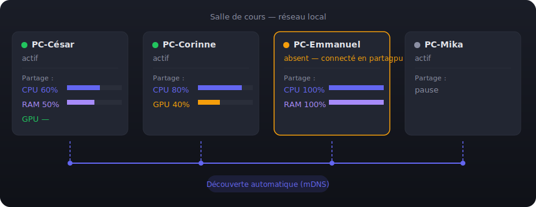
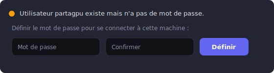
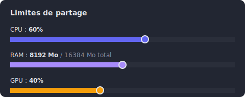
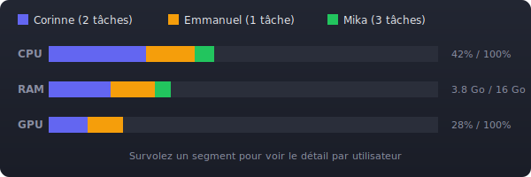
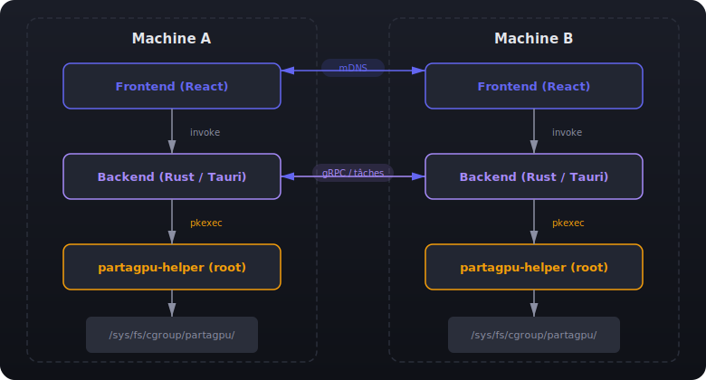

# PartaGPU

Application de partage de puissance de calcul (CPU/GPU/RAM) entre les ordinateurs d'une salle de cours, construite avec [Tauri](https://tauri.app/) (Rust + React/TypeScript).

Chaque poste peut choisir de mettre à disposition tout ou partie de ses ressources. Un compte utilisateur dédié `partagpu` est créé sur chaque machine, ce qui permet à n'importe qui de se connecter sur un ordinateur libre (même celui d'un absent) pour activer le partage.

---

## Table des matières

- [Principe général](#principe-général)
- [Installation](#installation)
- [Créer ou rejoindre une salle](#créer-ou-rejoindre-une-salle)
- [Configurer un poste (première fois)](#configurer-un-poste-première-fois)
- [Utilisation au quotidien](#utilisation-au-quotidien)
- [Activer le partage sur l'ordinateur d'un absent](#activer-le-partage-sur-lordinateur-dun-absent)
- [Découverte du réseau](#découverte-du-réseau)
- [Architecture technique](#architecture-technique)
- [Scripts disponibles](#scripts-disponibles)
- [Sécurité](#sécurité)
- [Prérequis](#prérequis)

---

## Principe général



- Chaque poste fait tourner PartaGPU et s'annonce automatiquement sur le réseau local
- Chaque utilisateur choisit **ce qu'il partage** et **combien** via des sliders
- Les tâches de calcul reçues tournent sous un compte système isolé (`partagpu`)
- Un camarade absent ? On allume son PC, on se connecte en `partagpu`, et ses ressources sont disponibles
- Une **salle virtuelle** protégée par un code d'accès garantit que seuls les postes autorisés peuvent communiquer

---

## Installation

### Option A : installer le .deb (Ubuntu/Debian, recommandé)

Téléchargez la dernière version depuis la [page des releases](https://github.com/cesar-lizurey/partagpu/releases) :

```bash
# Téléchargez le .deb depuis la page des releases, puis :
sudo dpkg -i partagpu_*_amd64.deb
```

Le `.deb` installe tout automatiquement : l'application, le helper, et la règle PolicyKit. PartaGPU apparaît dans le menu d'applications.

### Option B : AppImage (toute distribution Linux)

Téléchargez le `.AppImage` depuis la [page des releases](https://github.com/cesar-lizurey/partagpu/releases) :

```bash
chmod +x PartaGPU-*.AppImage
./PartaGPU-*.AppImage
```

Aucune installation nécessaire — l'AppImage est un exécutable autonome.

### Option C : depuis les sources (développement)

```bash
git clone https://github.com/cesar-lizurey/partagpu.git
cd partagpu
npm install
npm run tauri:dev      # mode développement
npm run tauri:build    # build de production (génère un .deb)
```

---

## Créer ou rejoindre une salle

### Pourquoi une salle ?

Quand PartaGPU est lancé, chaque poste s'annonce sur le réseau local via mDNS. **Sans protection, n'importe qui connecté au même réseau pourrait se faire passer pour un pair et soumettre des tâches malveillantes.**

Le système de salle résout ce problème : il génère un **secret partagé** qui sert à produire un code TOTP (code temporaire à 6 chiffres, comme les apps d'authentification). Chaque poste prouve son appartenance à la salle en présentant le bon code. Les postes dont le code ne correspond pas sont marqués comme **non vérifiés** dans l'interface.

### Créer une salle (un seul élève le fait)

1. En haut de l'application, cliquez sur **« Créer une salle »**
2. Entrez un nom (ex: `Salle B204`)
3. L'application affiche un **code d'accès de 4 mots** :

```
pomme-tigre-bleu-ocean
```

4. **Dictez ce code à voix haute** à vos camarades — c'est tout

### Rejoindre une salle (tous les autres)

1. Cliquez sur **« Rejoindre une salle »**
2. Entrez le même nom de salle (ex: `Salle B204`)
3. Tapez le code d'accès dicté : `pomme-tigre-bleu-ocean`
4. Vous êtes dans la salle

### Comment ça marche en arrière-plan

- Le code de 4 mots encode un secret cryptographique (chaque mot = 1 octet parmi 256 possibilités, soit 4 milliards de combinaisons)
- Ce secret génère un **code TOTP à 6 chiffres** qui change toutes les 30 secondes
- Chaque poste annonce son code TOTP courant via mDNS
- Les autres postes vérifient ce code — s'il correspond, le pair est marqué **OK** (vérifié)
- Un poste qui ne connaît pas le secret ne peut pas produire le bon code et apparaît comme **non vérifié**

### Pairs vérifiés et non vérifiés

Un **pair vérifié** est une machine qui a rejoint la même salle que vous avec le bon code d'accès. Concrètement :

- Chaque poste dans la salle possède le même secret (dérivé du code de 4 mots)
- À partir de ce secret, chaque poste génère un **code temporaire à 6 chiffres** qui change toutes les 30 secondes (protocole TOTP, le même que Google Authenticator)
- Ce code est annoncé automatiquement aux autres postes via le réseau local
- Les autres postes vérifient ce code : s'il correspond à ce qu'ils calculent eux-mêmes avec le même secret, le pair est **vérifié**

Un **pair non vérifié** est une machine qui :
- N'a pas rejoint la salle (pas de code d'accès)
- A entré un mauvais code d'accès
- N'utilise pas PartaGPU mais s'annonce sur le réseau

**Ce que ça change concrètement :**

| | Pair vérifié | Pair non vérifié |
|---|---|---|
| Visible dans la liste | Oui | Oui (grisé) |
| Peut soumettre des tâches | Oui | **Non** — la tâche est refusée |
| Peut recevoir des tâches | Oui | Oui (c'est lui qui décide) |
| Indicateur dans le tableau | **OK** (vert) | **?** (rouge) |

Si des machines non vérifiées sont détectées, un bandeau d'avertissement orange s'affiche au-dessus du tableau.

**Sans salle configurée** : toutes les machines sont acceptées (pas de vérification). La salle est optionnelle mais fortement recommandée.

### Tableau des machines dans l'onglet "Mon utilisation"

| Machine | IP | Auth | Partage | CPU | RAM | GPU |
|-|-|-|-|-|-|-|
| César (pc-salle-201) | 192.168.1.42 | **OK** | Actif | 60% | 8192 Mo | 40% |
| Corinne (pc-salle-203) | 192.168.1.44 | **OK** | Actif | 80% | — | 0% |
| ??? (pc-inconnu) | 192.168.1.99 | **?** | Actif | 100% | — | 0% |

La colonne **Auth** permet de repérer immédiatement un poste suspect. La troisième machine est grisée et ne pourra pas soumettre de tâches.

---

## Configurer un poste (première fois)

À faire **une seule fois** sur chaque ordinateur de la salle :

### Étape 1 : Activer le partage

Ouvrez l'onglet **« Mon partage »** et cliquez sur **« Activer le partage »**.

Une fenêtre de mot de passe apparaît (PolicyKit) — entrez le mot de passe administrateur de la machine. Cela crée le compte `partagpu` avec un shell de connexion.

### Étape 2 : Définir le mot de passe du compte `partagpu`

Un formulaire apparaît sous le bouton d'activation :



Choisissez un mot de passe **commun à toute la classe** (ex: `partagpu2024`). C'est le mot de passe qui sera utilisé pour se connecter sur l'écran de login de n'importe quel PC.

### Étape 3 : Nommer l'instance

En haut à droite de l'application, cliquez sur le nom de la machine pour le personnaliser :


Ce nom apparaîtra dans la liste des machines disponibles pour les autres.

### Étape 4 : Régler les limites de partage

Utilisez les sliders pour définir combien de ressources vous partagez :



- **CPU** : pourcentage max des cœurs alloués aux tâches partagées (par pas de 5%)
- **RAM** : quantité max en Mo (par pas de 256 Mo, 0 = illimitée)
- **GPU** : pourcentage max du GPU (visible uniquement si un GPU NVIDIA est détecté)

Ces limites sont appliquées via les [cgroups v2](https://docs.kernel.org/admin-guide/cgroup-v2.html) du noyau Linux. Les sliders sont réactifs et ne demandent pas de mot de passe (seule la première activation en demande un).

---

## Utilisation au quotidien

L'application a **3 onglets** :

### Onglet « Mon partage »

*Ce que les autres utilisent sur ma machine.*

- **Statut** : Actif / En pause / Désactivé — avec boutons pour changer
- **Compte partagpu** : statut du compte, formulaire de mot de passe
- **Jauges de ressources** : CPU, RAM, GPU en temps réel avec indicateur de limite
- **Limites** : sliders pour ajuster à tout moment
- **Répartition par utilisateur** : barres empilées colorées montrant la consommation de chaque pair
  

  Chaque segment a la couleur de l'utilisateur. Survolez pour voir le détail.
- **Tableau détaillé** : commande, source, statut, progression, CPU/RAM/GPU par tâche

### Onglet « Mon utilisation »

*Ce que j'utilise sur les autres machines.*

- **Machines disponibles** : liste des postes qui partagent, avec leur capacité et leur statut d'authentification (colonne **Auth**)
- **Toutes les machines** : y compris celles qui ne partagent pas encore
- **Mes tâches en cours** : progression en temps réel de ce que j'ai soumis

### Onglet « Guide »

Tutoriel intégré accessible à tout moment, avec les mêmes explications que ce README.

---

## Activer le partage sur l'ordinateur d'un absent

C'est le cas d'usage principal du compte `partagpu` :

1. **Allumez** l'ordinateur du camarade absent
2. Sur l'écran de login (GDM, LightDM...), choisissez l'utilisateur **`partagpu`**
3. Entrez le **mot de passe commun** défini lors de la configuration
4. PartaGPU **se lance automatiquement** (autostart configuré)
5. **Rejoignez la salle** en entrant le code d'accès (dictez-le depuis votre poste si besoin)
6. Cliquez sur **« Activer le partage »** — pas besoin de reconfigurer, tout est persistant

Le compte `partagpu`, son mot de passe et les paramètres de partage survivent aux redémarrages.

---

## Découverte du réseau

Les machines se trouvent automatiquement via **mDNS** (Multicast DNS, port 5353 UDP). Aucune configuration réseau manuelle n'est nécessaire — il suffit d'être sur le même sous-réseau.

Pour vérifier manuellement quelles machines sont visibles :

```bash
# Avec nmap (installer via : sudo apt install nmap)
nmap -sn 192.168.1.0/24

# Sans nmap
for i in $(seq 1 254); do
  ping -c 1 -W 1 192.168.1.$i &>/dev/null && echo "192.168.1.$i UP" &
done
wait
```

Si une machine n'apparaît pas, vérifiez que le pare-feu autorise les ports nécessaires.

### Règles de pare-feu

PartaGPU gère automatiquement le pare-feu via `ufw` ou `iptables` (ouverture à l'activation, fermeture à la pause/désactivation). Si votre environnement nécessite une configuration manuelle :

| Port | Protocole | Direction | Usage | Quand |
|------|-----------|-----------|-------|-------|
| 5353 | UDP | Entrant + Sortant | mDNS (découverte des pairs) | Toujours |
| 7654 | TCP | Entrant | Communication entre pairs | Uniquement quand le partage est actif |

Avec `ufw` :
```bash
sudo ufw allow 5353/udp comment "PartaGPU mDNS"
sudo ufw allow 7654/tcp comment "PartaGPU"
```

Avec `iptables` :
```bash
sudo iptables -A INPUT -p udp --dport 5353 -m comment --comment "PartaGPU mDNS" -j ACCEPT
sudo iptables -A INPUT -p tcp --dport 7654 -m comment --comment "PartaGPU" -j ACCEPT
```

---

## Architecture technique

```
partagpu/
├── src-tauri/                   # Backend Rust (Tauri)
│   ├── src/
│   │   ├── main.rs              # Point d'entrée
│   │   ├── lib.rs               # Initialisation Tauri, enregistre les commandes
│   │   ├── auth.rs              # Système de salle : TOTP, passphrase, vérification
│   │   ├── discovery.rs         # Découverte mDNS (mdns-sd) + vérification TOTP des pairs
│   │   ├── user_manager.rs      # Création utilisateur, pkexec, cgroups
│   │   ├── resource.rs          # Monitoring CPU/RAM (sysinfo) + GPU (nvidia-smi)
│   │   ├── sharing.rs           # État du partage (Active/Paused/Disabled) + limites
│   │   ├── task_runner.rs       # Files de tâches entrantes/sortantes
│   │   └── api.rs               # Commandes Tauri exposées au frontend
│   ├── resources/
│   │   ├── partagpu-helper      # Script bash exécuté via pkexec (root)
│   │   └── com.partagpu.policy  # Règle PolicyKit
│   └── Cargo.toml
├── scripts/
│   ├── install-helper.sh        # sudo : installe helper + policy
│   └── uninstall-helper.sh      # sudo : désinstalle helper + policy
├── src/                         # Frontend React/TypeScript
│   ├── main.tsx                 # Point d'entrée React
│   ├── App.tsx                  # Header + salle + 3 onglets
│   ├── styles.css               # Theme dark complet
│   ├── pages/
│   │   ├── MySharing.tsx        # Mon partage : jauges, sliders, répartition, tâches
│   │   ├── MyUsage.tsx          # Mon utilisation : pairs, tâches soumises
│   │   └── Guide.tsx            # Tutoriel intégré
│   ├── components/
│   │   ├── RoomSetup.tsx        # Créer / rejoindre / quitter une salle
│   │   ├── ResourceGauge.tsx    # Barre de progression avec indicateur de limite
│   │   ├── ResourceSliders.tsx  # Sliders CPU/RAM/GPU avec debounce 300ms
│   │   ├── SharingToggle.tsx    # Boutons Activer/Pause/Désactiver
│   │   ├── PeerTable.tsx        # Tableau des machines (avec colonne Auth)
│   │   ├── TaskList.tsx         # Tableau des tâches entrantes/sortantes
│   │   └── UsageBreakdown.tsx   # Barres empilées par utilisateur (8 couleurs)
│   └── lib/
│       └── api.ts               # Types TypeScript + appels invoke
├── package.json
├── tsconfig.json
├── vite.config.ts
├── SECURITY.md                  # Documentation détaillée de la sécurité
├── TODO.md                      # Plan de sécurité restant
└── README.md
```

### Flux de données



### Quand pkexec est-il appelé ?

`pkexec` (fenêtre de mot de passe) n'est demandé que pour **4 actions** :

| Action | Quand |
|--------|-------|
| `create-user` | Première activation du partage sur un poste |
| `set-password` | Définition/modification du mot de passe partagpu |
| `setup-cgroup` | Première création du cgroup (ensuite écriture directe) |
| `remove-user` | Suppression complète du compte partagpu |

Les ajustements de sliders, la consultation du statut, et le monitoring **n'appellent jamais pkexec** — tout se fait par écriture directe dans les fichiers cgroup ou par lecture de `/etc/passwd`.

---

## Scripts disponibles

| Commande | Description |
|----------|-------------|
| `npm run dev` | Frontend seul (Vite, port 1420) |
| `npm run tauri:dev` | Application Tauri complète en développement |
| `npm run tauri:build` | Build de production (génère un .deb) |
| `npm run test` | Tests unitaires (vitest) |
| `npm run test:watch` | Tests en mode watch |
| `npm run test:coverage` | Tests avec couverture de code |
| `npm run check` | TypeScript + ESLint |
| `npm run format` | Formatage Prettier |
| `npm run clean` | Supprime dist/, node_modules/, target/ |

---

## Sécurité

- **Authentification par salle** : un code d'accès de 4 mots génère un secret TOTP partagé. Chaque poste prouve son appartenance en présentant un code temporaire à 6 chiffres qui change toutes les 30 secondes. Les postes non vérifiés sont clairement identifiés.
- **Isolation** : le compte `partagpu` est dédié au partage, il n'a pas accès aux fichiers personnels des autres utilisateurs
- **Cgroups v2** : les tâches ne peuvent pas dépasser les limites CPU/RAM définies par les sliders
- **PolicyKit** : les opérations root passent par `pkexec` avec une règle explicite, pas de sudo en dur. Le mot de passe transite par stdin, jamais en argument CLI.
- **Validation des entrées** : toutes les entrées passées au helper root sont validées (entiers, longueur, caractères interdits)
- **Contrôle local** : chaque machine garde le contrôle total — pause ou désactivation en un clic, les tâches distantes sont immédiatement arrêtées

Pour le détail complet de chaque mécanisme (schémas, fichiers concernés, scénarios d'attaque), voir [SECURITY.md](SECURITY.md).

Pour le détail de toutes les mesures restantes, voir [TODO.md](TODO.md).

---

## CI/CD

Le projet utilise GitLab CI/CD. Le pipeline s'exécute automatiquement à chaque push :

| Étape | Ce qui est vérifié |
|-------|-------------------|
| **check** | TypeScript (`tsc --noEmit`), formatage (Prettier), lint (ESLint), compilation Rust (`cargo check`) |
| **audit** | `npm audit` et `cargo audit` — détection de vulnérabilités dans les dépendances |
| **build** | Construction du `.deb` (frontend + backend + helper) — uniquement sur `main` et les tags |
| **release** | Publication automatique sur la page des releases avec le `.deb` en téléchargement |

### Publier une nouvelle version

```bash
# Mettre à jour la version dans package.json, Cargo.toml et tauri.conf.json
# Puis taguer et pousser :
git tag v0.2.0
git push origin v0.2.0
```

Le pipeline construit le `.deb` et le publie automatiquement dans une release GitLab. Le lien de téléchargement dans la section [Installation](#installation) pointe vers la dernière release.

---

## Prérequis

| Logiciel | Version | Obligatoire |
|----------|---------|-------------|
| Linux | Ubuntu 22.04+ ou équivalent | Oui |
| Node.js | 18+ | Oui |
| Rust | 1.75+ | Oui |
| Tauri CLI | 2+ (`npm` l'installe automatiquement) | Oui |
| PolicyKit | `policykit-1` (installé par défaut) | Oui |
| GPU NVIDIA | Drivers + `nvidia-smi` | Non (CPU/RAM uniquement sans GPU) |
| nmap | Toute version | Non (découverte manuelle) |

---

## Licence

MIT
