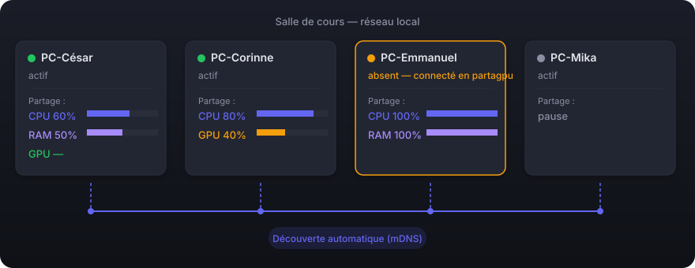
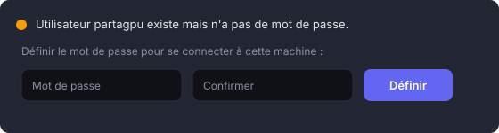
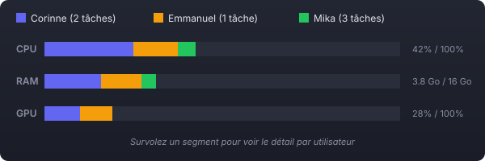
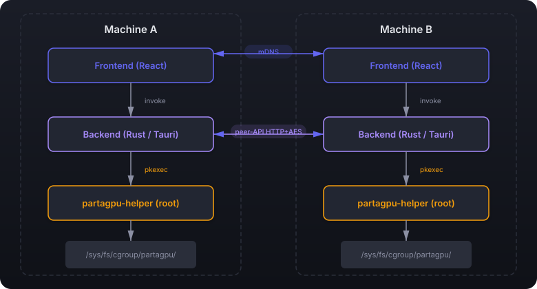

# PartaGPU

Application de partage de puissance de calcul (CPU/GPU/RAM) entre les ordinateurs d'une salle de cours, construite avec [Tauri](https://tauri.app/) (Rust + React/TypeScript).

Chaque poste peut choisir de mettre à disposition tout ou partie de ses ressources. Un compte utilisateur dédié `partagpu` est créé sur chaque machine, ce qui permet à n'importe qui de se connecter sur un ordinateur libre (même celui d'un absent) pour activer le partage.

Côté code, un package Python (`partagpu`) permet d'exécuter une commande sur un pair (`partagpu.run_remote`) ou de **lancer un entraînement PyTorch DDP en parallèle sur tous les GPU de la salle** (`partagpu.distribute`).

**Documentation complémentaire** :
- [docs/ARCHITECTURE.md](docs/ARCHITECTURE.md) — comment ça fonctionne en interne (les deux serveurs HTTP, l'auth TOTP, le sandbox, l'orchestration DDP)
- [docs/TROUBLESHOOTING.md](docs/TROUBLESHOOTING.md) — diagnostic des erreurs courantes (TOTP mismatch, NCCL hang, sandbox plante, etc.)
- [SECURITY.md](SECURITY.md) — modèle de sécurité détaillé

---

## Table des matières

- [Principe général](#principe-général)
- [Installation](#installation)
- [Créer ou rejoindre une salle](#créer-ou-rejoindre-une-salle)
- [Configurer un poste (première fois)](#configurer-un-poste-première-fois)
- [Utilisation au quotidien](#utilisation-au-quotidien)
- [Activer le partage sur l'ordinateur d'un absent](#activer-le-partage-sur-lordinateur-dun-absent)
- [Découverte du réseau](#découverte-du-réseau)
- [Architecture technique](#architecture-technique)
- [Package Python — Entraînement distribué](#package-python--entraînement-distribué)
- [Scripts disponibles](#scripts-disponibles)
- [Sécurité](#sécurité)
- [Prérequis](#prérequis)

---

## Principe général



- Chaque poste fait tourner PartaGPU et s'annonce automatiquement sur le réseau local
- Chaque utilisateur choisit **ce qu'il partage** et **combien** via des curseurs rouges directement sur les jauges de ressources
- Les tâches de calcul reçues tournent sous un compte système isolé (`partagpu`) dans un sandbox **bubblewrap** (FS read-only, /workspace tmpfs, network opt-in)
- Un camarade absent ? On allume son PC, on se connecte en `partagpu`, et ses ressources sont disponibles
- Une **salle virtuelle** protégée par un code d'accès garantit que seuls les postes autorisés peuvent communiquer (auth TOTP partagée)
- Côté code, un package Python (`partagpu`) permet d'entraîner avec PyTorch DDP sur **tous les GPU de la salle** via un simple `partagpu.distribute("train.py")`

---

## Installation

### Option A : installer le .deb (Ubuntu/Debian, recommandé)

Téléchargez la dernière version depuis la [page des releases](https://github.com/cesar-lizurey/partagpu/releases) :

```bash
# Téléchargez le .deb depuis la page des releases, puis :
sudo dpkg -i partagpu_*_amd64.deb
```

Le `.deb` installe tout automatiquement : l'application, le helper, et la règle PolicyKit. PartaGPU apparaît dans le menu d'applications.

### Option B : AppImage (toute distribution Linux)

Téléchargez le `.AppImage` depuis la [page des releases](https://github.com/cesar-lizurey/partagpu/releases) :

```bash
chmod +x PartaGPU-*.AppImage
./PartaGPU-*.AppImage
```

Aucune installation nécessaire — l'AppImage est un exécutable autonome.

### Option C : depuis les sources (développement)

```bash
git clone https://github.com/cesar-lizurey/partagpu.git
cd partagpu
npm install
npm run tauri:dev      # mode développement
npm run tauri:build    # build de production (génère un .deb)
```

---

## Créer ou rejoindre une salle

### Pourquoi une salle ?

Quand PartaGPU est lancé, chaque poste s'annonce sur le réseau local via mDNS. **Sans protection, n'importe qui connecté au même réseau pourrait se faire passer pour un pair et soumettre des tâches malveillantes.**

Le système de salle résout ce problème : il génère un **secret partagé** qui sert à produire un code TOTP (code temporaire à 6 chiffres, comme les apps d'authentification). Chaque poste prouve son appartenance à la salle en présentant le bon code. Les postes dont le code ne correspond pas sont marqués comme **non vérifiés** dans l'interface.

### Créer une salle (un seul élève le fait)

1. En haut de l'application, cliquez sur **« Créer une salle »**
2. Entrez un nom (ex: `Salle B204`)
3. L'application affiche un **code d'accès de 4 mots** :

```
pomme-tigre-bleu-ocean
```

4. **Dictez ce code à voix haute** à vos camarades — c'est tout

### Rejoindre une salle (tous les autres)

1. Cliquez sur **« Rejoindre une salle »**
2. Entrez le même nom de salle (ex: `Salle B204`)
3. Tapez le code d'accès dicté : `pomme-tigre-bleu-ocean`
4. Vous êtes dans la salle

### Comment ça marche en arrière-plan

- Le code de 4 mots encode un secret cryptographique (chaque mot = 1 octet parmi 256 possibilités, soit 4 milliards de combinaisons)
- Ce secret génère un **code TOTP à 6 chiffres** qui change toutes les 30 secondes
- Chaque poste annonce son code TOTP courant via mDNS
- Les autres postes vérifient ce code — s'il correspond, le pair est marqué **OK** (vérifié)
- Un poste qui ne connaît pas le secret ne peut pas produire le bon code et apparaît comme **non vérifié**

### Pairs vérifiés, non vérifiés et inconnus

PartaGPU distingue trois catégories de machines :

#### Pair vérifié

Machine visible sur le réseau via mDNS **et** dont le code TOTP correspond au vôtre (même salle, même code d'accès).

- Chaque poste dans la salle possède le même secret (dérivé du code de 4 mots)
- À partir de ce secret, chaque poste génère un **code temporaire à 6 chiffres** qui change toutes les 30 secondes (protocole TOTP, le même que Google Authenticator)
- Ce code est annoncé automatiquement aux autres postes via le réseau local
- Les autres postes vérifient ce code : s'il correspond à ce qu'ils calculent eux-mêmes avec le même secret, le pair est **vérifié**

#### Pair non vérifié

Machine visible sur le réseau via mDNS (elle fait tourner PartaGPU) **mais** dont le code TOTP ne correspond pas. Causes possibles :
- Elle n'a rejoint aucune salle
- Elle est dans une salle différente
- Elle a entré un mauvais code d'accès

#### Pair inconnu

Machine qui n'a **pas été découverte via mDNS** mais qui tente d'envoyer une tâche directement (par exemple via une requête sur le port 7654). C'est un comportement potentiellement malveillant — la tâche est refusée et un événement de sécurité est enregistré.

**Ce que ça change concrètement :**

| | Pair vérifié | Pair non vérifié | Pair inconnu |
|---|---|---|---|
| Visible dans la liste | Oui | Oui (grisé) | Non |
| Peut soumettre des tâches | Oui | **Non** — refusée | **Non** — refusée |
| Peut recevoir des tâches | Oui | Oui (c'est lui qui décide) | Non applicable |
| Indicateur dans le tableau | **OK** (vert) | **?** (rouge) | — |
| Log de sécurité | Info | Alerte | Alerte |

Si des machines non vérifiées sont détectées, un bandeau d'avertissement orange s'affiche au-dessus du tableau.

**Sans salle configurée** : toutes les machines sont acceptées (pas de vérification). La salle est optionnelle mais fortement recommandée.

### Tableau des machines dans l'onglet "Mon utilisation"

| Machine | IP | Auth | Partage | CPU | RAM | GPU |
|-|-|-|-|-|-|-|
| César (pc-salle-201) | 192.168.1.42 | **OK** | Actif | 60% | 8192 Mo | 40% |
| Corinne (pc-salle-203) | 192.168.1.44 | **OK** | Actif | 80% | — | 0% |
| ??? (pc-inconnu) | 192.168.1.99 | **?** | Actif | 100% | — | 0% |

La colonne **Auth** permet de repérer immédiatement un poste suspect. La troisième machine est grisée et ne pourra pas soumettre de tâches.

---

## Configurer un poste (première fois)

À faire **une seule fois** sur chaque ordinateur de la salle :

### Étape 1 : Activer le partage

Ouvrez l'onglet **« Mon partage »** et cliquez sur **« Activer le partage »**.

Une fenêtre de mot de passe apparaît (PolicyKit) — entrez le mot de passe administrateur de la machine. Cela crée le compte `partagpu` avec un shell de connexion.

### Étape 2 : Définir le mot de passe du compte `partagpu`

Un formulaire apparaît sous le bouton d'activation :



Choisissez un mot de passe **commun à toute la classe** (ex: `partagpu2024`). C'est le mot de passe qui sera utilisé pour se connecter sur l'écran de login de n'importe quel PC.

### Étape 3 : Nommer l'instance

En haut à droite de l'application, cliquez sur le nom de la machine pour le personnaliser :


Ce nom apparaîtra dans la liste des machines disponibles pour les autres.

### Étape 4 : Régler les limites de partage

Sur chaque jauge de ressource (*Mon partage* → *Ressources de cette machine*), un **curseur rouge draggable** indique la limite que vous partagez. Faites-le glisser à la souris pour ajuster :

- **CPU** : pourcentage max des cœurs alloués aux tâches partagées (par pas de 5 %)
- **RAM** : quantité max en Mo (par pas de 256 Mo, 0 = illimitée)
- **GPU** : pourcentage max du GPU (visible uniquement si un GPU NVIDIA est détecté)

Le curseur n'apparaît que quand le partage est *Actif* — sans partage, il n'y a rien à limiter. Les modifications sont debounced à 300 ms et appliquées via les [cgroups v2](https://docs.kernel.org/admin-guide/cgroup-v2.html) du noyau Linux, sans demander de mot de passe (seule la première activation du partage en demande un).

---

## Utilisation au quotidien

L'application a **3 onglets** :

### Onglet « Mon partage »

*Ce que les autres utilisent sur ma machine.*

- **Statut** : Actif / En pause / Désactivé. Trois actions distinctes :
  - **Pause** (depuis Actif) : arrêt **temporaire**. Ferme le pare-feu, refuse les tâches entrantes. Le compte `partagpu`, le cgroup, le venv géré, tout reste en place. Cliquer **Reprendre** redémarre instantanément, sans pkexec.
  - **Désactiver** (depuis Actif ou Paused) : **nettoyage complet**. Demande confirmation, puis tue les tâches en cours, supprime le compte `partagpu`, vire le venv géré (~3 Go), libère le cgroup, retire les règles SSH/sudo deny, ferme le pare-feu. Pour ré-utiliser ensuite il faudra cliquer **Activer** à nouveau (re-pkexec + ré-install du venv si voulu).
  - **Activer** (depuis Désactivé) : crée le compte, configure le cgroup, ouvre le pare-feu. Demande pkexec.
- **Compte partagpu** : statut du compte, formulaire de mot de passe
- **Jauges de ressources** : CPU, RAM, GPU en temps réel, avec un curseur rouge draggable directement sur la jauge pour fixer la limite de partage (apparaît seulement quand le partage est Actif)
- **Répartition par utilisateur** : barres empilées colorées montrant la consommation de chaque pair
  

  Chaque segment a la couleur de l'utilisateur. Survolez pour voir le détail.
- **Tableau détaillé** : commande, source (display_name du pair), statut, **progression et CPU/RAM en temps réel** (mise à jour chaque seconde, agrégés sur tout le sous-arbre de processus de la sandbox), **bouton Stop** pour annuler une tâche entrante en cours (utile si vous pensez qu'un camarade pousse n'importe quoi). GPU per-task pas mesuré pour l'instant — voyez la jauge globale.

### Onglet « Mon utilisation »

*Ce que j'utilise sur les autres machines.*

- **Machines disponibles** : liste des postes qui partagent, avec leur capacité et leur statut d'authentification (colonne **Auth**)
- **Toutes les machines** : y compris celles qui ne partagent pas encore
- **Lancer une commande sur un pair** : formulaire pour dispatcher une commande sur un pair sans passer par Python (sélection du pair, commande avec parsing shell, timeout, accès réseau opt-in, **upload de fichiers du workspace** par file picker, panneau résultat avec stdout/stderr **qui défile en direct** pendant l'exécution — utile pour voir les `print()` d'un long entraînement arriver ligne par ligne)
- **Mes tâches en cours** : progression en temps réel de ce que j'ai soumis. Bouton **Stop** sur les tâches Queued/Running pour les annuler proprement (SIGTERM côté pair, propagation aux rangs siblings dans un DDP).

### Onglet « Guide »

Tutoriel intégré accessible à tout moment, avec les mêmes explications que ce README.

---

## Activer le partage sur l'ordinateur d'un absent

C'est le cas d'usage principal du compte `partagpu` :

1. **Allumez** l'ordinateur du camarade absent
2. Sur l'écran de login (GDM, LightDM...), choisissez l'utilisateur **`partagpu`**
3. Entrez le **mot de passe commun** défini lors de la configuration
4. PartaGPU **se lance automatiquement** (autostart configuré)
5. **Rejoignez la salle** en entrant le code d'accès (dictez-le depuis votre poste si besoin)
6. Cliquez sur **« Activer le partage »** — pas besoin de mot de passe administrateur ni de reconfigurer, le compte et le cgroup sont déjà en place depuis la configuration initiale

Le compte `partagpu`, son mot de passe et les paramètres de partage survivent aux redémarrages.

---

## Découverte du réseau

Les machines se trouvent automatiquement via **mDNS** (Multicast DNS, port 5353 UDP). Aucune configuration réseau manuelle n'est nécessaire — il suffit d'être sur le même sous-réseau.

Pour vérifier manuellement quelles machines sont visibles :

```bash
# Avec nmap (installer via : sudo apt install nmap)
nmap -sn 192.168.1.0/24

# Sans nmap
for i in $(seq 1 254); do
  ping -c 1 -W 1 192.168.1.$i &>/dev/null && echo "192.168.1.$i UP" &
done
wait
```

Si une machine n'apparaît pas, vérifiez que le pare-feu autorise les ports nécessaires.

### Règles de pare-feu

PartaGPU gère automatiquement le pare-feu via `ufw` ou `iptables` (ouverture à l'activation, fermeture à la pause/désactivation). Si votre environnement nécessite une configuration manuelle :

| Port | Protocole | Direction | Usage | Quand |
|------|-----------|-----------|-------|-------|
| 5353 | UDP | Entrant + Sortant | mDNS (découverte des pairs) | Toujours |
| 7654 | TCP | Entrant (loopback) | API HTTP locale (clients Python, dispatch) | Toujours |
| 7655 | TCP | Entrant | API pair-à-pair (réception de tâches d'autres machines) | Quand le partage est actif |
| 29500–29510 | TCP | Entrant | Rendezvous DDP (NCCL/Gloo) entre pairs | Quand le partage est actif |

Avec `ufw` :
```bash
sudo ufw allow 5353/udp comment "PartaGPU mDNS"
sudo ufw allow 7654/tcp comment "PartaGPU local API"
sudo ufw allow 7655/tcp comment "PartaGPU peer API"
sudo ufw allow 29500:29510/tcp comment "PartaGPU DDP"
```

Avec `iptables` :
```bash
sudo iptables -A INPUT -p udp --dport 5353 -m comment --comment "PartaGPU mDNS" -j ACCEPT
sudo iptables -A INPUT -p tcp --dport 7654 -m comment --comment "PartaGPU local" -j ACCEPT
sudo iptables -A INPUT -p tcp --dport 7655 -m comment --comment "PartaGPU peer" -j ACCEPT
sudo iptables -A INPUT -p tcp -m multiport --dports 29500:29510 -m comment --comment "PartaGPU DDP" -j ACCEPT
```

---

## Architecture technique

```
partagpu/
├── src-tauri/                   # Backend Rust (Tauri)
│   ├── src/
│   │   ├── main.rs              # Point d'entrée binaire
│   │   ├── lib.rs               # Initialisation Tauri, démarrage des serveurs HTTP
│   │   ├── auth.rs              # Salles : TOTP, passphrase 4 mots, vérification
│   │   ├── discovery.rs         # Découverte mDNS + annonce gpu_count + vérif TOTP
│   │   ├── user_manager.rs      # Création utilisateur, pkexec, cgroups
│   │   ├── resource.rs          # CPU/RAM (sysinfo) + GPU (nvidia-smi multi-device)
│   │   ├── sharing.rs           # État du partage (Active/Paused/Disabled) + limites
│   │   ├── sandbox.rs           # bubblewrap : passthrough GPU, network opt-in, workspace
│   │   ├── task_runner.rs       # Files de tâches entrantes/sortantes + create_and_run
│   │   ├── http_api.rs          # API HTTP locale 127.0.0.1:7654 + POST /api/dispatch
│   │   ├── peer_api.rs          # API HTTP pair-à-pair 0.0.0.0:7655 (auth TOTP header)
│   │   ├── api.rs               # Commandes Tauri exposées au frontend
│   │   └── security_log.rs      # Journal d'événements de sécurité (ring buffer)
│   ├── helper/                  # Crate séparée : binaire Rust exécuté via pkexec
│   │   └── src/main.rs          # create-user, set-password, setup-cgroup, open-port…
│   └── Cargo.toml
├── scripts/
│   ├── install-helper.sh        # sudo : installe helper + policy PolicyKit
│   └── uninstall-helper.sh      # sudo : désinstalle helper + policy
├── src/                         # Frontend React/TypeScript
│   ├── main.tsx, App.tsx        # Entrée React + header + onglets
│   ├── pages/                   # MySharing, MyUsage, Guide
│   ├── components/              # RoomSetup, gauges, sliders, tableaux
│   └── lib/api.ts               # Types + appels invoke()
├── python/                      # Package partagpu pour clients Python
│   └── src/partagpu/
│       ├── __init__.py          # Exporte discover, run_remote, distribute, TaskResult
│       ├── discover.py          # GPUResource (host, ip, device_index) + Peer
│       ├── remote.py            # run_remote(peer, args, network=, workspace=, …)
│       └── distributed.py       # distribute() orchestrateur DDP multi-GPU multi-host
├── examples/                    # Notebook + scripts d'exemple + smoke tests
│   ├── decouverte_gpu.ipynb
│   ├── ddp_train_demo.py
│   └── smoke_*.py
├── docs/
│   ├── ARCHITECTURE.md          # Comment ça fonctionne en détail
│   └── images/                  # Schémas SVG
├── package.json, tsconfig.json, vite.config.ts
├── SECURITY.md                  # Détail des mesures de sécurité
├── TODO.md                      # Plan de sécurité restant
└── README.md
```

### Flux de données



### Quand pkexec est-il appelé ?

`pkexec` (fenêtre de mot de passe) n'est demandé que pour **4 actions** :

| Action | Quand |
|--------|-------|
| `create-user` | Première activation du partage sur un poste |
| `set-password` | Définition/modification du mot de passe partagpu |
| `setup-cgroup` | Première création du cgroup (ensuite écriture directe) |
| `remove-user` | Suppression complète du compte partagpu |

Les ajustements de sliders, la consultation du statut, et le monitoring **n'appellent jamais pkexec** — tout se fait par écriture directe dans les fichiers cgroup ou par lecture de `/etc/passwd`.

---

## Scripts disponibles

| Commande | Description |
|----------|-------------|
| `npm run dev` | Frontend seul (Vite, port 1420) |
| `npm run tauri:dev` | Application Tauri complète en développement |
| `npm run tauri:build` | Build de production (génère un .deb) |
| `npm run test` | Tests unitaires (vitest) |
| `npm run test:watch` | Tests en mode watch |
| `npm run test:coverage` | Tests avec couverture de code |
| `npm run check` | TypeScript + ESLint |
| `npm run format` | Formatage Prettier |
| `npm run clean` | Supprime dist/, node_modules/, target/ |

---

## Sécurité

- **Authentification par salle** : un code d'accès de 4 mots génère un secret TOTP partagé. Chaque poste prouve son appartenance en présentant un code temporaire à 6 chiffres qui change toutes les 30 secondes. Les postes non vérifiés sont clairement identifiés.
- **Chiffrement pair-à-pair** (depuis 1.6.0) : les bodies HTTP entre pairs (port 7655) sont chiffrés en AES-256-GCM avec une clé HKDF dérivée du secret de salle. Confidentialité + intégrité contre l'écoute LAN passive. Tous les pairs doivent être en `>= 1.6.0`.
- **Isolation** : le compte `partagpu` est dédié au partage, il n'a pas accès aux fichiers personnels des autres utilisateurs
- **Cgroups v2** : les tâches ne peuvent pas dépasser les limites CPU/RAM définies par les sliders
- **PolicyKit** : les opérations root passent par `pkexec` avec une règle explicite, pas de sudo en dur. Le mot de passe transite par stdin, jamais en argument CLI.
- **Validation des entrées** : toutes les entrées passées au helper root sont validées (entiers, longueur, caractères interdits)
- **Contrôle local** : chaque machine garde le contrôle total — *Pause* (suspend temporairement) ou *Désactiver* (nettoie tout, comme si PartaGPU n'avait jamais été installé) en un clic ; les tâches distantes en cours sont immédiatement arrêtées

Pour le détail complet de chaque mécanisme (schémas, fichiers concernés, scénarios d'attaque), voir [SECURITY.md](SECURITY.md).

Pour le détail de toutes les mesures restantes, voir [TODO.md](TODO.md).

---

## CI/CD

Le projet utilise GitLab CI/CD. Le pipeline s'exécute automatiquement à chaque push :

| Étape | Ce qui est vérifié |
|-------|-------------------|
| **check** | TypeScript (`tsc --noEmit`), formatage (Prettier), lint (ESLint), compilation Rust (`cargo check`) |
| **audit** | `npm audit` et `cargo audit` — détection de vulnérabilités dans les dépendances |
| **build** | Construction du `.deb` (frontend + backend + helper) — uniquement sur `main` et les tags |
| **release** | Publication automatique sur la page des releases avec le `.deb` en téléchargement |

### Publier une nouvelle version

```bash
# Mettre à jour la version dans package.json, Cargo.toml et tauri.conf.json
# Puis taguer et pousser :
git tag v0.2.0
git push origin v0.2.0
```

Le pipeline construit le `.deb` et le publie automatiquement dans une release GitLab. Le lien de téléchargement dans la section [Installation](#installation) pointe vers la dernière release.

---

## Package Python — Entraînement distribué

PartaGPU fournit un package Python (`partagpu`) qui transforme l'application en une plateforme de calcul distribuée. Tout passe par l'app locale (`localhost:7654`) : c'est elle qui authentifie les requêtes via TOTP et les transmet aux pairs. Vous n'avez **rien à configurer côté réseau** — pas de SSH, pas de keys.

### Installation

Le package n'est **pas encore publié sur PyPI**. Installez-le en mode éditable depuis le clone du repo (le package suit l'état du checkout) :

```bash
git clone https://github.com/cesar-lizurey/partagpu.git
cd partagpu
python3 -m venv venv && source venv/bin/activate
pip install -e python/
```

Pour les exemples du dossier [examples/](examples/), il y a déjà tout un setup `requirements.txt` + kernel Jupyter — voir [examples/decouverte_gpu.ipynb](examples/decouverte_gpu.ipynb).

### Quatre APIs, par ordre d'usage

| API | Quand l'utiliser |
|---|---|
| `partagpu.discover()` | Lister les GPU dispo dans la salle (local + pairs vérifiés qui partagent). Une entrée par CUDA device. |
| `partagpu.run_remote(peer, args, …)` | Exécuter **une commande** sur **un pair** (le local app fait broker). Bloquant, retourne `TaskResult`. |
| `partagpu.distribute(script, args=, …)` | Entraîner avec **PyTorch DDP** sur **tous les GPU de la salle**. Multi-GPU **par machine** géré automatiquement. |
| `partagpu.cancel(local_id)` | Annuler une tâche en cours par programme (depuis un autre notebook par ex.). Le `local_id` vient de `TaskResult.id`. `Ctrl+C` dans `run_remote`/`distribute` propage automatiquement le cancel au pair. |

### Découverte des GPU

```python
import partagpu

gpus = partagpu.discover()
# Une entrée par GPU physique. Un PC avec 4 GPU produit 4 entrées.
# [GPU('local',   ip='192.168.70.103', dev=0, limit=100%, verified),
#  GPU('local',   ip='192.168.70.103', dev=1, limit=100%, verified),
#  GPU('César 2', ip='192.168.70.105', dev=0, limit=50%,  verified)]
```

### Exécution distante (`run_remote`)

```python
import partagpu

peer = next(g for g in partagpu.discover() if g.host != "local")

result = partagpu.run_remote(
    peer,
    ["python3", "-c", "import torch; print(torch.cuda.get_device_name(0))"],
    timeout=30,
)
print(result.stdout)
result.check()  # raise RemoteTaskError si exit != 0
```

Options utiles :
- `network=True` : le sandbox du pair garde l'accès réseau (requis pour DDP rendezvous).
- `workspace={"train.py": "<contenu>"}` ou `workspace=[Path("./train.py")]` : pousse des fichiers dans le `/workspace` du sandbox (jusqu'à 16 Mo total).
- `timeout=int` : secondes (défaut 300).

### Entraînement DDP (`distribute`)

```python
import partagpu

results = partagpu.distribute(
    "train.py",
    args=["--epochs", "10"],
    extra_files=["config.yaml", "model.py"],
    timeout=1800,
)
for r in results:
    print(r.target_machine, "exit", r.exit_code)
    print(r.stdout[-500:])
```

`distribute` :
- découvre tous les GPU de la salle (sauf si `gpus=` est passé) ;
- gère le **multi-GPU par machine** : un PC avec 4 GPU contribue 4 workers ;
- pousse `train.py` (et `extra_files`) dans le sandbox de chaque pair ;
- définit `MASTER_ADDR`, `MASTER_PORT`, `RANK`, `WORLD_SIZE`, `LOCAL_RANK`, `CUDA_VISIBLE_DEVICES`, `PARTAGPU_LOCAL_RANK`, `BACKEND` sur chaque worker ;
- isole chaque worker à son GPU via `CUDA_VISIBLE_DEVICES` (le script utilise `cuda:0` quoi qu'il arrive) ;
- ouvre l'isolation réseau du sandbox de chaque pair pour le rendezvous NCCL/Gloo ;
- lance les workers en parallèle, attend tous les résultats.

Côté `train.py`, init DDP standard :

```python
import os
import torch
import torch.distributed as dist
from torch.nn.parallel import DistributedDataParallel as DDP

dist.init_process_group(backend=os.environ["BACKEND"], init_method="env://")
rank = int(os.environ["RANK"])
device = torch.device("cuda:0")  # CUDA_VISIBLE_DEVICES isole déjà au bon GPU

model = MyModel().to(device)
model = DDP(model)
# ... entraînement normal
dist.destroy_process_group()
```

**Pré-requis sur chaque machine cible** (pas seulement la machine de lancement) :
- `bubblewrap` installé (`sudo apt install bubblewrap`)
- `torch` accessible côté sandbox. Deux options :
  - **Recommandé** : utiliser le **venv géré** (UI → *Mon partage* → *Environnement Python pour les tâches reçues* → *Installer la toolkit ML*). PartaGPU provisionne `/var/lib/partagpu/venv/` avec une toolkit complète : `torch`, `torchvision`, `numpy`, `scipy`, `pandas`, `scikit-learn`, `matplotlib`, `pillow`. Le sandbox bind le venv automatiquement. Pas de pollution du Python système.
  - **Alternative** : installer les packages en Python système :
    ```bash
    sudo apt install -y python3-pip
    sudo /usr/bin/python3 -m pip install --break-system-packages \
      torch torchvision numpy scipy pandas scikit-learn matplotlib pillow
    ```

### API HTTP

L'application expose deux serveurs HTTP :

**API locale** sur `127.0.0.1:7654` (pour les clients Python et l'introspection) :

| Route | Méthode | Description |
|---|---|---|
| `/api/peers` | GET | Liste de tous les pairs découverts |
| `/api/gpu` | GET | Liste des GPU dispo, **une entrée par device** (champ `device_index`) |
| `/api/status` | GET | Statut de partage local |
| `/api/dispatch` | POST | Soumet une tâche à un pair, **bloque** jusqu'à completion. Body : `{"peer_ip", "args", "timeout_secs", "network", "workspace", "user", "local_id"}` (le `local_id` est optionnel — sert à pré-allouer un id côté client pour pouvoir annuler mid-flight) |
| `/api/cancel` | POST | Annule une tâche sortante par son `local_id`. Propage en `DELETE` au pair. Body : `{"local_id"}` |

**API pair-à-pair** sur `0.0.0.0:7655` (utilisée par les autres pairs PartaGPU, auth via header `X-PartaGPU-TOTP`) :

| Route | Méthode | Description |
|---|---|---|
| `/peer/v1/health` | GET | Liveness + état (no auth) |
| `/peer/v1/tasks` | POST | Reçoit une tâche d'un pair vérifié, la lance dans le sandbox |
| `/peer/v1/tasks/<id>` | GET | Status / output d'une tâche |
| `/peer/v1/tasks/<id>` | DELETE | Annule la tâche (SIGTERM puis SIGKILL après 2 s sur le bwrap) |

Pour le détail technique du flux et des protocoles, voir [docs/ARCHITECTURE.md](docs/ARCHITECTURE.md).

### Smoke tests

Trois scripts dans [examples/](examples/) pour valider l'installation pas à pas :

| Script | Ce qu'il teste | Pré-requis |
|---|---|---|
| `smoke_run_remote.py` | Dispatch d'une commande loopback | App lancée + dans une salle + partage actif |
| `smoke_ddp.py` | DDP `world_size=1` puis multi-machine | + `torch` en system Python sur les pairs |
| `smoke_multi_gpu.py` | Logique multi-GPU par machine | + `PARTAGPU_FORCE_GPU_COUNT=N` au lancement de l'app |

```bash
cd examples
./venv/bin/python smoke_run_remote.py
PARTAGPU_TEST_MULTI=1 ./venv/bin/python smoke_ddp.py
```

---

## Prérequis

| Logiciel | Version | Obligatoire |
|----------|---------|-------------|
| Linux | Ubuntu 22.04+ ou équivalent | Oui |
| Node.js | 18+ | Oui |
| Rust | 1.75+ | Oui |
| Tauri CLI | 2+ (`npm` l'installe automatiquement) | Oui |
| PolicyKit | `policykit-1` (installé par défaut) | Oui |
| GPU NVIDIA | Drivers + `nvidia-smi` | Non (CPU/RAM uniquement sans GPU) |
| nmap | Toute version | Non (découverte manuelle) |

---

## Licence

MIT
