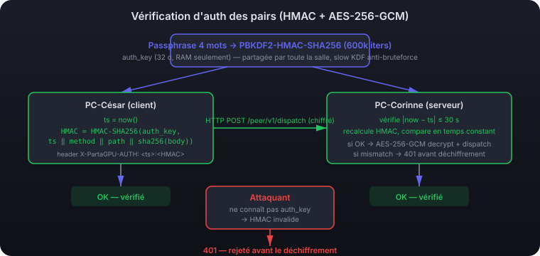
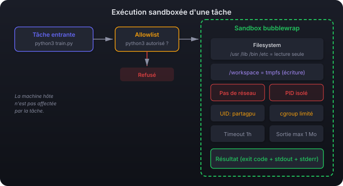
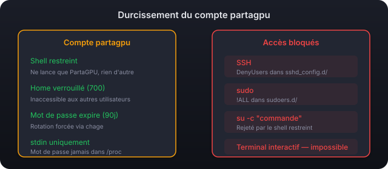
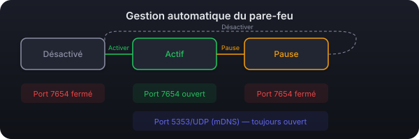
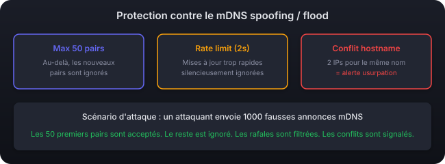

🇫🇷 [Version française](SECURITY.md)

# PartaGPU Security

This document details the security measures implemented in PartaGPU. The application is designed for a classroom environment where machines share a LAN and users have moderate trust in each other.

---

## Table of contents

- [Overview](#overview)
- [1. Peer authentication via HMAC + timestamp](#1-peer-authentication-via-hmac--timestamp)
- [2. Peer-to-peer message encryption](#2-peer-to-peer-message-encryption)
- [3. Execution sandbox (bubblewrap)](#3-execution-sandbox-bubblewrap)
- [4. Hardening of the partagpu account](#4-hardening-of-the-partagpu-account)
- [5. Automatic firewall management](#5-automatic-firewall-management)
- [6. Protection against mDNS spoofing / flooding](#6-protection-against-mdns-spoofing--flooding)
- [7. Secure privilege elevation (PolicyKit)](#7-secure-privilege-elevation-policykit)
- [8. Input validation](#8-input-validation)
- [Remaining measures](#remaining-measures)
- [Reporting a vulnerability](#reporting-a-vulnerability)

---

## Overview

PartaGPU layers several complementary defenses:

| Layer | Protects against | Implementation |
|--------|---------------|----------------|
| **HMAC authentication** | Unauthorized peers, impostors | Time-based code derived from a shared secret |
| **AES-256-GCM encryption** | Passive network eavesdropping | HKDF-derived key from the room secret, mandatory on `/peer/v1/tasks*` |
| **bubblewrap sandbox** | Malicious code execution | Read-only filesystem, no network, isolated PID namespace |
| **Hardened account** | `partagpu` account abuse | Restricted shell, SSH blocked, sudo blocked |
| **Automatic firewall** | Unnecessary network exposure | Port open only when sharing is active |
| **Anti mDNS spoofing** | Flooding, identity spoofing | Rate limiting, max peers, conflict detection |
| **PolicyKit** | Privilege escalation | Compiled Rust helper, password via stdin |
| **Input validation** | Command injection | Allowlist, strict validation, no shell |
| **Masked passphrase (UX)** | Shoulder-surfing the room code | Stars by default, only revealed while the eye button is held |

---

## 1. Peer authentication via HMAC + timestamp

### The problem

On a LAN, anyone can broadcast an mDNS service and pose as a legitimate PartaGPU peer. Without verification, an attacker could submit malicious tasks to any machine.

### The solution

Each PartaGPU room shares a **cryptographic secret** (encoded as a 4-word code). From it, two keys are derived:

- a **`room_key`** for AES-256-GCM body encryption, derived via HKDF-SHA256 (cf. section 2)
- a distinct **`auth_key`** for HMAC authentication proofs, derived via **PBKDF2-HMAC-SHA256** with 600 000 iterations (slow KDF)

For **passive mDNS verification**, every peer publishes an `auth_proof` = `HMAC-SHA256(auth_key, current_30s_window)` truncated to 8 hex chars (32 bits) in its TXT record. Others recompute it and constant-time compare ; no HTTP round-trip needed to flip the `verified` badge.

For **HTTP requests**, every peer-to-peer call carries a header :
```
X-PartaGPU-AUTH: <unix_ts>:<HMAC-SHA256(auth_key, "PartaGPU/auth-req/v1\n" || ts || "\n" || method || "\n" || path || "\n" || sha256(body)) hex>
```

The server checks `|now - ts| ≤ 30 s`, then recomputes the HMAC and constant-time compares. The HMAC **binds the auth to the request body**, so a captured header cannot be replayed on a different request even within the 30 s window. An attacker who doesn't know the `auth_key` never reaches the AES layer — auth is gated *before* decryption.



### Technical details

- **Primitive**: HMAC-SHA256 (RFC 2104). Simpler, more standard, and better aligned with the rest of the crypto stack than TOTP (RFC 6238) which was used through 1.8.x.
- **Clock-skew tolerance**: ±1 window (`AUTH_WINDOW_SECS = 30 s`).
- **Access code**: 4 words from a 256-word list = 256^4 ≈ 4.3 billion combinations.
- **Conversion**: the 4-word passphrase is converted to 4 bytes, then expanded to 20 bytes via SHA-1 to form a stable-length secret. Same shape as 1.6.x–1.8.x so existing `room.json` files keep working (config backward compat).
- **Derivation**: `auth_key = PBKDF2-HMAC-SHA256(room_secret, salt = "PartaGPU/auth-key-pbkdf2-v2", iters = 600 000, len = 32 bytes)`. Intentionally slow KDF: the derivation takes ~100 ms on a modern CPU, invisible at room-join time, but multiplies by ~10⁵ the cost of an offline brute-force of the passphrase from leaked mDNS `auth_proof` tags (from ~10 min on a laptop to ~7 CPU-days = ~$1 500 of cloud). Distinct from the AES `room_key`, which stays on HKDF-SHA256 (the `room_key` is never broadcast — different threat profile). **Protocol break vs ≤ 1.10.0**: every peer in a room must run a matching version.
- **Persistence**: only the secret is saved to `~/.config/partagpu/room.json` ; the `auth_key` is re-derived on every load.

### What's blocked

When a room is active, the peer-API server :
- **Refuses** (HTTP 401) requests without an `X-PartaGPU-AUTH` header
- **Refuses** (401) requests with an invalid HMAC header (wrong key, tampered body, timestamp out of window)
- **Refuses** (403) requests when sharing is disabled locally
- **Logs** every rejection via `SecurityLog::peer_event(EventCategory::TaskRejected, …)`

### Files involved

- `src-tauri/src/auth.rs` — HMAC auth generation/verification, passphrase, persistence
- `src-tauri/src/discovery.rs` — broadcast and verification of the code in mDNS properties
- `src-tauri/src/api.rs` — peer verification in `submit_task`

---

## 2. Peer-to-peer message encryption

### The problem

HMAC auth authenticates the peer but encrypts nothing. Without encryption, an attacker eavesdropping on the LAN (port mirror, ARP spoofing, or shared Wi-Fi) would see in plain:

- command arguments (`python3 -c "secret"` → secret visible)
- workspace files pushed to the peer (proprietary code, datasets)
- task stdout/stderr (computation results, sometimes sensitive)

### The defense

Every HTTP body exchanged on the peer-to-peer port (`7655`, except `/peer/v1/health`) is encrypted with **AES-256-GCM** (authenticated encryption — confidentiality + integrity in one primitive).

#### Key derivation (v=1, fallback)

```
key = HKDF-SHA256(
    ikm    = base32_decode(room_secret),
    salt   = "PartaGPU/peer-api/v1",
    info   = "AES-256-GCM message key",
    length = 32 bytes,
)
```

The `room_secret` is the same one used for HMAC auth — already shared between room members through the 4-word passphrase. No new material to distribute.

#### Key derivation (v=2, default since 1.7.0)

At startup, every peer generates an ephemeral X25519 keypair (kept **in RAM only**) and publishes its public key via mDNS (TXT field `eph_pk`). Every 10 minutes, a background thread rotates this keypair; the previous one stays valid for ~60 s to absorb in-flight requests.

For each request, the client generates **its own** ephemeral X25519 keypair, computes the shared secret `ECDH(client_eph_priv, server_eph_pub)` and derives the session key:

```
session_key = HKDF-SHA256(
    ikm    = ECDH_shared_secret,
    salt   = HKDF(room_secret),               // serves as salt in v=2
    info   = "AES-256-GCM session key v2 (room|ecdh)",
    length = 32 bytes,
)
```

The same key is used for both the request **and** the response — the server derives it identically via `ECDH(server_eph_priv, client_eph_pub)`. The client's public key travels with the envelope (`eph_pk`); the private half never leaves its machine.

This is what gives the **forward secrecy** property: capturing the encrypted traffic and stealing the room passphrase later is no longer enough — you'd also need the private half of an ephemeral keypair that was never persisted.

#### Wire format

Two envelope versions coexist (the server accepts both; the client uses v=2 when the peer publishes a pubkey, v=1 otherwise):

- **v=1 (legacy)**: `{"v": 1, "nonce": "<base64-12B>", "ct": "<base64>"}`. AES key = HKDF(room_secret).
- **v=2 (forward-secret, default)**: `{"v": 2, "eph_pk": "<base64-32B>", "nonce": "...", "ct": "..."}`. The client generates a fresh X25519 keypair per request, does Diffie-Hellman against the server's ephemeral pubkey (announced over mDNS, **regenerated at every app start and rotated every 10 minutes**, **never on disk**), and the AES key is HKDF(room_secret || ECDH_shared). The response reuses the same session key. During rotation, the previous key stays valid for ~60 s.

Content-Type in both cases: `application/x-partagpu-encrypted-v1`. Random 12-byte nonce per message (well below the 2^48 birthday bound).

#### Mandatory

The peer-API server rejects any request with a body but the wrong Content-Type (HTTP `415 Unsupported Media Type`). No plaintext fallback. Consequence: every peer must be `>= 1.6.0` to talk to the others.

### Properties

- **Confidentiality**: an eavesdropper sees nothing — no commands, no workspaces, no outputs.
- **Integrity**: any flipped bit fails decryption (GCM tag rejected). The server returns 415, the client gets the error without having accepted the tampered message.
- **Room-level authenticity**: only secret holders can produce a body that decrypts cleanly. the `X-PartaGPU-AUTH` header adds anti-replay over ~30 s.
- **Forward secrecy (v=2)**: an attacker who captures encrypted traffic and obtains the room secret later still can't decrypt the capture, because the private half of the ephemeral key never left the server's RAM and is gone after the next app restart.

### Known limits

- **Forward secrecy bounded to 10 min**: an attacker with RAM access **while a station is running** can decrypt the last 10 minutes of sessions. Beyond that, the old keys have been rotated and overwritten.
- **No protection against an in-room attacker**: by construction, every peer in the room has the room key. The threat model is "LAN attacker who is NOT in the room".
- **Weak anti-DoS**: the body (up to 32 MB) is read and we attempt to decrypt it BEFORE checking the HMAC header. A LAN attacker could spam invalid bodies to force memory allocations. Current mitigation: the port is only open when sharing is active (firewall closed otherwise).

### Files involved

- `src-tauri/src/crypto.rs` — encryption module (HKDF, AES-GCM, envelope serde, X25519)
- `src-tauri/src/peer_api.rs` — body encrypt/decrypt handler
- `src-tauri/src/http_api.rs` — client-side encryption (run_remote_blocking)

Tests:
- Unit (8 tests): `cargo test --lib crypto::` — round-trip v=1 and v=2, wrong key, tampering, JSON round-trip, wrong server eph key, rotation grace window, forward secrecy after rotation.
- Integration (5 tests): `cargo test --test peer_api_e2e` — plaintext refusal, refusal without an X-PartaGPU-AUTH header, refusal with wrong room secret, full v=2 round-trip on a real localhost server, 404 on unknown cancel.

---

## 3. Execution sandbox (bubblewrap)

### The problem

Compute tasks are arbitrary commands executed on the machine. Even with a verified peer, an error or compromise could lead to destructive commands (`rm -rf /`, reverse shell, data exfiltration).

### The solution

Every task runs inside a **bubblewrap sandbox** with strict restrictions.



### Restrictions applied

| Restriction | Detail |
|------------|--------|
| **Filesystem** | `/usr`, `/lib`, `/bin`, `/etc` mounted **read-only**. No access to home directories. |
| **Workspace** | `/workspace` and `/tmp` are ephemeral tmpfs — destroyed at task end. |
| **Network** | `--unshare-net` — no network connection possible (no exfiltration, no reverse shell). |
| **Processes** | `--unshare-pid` — the task only sees its own processes, not the host's. |
| **User** | Runs under the `partagpu` UID/GID. |
| **Cgroup** | Each task is placed under `/sys/fs/cgroup/partagpu/task-<uuid>/` with the CPU/RAM limits from the sliders. |
| **Timeout** | Each task has a maximum wall-clock budget (default: 1 hour). Exceeded → killed. |
| **Output** | stdout capped at 1 MB, stderr at 256 KB — prevents memory blowup from infinite output. |
| **No shell** | Commands are passed as direct `argv` (no `sh -c`). Command injection is structurally impossible. |

### Command allowlist

Only **explicitly allowed** commands can be executed. Default list:

`python3`, `python`, `bash`, `sh`, `cat`, `grep`, `awk`, `sed`, `make`, `cmake`, `gcc`, `g++`, `rustc`, `cargo`, `julia`, `Rscript`, `nvidia-smi`

The allowlist is configurable via the API (`addToAllowlist` / `removeFromAllowlist`).

If a command isn't on the list, the task is **refused before the sandbox even starts** — no execution attempt.

### Explicit trust boundary: a verified peer = arbitrary code execution in the sandbox

The default allowlist intentionally includes `bash`, `sh`, `gcc`, `g++`, `make`, `cmake`, `cargo`, `rustc` because these are the standard tools of an ML / data-science session (`python3 train.py` calling `gcc` to compile a C extension, Cargo projects, shell scripts, etc.). **An authenticated peer can therefore run arbitrary code inside the target sandbox.** That's expected — the allowlist filters typos and unexpected binaries, not a determined attacker holding the passphrase.

The defenses that remain in front of a compromised or malicious peer **inside the room**:

- **The bubblewrap sandbox**: read-only filesystem, network unshare, cgroup CPU/RAM/PIDs, `partagpu` UID (never root, never the regular user's UID). A malicious task sees `/usr` and `/etc` read-only, can't touch the user's home or anything outside `/workspace` and `/tmp` (themselves ephemeral).
- **The hardened `partagpu` account**: SSH blocked, sudo blocked, restricted shell that only launches PartaGPU.
- **The `/dev/nvidia*` passthrough** is read-write and remains a privilege-escalation vector if the NVIDIA driver has an unpatched CVE. Keeping the driver up to date is part of the model.
- **The PIDs cap** (1024 per cgroup) kills fork bombs ; the CPU/RAM caps bound resource usage.

Concretely: if the room passphrase leaks (capture, indiscretion), an attacker who joins the room can run code in every verified peer's sandbox. The defense is isolation, not command filtering. **The passphrase's secrecy is therefore the invariant to maintain** — see the masked passphrase display (RevealOnHold) and `chmod 600` on `room.json`.

### Files involved

- `src-tauri/src/sandbox.rs` — bwrap command construction, allowlist, execution
- `src-tauri/src/task_runner.rs` — task orchestration, sandbox invocation
- **System dependency**: `bubblewrap` (`sudo apt install bubblewrap`)

---

## 4. Hardening of the partagpu account

### The problem

The `partagpu` account is a real user account with a password (necessary to log in via the display manager on an absent classmate's PC). By default, that means full shell access, possibly SSH, sudo, etc.

### The solution

The account is locked down by 5 complementary mechanisms.



### Detail of each protection

**Restricted shell** (`/usr/local/lib/partagpu/partagpu-shell`)

A script that does only one thing: launch PartaGPU then quit the session. If someone tries `su -c "command" partagpu`, the shell detects the `-c` flag and refuses. This shell is registered in `/etc/shells` so display managers (GDM, LightDM) accept it.

**SSH blocked** (`/etc/ssh/sshd_config.d/partagpu-deny.conf`)

```
DenyUsers partagpu
```

Even with the right password, SSH login is impossible. `sshd` is reloaded automatically after writing the file.

**sudo blocked** (`/etc/sudoers.d/partagpu-deny`)

```
partagpu ALL=(ALL) !ALL
```

The account can never use sudo, even if added to a privileged group.

**Locked home** — `chmod 700` on `/var/lib/partagpu`. Other users on the machine cannot read the account's files.

**Password expiration** — `chage --maxdays 90`. The password expires after 90 days, forcing periodic rotation.

**Password via stdin** — The password is never passed as a CLI argument (visible in `/proc/*/cmdline`). It transits via stdin to `chpasswd`.

### Files involved

- `src-tauri/helper/src/main.rs` — `cmd_create_user()`, `install_restricted_shell()`, `install_ssh_deny()`, `install_sudoers_deny()`

---

## 5. Automatic firewall management

### The problem

The PartaGPU listening port (TCP 7654) should only be open when sharing is actually active. Leaving it open all the time exposes the machine unnecessarily.

### The solution

The helper opens and closes the port automatically based on the sharing state.



### Rules applied

| User action | Firewall |
|---|---|
| **Enable** sharing | `ufw allow 7654/tcp` + `ufw allow 5353/udp` |
| **Pause** | `ufw delete allow 7654/tcp` (immediate close) |
| **Resume** | `ufw allow 7654/tcp` (reopen) |
| **Disable** | `ufw delete allow 7654/tcp` |
| **Remove account** | Port closed + cgroup removed |

The mDNS port (5353/UDP) is not closed on pause or disable as other system services may depend on it.

**Compatibility**: the helper detects `ufw` automatically, falls back to `iptables` otherwise. If no firewall is found, the operation is silently skipped.

### Files involved

- `src-tauri/helper/src/main.rs` — `cmd_open_port()`, `cmd_close_port()`
- `src-tauri/src/sharing.rs` — automatic calls in `enable()`, `pause()`, `resume()`, `disable()`

---

## 6. Protection against mDNS spoofing / flooding

### The problem

mDNS is a multicast-based protocol with no native authentication. A LAN attacker can:
- **Flood** fake announcements to pile up the peer list and exhaust memory
- **Spoof** an existing machine's hostname to impersonate it

### The solution

Three complementary protections in the discovery module.



### Detail of each protection

**Maximum peer cap (50)**

Beyond 50 known peers, new mDNS announcements are ignored. Each rejection is logged: `SECURITY: max peers (50) reached, ignoring new peer: <name>`.

**Rate limiting (2 seconds)**

Updates from the same peer arriving less than 2 s apart are silently dropped. This prevents an attacker from flooding rapid updates to saturate CPU or push fake state.

**Hostname conflict detection**

If two different IPs announce the same hostname, the second is flagged `hostname_conflict`. In the UI:
- Red `!!` badge in the Auth column
- Row with subtle red background
- Alert: "Hostname conflict detected — possible identity spoofing"

Logged: `SECURITY: hostname conflict detected — « <hostname> » announced by <IP> but already known from another IP`.

### Files involved

- `src-tauri/src/discovery.rs` — all the protection logic in `start_browsing()`

---

## 7. Secure privilege elevation (PolicyKit)

### The problem

Some operations require root (creating a user, configuring cgroups, managing the firewall). The application runs as a normal user.

### The solution

A separate **Rust helper binary** (`partagpu-helper`) is executed via `pkexec` (PolicyKit). This shows a native system password prompt.

### Why a Rust binary and not a bash script?

- **No interpreter**: a compiled binary doesn't depend on bash, PATH, IFS, or other manipulable environment variables
- **Strong typing**: inputs are validated by the compiler and the code, not by fragile bash regexes
- **No injection**: commands are executed via `Command::new()` with separate arguments, never concatenated into a shell string
- **Zero dependency**: the helper only uses the Rust standard library

### When is pkexec called?

`pkexec` is asked only for **4 operations**:

| Command | When |
|----------|-------|
| `create-user` | First sharing activation |
| `set-password` | Set/modify the password |
| `setup-cgroup` | First cgroup creation (afterwards, direct write) |
| `open-port` / `close-port` | Sharing activation/deactivation |

Slider adjustments, monitoring, and status checks **never call pkexec**. Cgroup files are made writable by the calling user after first creation (`chown` of the `PKEXEC_UID`).

The `auth_admin_keep` option in the PolicyKit policy remembers the password for a few minutes, avoiding repeat prompts for successive operations.

### Files involved

- `src-tauri/helper/` — Rust helper crate (zero dependency)
- `src-tauri/resources/com.partagpu.policy` — PolicyKit rule
- `src-tauri/src/user_manager.rs` — helper invocations via `pkexec`

---

## 8. Input validation

Every user and network input is validated before processing:

### Password

- Length: 4–128 chars
- Forbidden chars: null bytes (`\0`), carriage returns (`\r`, `\n`)
- Transmitted via stdin (never as CLI argument)
- Validated on the Rust side **and** in the helper

### Cgroup limits

- `cpu_percent`: capped at 100, validated as a positive integer
- `ram_limit_mb`: capped at 1,048,576 (1 TB), validated as a positive integer
- `PKEXEC_UID`: validated as integer before being passed to `chown`

### Task commands

- Checked against the allowlist **before** any execution
- Passed as `argv` (argument array), never as a shell string
- No shell is involved (`sh -c` is never called)

### Room passphrase

- Must contain exactly 4 words separated by hyphens
- Each word is checked against the 256-word list
- An unknown word produces an explicit error message

### Masked passphrase display (UX)

The room passphrase is **never displayed in clear by default** in the UI: the `RevealOnHold` component renders it as `*****-*****-****-*****` and requires the user to **hold** an eye button (mouse, touch, or keyboard Space/Enter) to reveal it. On release (or focus loss), it re-masks instantly. No persistent toggle: the passphrase cannot stay visible by accident — for example, if someone briefly leaves the seat while reading the code to classmates.

---

## Remaining measures

See [TODO.en.md](TODO.en.md) for the up-to-date list. No critical measure remains: encryption (AES-256-GCM + X25519 forward secrecy), per-task isolation (cgroup sub-tree) and the concurrent-task cap are shipped. The remainder is low-priority polish:

| Priority | Measure | Description |
|----------|--------|-------------|
| Low | Deeper integration tests | Two-instance test that exercises end-to-end dispatch (requires faking mDNS) |
| None | Finer-grained re-keying | Rotate after N processed requests too, not just every 10 min |
| Medium | Dependency audit | `cargo audit` + `npm audit` in CI, Dependabot |

---

## Reporting a vulnerability

If you find a vulnerability in PartaGPU, please report it responsibly by opening a private issue on the GitHub repo or contacting the maintainers directly. Don't publish exploitation details before a fix is available.
