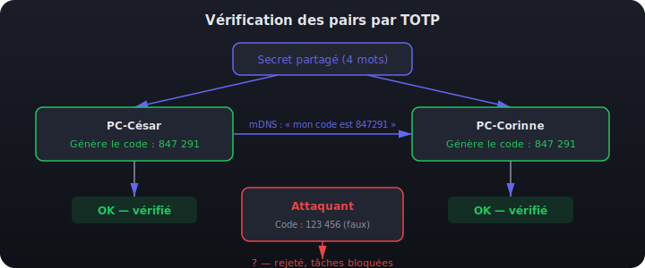
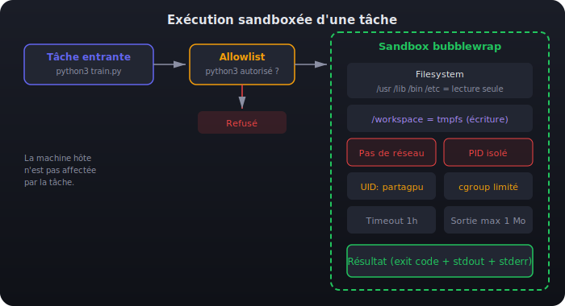
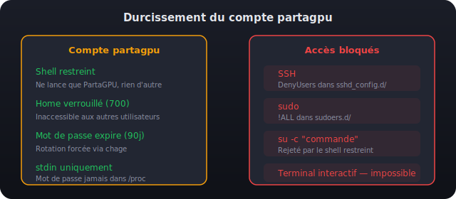
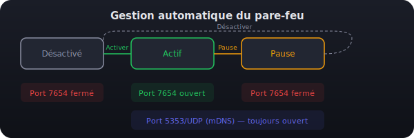
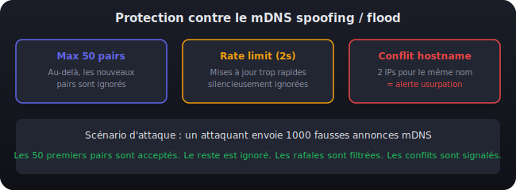

# Sécurité de PartaGPU

Ce document détaille les mesures de sécurité implémentées dans PartaGPU. L'application est conçue pour fonctionner dans un environnement de salle de cours où les postes sont sur le même réseau local, avec un niveau de confiance modéré entre les utilisateurs.

---

## Table des matières

- [Vue d'ensemble](#vue-densemble)
- [1. Authentification des pairs par TOTP](#1-authentification-des-pairs-par-totp)
- [2. Sandbox d'exécution (bubblewrap)](#2-sandbox-dexécution-bubblewrap)
- [3. Durcissement du compte partagpu](#3-durcissement-du-compte-partagpu)
- [4. Gestion automatique du pare-feu](#4-gestion-automatique-du-pare-feu)
- [5. Protection contre le mDNS spoofing / flood](#5-protection-contre-le-mdns-spoofing--flood)
- [6. Élévation de privilèges sécurisée (PolicyKit)](#6-élévation-de-privilèges-sécurisée-policykit)
- [7. Validation des entrées](#7-validation-des-entrées)
- [Mesures restantes à implémenter](#mesures-restantes-à-implémenter)
- [Signaler une vulnérabilité](#signaler-une-vulnérabilité)

---

## Vue d'ensemble

PartaGPU repose sur plusieurs couches de sécurité complémentaires :

| Couche | Protège contre | Implémentation |
|--------|---------------|----------------|
| **Authentification TOTP** | Pairs non autorisés, imposteurs | Code temporaire dérivé d'un secret partagé |
| **Sandbox bubblewrap** | Exécution de code malveillant | Filesystem read-only, pas de réseau, PID isolé |
| **Compte durci** | Abus du compte partagpu | Shell restreint, SSH bloqué, sudo bloqué |
| **Pare-feu automatique** | Exposition réseau inutile | Port ouvert uniquement quand le partage est actif |
| **Anti-spoofing mDNS** | Flood, usurpation d'identité | Rate limiting, max peers, détection de conflits |
| **PolicyKit** | Escalade de privilèges | Helper Rust compilé, mot de passe via stdin |
| **Validation des entrées** | Injection de commandes | Allowlist, validation stricte, pas de shell |

---

## 1. Authentification des pairs par TOTP

### Le problème

Sur un réseau local, n'importe qui peut annoncer un service mDNS et se faire passer pour un pair PartaGPU légitime. Sans vérification, un attaquant pourrait soumettre des tâches malveillantes à n'importe quelle machine.

### La solution

Chaque salle PartaGPU partage un **secret cryptographique** (encodé comme un code de 4 mots). Ce secret produit un **code TOTP à 6 chiffres** qui change toutes les 30 secondes. Chaque poste annonce son code courant via mDNS, et les autres vérifient qu'il correspond.



### Détails techniques

- **Algorithme** : TOTP (RFC 6238) avec SHA-1, fenêtre de 30 secondes
- **Tolérance de clock skew** : +/- 1 fenêtre (le code précédent et suivant sont aussi acceptés)
- **Code d'accès** : 4 mots parmi 256 = 256^4 = ~4,3 milliards de combinaisons
- **Conversion** : le passphrase de 4 mots est converti en 4 octets, puis étendu à 20 octets via SHA-1 pour former le secret TOTP
- **Persistance** : le secret est sauvegardé dans `~/.config/partagpu/room.json` et rechargé automatiquement au démarrage

### Ce qui est bloqué

Quand une salle est active, l'API `submit_task` :
- **Refuse** les tâches provenant de pairs non vérifiés (TOTP invalide)
- **Refuse** les tâches provenant de pairs inconnus (absents de la liste mDNS)
- **Logue** chaque tentative refusée sur stderr avec le préfixe `SECURITY:`

### Fichiers concernés

- `src-tauri/src/auth.rs` — génération/vérification TOTP, passphrase, persistance
- `src-tauri/src/discovery.rs` — annonce et vérification du code dans les properties mDNS
- `src-tauri/src/api.rs` — vérification du pair dans `submit_task`

---

## 2. Sandbox d'exécution (bubblewrap)

### Le problème

Les tâches de calcul sont des commandes exécutées sur la machine. Même avec un pair vérifié, une erreur ou une compromission pourrait mener à l'exécution de commandes destructrices (`rm -rf /`, reverse shell, exfiltration de données).

### La solution

Chaque tâche s'exécute dans un **sandbox bubblewrap** avec des restrictions strictes.



### Restrictions appliquées

| Restriction | Détail |
|------------|--------|
| **Filesystem** | `/usr`, `/lib`, `/bin`, `/etc` montés en **lecture seule**. Aucun accès aux home directories. |
| **Workspace** | `/workspace` et `/tmp` sont des tmpfs éphémères — détruits à la fin de la tâche. |
| **Réseau** | `--unshare-net` — aucune connexion réseau possible (pas d'exfiltration, pas de reverse shell). |
| **Processus** | `--unshare-pid` — la tâche ne voit que ses propres processus, pas ceux de l'hôte. |
| **Utilisateur** | Exécution sous l'UID/GID du compte `partagpu`. |
| **Cgroup** | La tâche est placée dans `/sys/fs/cgroup/partagpu/` avec les limites CPU/RAM définies par les sliders. |
| **Timeout** | Chaque tâche a un délai maximum (défaut : 1 heure). Si dépassé, le processus est tué. |
| **Sortie** | stdout limité à 1 Mo, stderr à 256 Ko — empêche un remplissage mémoire par sortie infinie. |
| **Pas de shell** | Les commandes sont passées en `argv` direct (pas de `sh -c`). L'injection de commandes est structurellement impossible. |

### Allowlist de commandes

Seules les commandes **explicitement autorisées** peuvent être exécutées. Par défaut :

`python3`, `python`, `bash`, `sh`, `cat`, `grep`, `awk`, `sed`, `make`, `cmake`, `gcc`, `g++`, `rustc`, `cargo`, `julia`, `Rscript`, `nvidia-smi`

L'allowlist est configurable via l'API (`addToAllowlist` / `removeFromAllowlist`).

Si une commande n'est pas dans la liste, la tâche est **refusée avant même de lancer le sandbox** — pas de tentative d'exécution.

### Fichiers concernés

- `src-tauri/src/sandbox.rs` — construction de la commande bwrap, allowlist, exécution
- `src-tauri/src/task_runner.rs` — orchestration des tâches, appel au sandbox
- **Dépendance système** : `bubblewrap` (`sudo apt install bubblewrap`)

---

## 3. Durcissement du compte partagpu

### Le problème

Le compte `partagpu` est un vrai compte utilisateur avec un mot de passe (nécessaire pour se connecter via l'écran de login sur le PC d'un absent). Par défaut, cela signifie un accès shell complet, la possibilité de SSH, de sudo, etc.

### La solution

Le compte est verrouillé par 5 mécanismes complémentaires.



### Détail des protections

**Shell restreint** (`/usr/local/lib/partagpu/partagpu-shell`)

Un script qui ne fait qu'une chose : lancer PartaGPU puis quitter la session. Si quelqu'un tente `su -c "commande" partagpu`, le shell détecte le flag `-c` et refuse. Ce shell est enregistré dans `/etc/shells` pour que les display managers (GDM, LightDM) l'acceptent.

**SSH bloqué** (`/etc/ssh/sshd_config.d/partagpu-deny.conf`)

```
DenyUsers partagpu
```

Même avec le bon mot de passe, impossible de se connecter en SSH. `sshd` est rechargé automatiquement après l'écriture du fichier.

**sudo bloqué** (`/etc/sudoers.d/partagpu-deny`)

```
partagpu ALL=(ALL) !ALL
```

Le compte ne peut jamais utiliser sudo, même s'il était ajouté à un groupe privilegié.

**Home verrouillé** — `chmod 700` sur `/var/lib/partagpu`. Les autres utilisateurs de la machine ne peuvent pas lire les fichiers du compte.

**Expiration du mot de passe** — `chage --maxdays 90`. Le mot de passe expire après 90 jours, forçant une rotation régulière.

**Mot de passe via stdin** — Le mot de passe n'est jamais passé en argument CLI (visible dans `/proc/*/cmdline`). Il transite par stdin vers `chpasswd`.

### Fichiers concernés

- `src-tauri/helper/src/main.rs` — `cmd_create_user()`, `install_restricted_shell()`, `install_ssh_deny()`, `install_sudoers_deny()`

---

## 4. Gestion automatique du pare-feu

### Le problème

Le port d'écoute de PartaGPU (TCP 7654) ne devrait être ouvert que quand le partage est réellement actif. Le laisser ouvert en permanence expose la machine inutilement.

### La solution

Le helper ouvre et ferme le port automatiquement en fonction de l'état du partage.



### Règles appliquées

| Action utilisateur | Pare-feu |
|---|---|
| **Activer** le partage | `ufw allow 7654/tcp` + `ufw allow 5353/udp` |
| **Pause** | `ufw delete allow 7654/tcp` (fermeture immédiate) |
| **Reprendre** | `ufw allow 7654/tcp` (réouverture) |
| **Désactiver** | `ufw delete allow 7654/tcp` |
| **Supprimer le compte** | Fermeture du port + suppression du cgroup |

Le port mDNS (5353/UDP) n'est pas fermé lors de la pause ou désactivation car d'autres services système peuvent en dépendre.

**Compatibilité** : le helper détecte automatiquement `ufw` ou tombe sur `iptables` en fallback. Si aucun pare-feu n'est détecté, l'opération est silencieusement ignorée.

### Fichiers concernés

- `src-tauri/helper/src/main.rs` — `cmd_open_port()`, `cmd_close_port()`
- `src-tauri/src/sharing.rs` — appels automatiques dans `enable()`, `pause()`, `resume()`, `disable()`

---

## 5. Protection contre le mDNS spoofing / flood

### Le problème

mDNS est un protocole basé sur le multicast, sans authentification native. Un attaquant sur le réseau local peut :
- **Flooder** de fausses annonces pour remplir la liste de pairs et saturer la mémoire
- **Usurper** le hostname d'une machine existante pour se faire passer pour elle

### La solution

Trois protections complémentaires dans le module de découverte.



### Détail des protections

**Limite maximale de pairs (50)**

Au-delà de 50 pairs découverts, les nouvelles annonces mDNS sont ignorées. Chaque rejet est loggé : `SECURITY: max peers (50) reached, ignoring new peer: <name>`.

**Rate limiting (2 secondes)**

Les mises à jour d'un même pair espacées de moins de 2 secondes sont silencieusement droppées. Cela empêche un attaquant de flooder avec des mises à jour rapides pour saturer le CPU ou pousser de faux états.

**Détection de conflit de hostname**

Si deux adresses IP différentes annoncent le même hostname, le second est marqué `hostname_conflict`. Dans l'interface :
- Badge `!!` rouge dans la colonne Auth
- Ligne avec fond rouge subtil
- Alerte : "Conflit de hostname détecté — possible usurpation d'identité"

Loggé : `SECURITY: hostname conflict detected — « <hostname> » announced by <IP> but already known from another IP`.

### Fichiers concernés

- `src-tauri/src/discovery.rs` — toute la logique de protection dans `start_browsing()`

---

## 6. Élévation de privilèges sécurisée (PolicyKit)

### Le problème

Certaines opérations nécessitent les droits root (créer un utilisateur, configurer les cgroups, gérer le pare-feu). L'application tourne sous un compte utilisateur normal.

### La solution

Un **binaire helper Rust** séparé (`partagpu-helper`) est exécuté via `pkexec` (PolicyKit). Cela affiche une fenêtre de mot de passe native du système.

### Pourquoi un binaire Rust et pas un script bash ?

- **Pas d'interpréteur** : un binaire compilé ne dépend pas de bash, PATH, IFS, ou d'autres variables d'environnement manipulables
- **Typage fort** : les entrées sont validées par le compilateur et le code, pas par des regex bash fragiles
- **Pas d'injection** : les commandes sont exécutées via `Command::new()` avec des arguments séparés, jamais concaténés dans une chaîne shell
- **Zéro dépendance** : le helper n'utilise que la bibliothèque standard Rust

### Quand pkexec est-il appelé ?

`pkexec` n'est demandé que pour **4 opérations** :

| Commande | Quand |
|----------|-------|
| `create-user` | Première activation du partage |
| `set-password` | Définition/modification du mot de passe |
| `setup-cgroup` | Première création du cgroup (ensuite écriture directe) |
| `open-port` / `close-port` | Activation/désactivation du partage |

Les ajustements de sliders, le monitoring, et la vérification de statut **n'appellent jamais pkexec**. Les fichiers cgroup sont rendus modifiables par l'utilisateur courant après la première création (via `chown` du `PKEXEC_UID`).

L'option `auth_admin_keep` dans la policy PolicyKit mémorise le mot de passe quelques minutes, évitant de le redemander pour chaque opération successive.

### Fichiers concernés

- `src-tauri/helper/` — crate Rust du helper (zéro dépendance)
- `src-tauri/resources/com.partagpu.policy` — règle PolicyKit
- `src-tauri/src/user_manager.rs` — appels au helper via `pkexec`

---

## 7. Validation des entrées

Toutes les entrées utilisateur et réseau sont validées avant traitement :

### Mot de passe

- Longueur : 4–128 caractères
- Caractères interdits : null bytes (`\0`), retours chariot (`\r`, `\n`)
- Transmis via stdin (jamais en argument CLI)
- Validé côté Rust **et** côté helper

### Limites cgroup

- `cpu_percent` : plafonné à 100, validé comme entier positif
- `ram_limit_mb` : plafonné à 1 048 576 (1 To), validé comme entier positif
- `PKEXEC_UID` : validé comme entier avant d'être passé à `chown`

### Commandes de tâches

- Vérifiées contre l'allowlist **avant** toute exécution
- Passées en `argv` (tableau d'arguments), jamais comme chaîne shell
- Aucun shell n'est impliqué (`sh -c` n'est jamais appelé)

### Passphrase de salle

- Doit contenir exactement 4 mots séparés par des tirets
- Chaque mot est vérifié contre la wordlist de 256 mots
- Un mot inconnu produit un message d'erreur explicite

---

## Mesures restantes à implémenter

Voir [TODO.md](TODO.md) pour la liste complète. Les principales :

| Priorité | Mesure | Description |
|----------|--------|-------------|
| Haut | Chiffrement des communications | Chiffrer les échanges entre pairs (AES dérivé du secret de salle) |
| Moyen | Audit des dépendances | `cargo audit` + `npm audit` en CI, Dependabot |
| Bas | Journalisation | Logger les événements de sécurité dans l'interface |

---

## Signaler une vulnérabilité

Si vous trouvez une vulnérabilité dans PartaGPU, merci de la signaler de manière responsable en ouvrant une issue privée sur le dépôt GitHub ou en contactant directement les mainteneurs. Ne publiez pas de détails d'exploitation publiquement avant qu'un correctif ne soit disponible.
