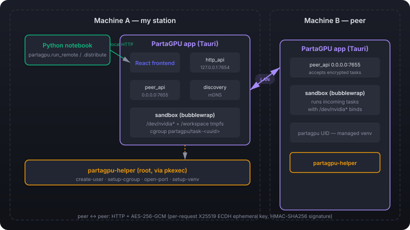
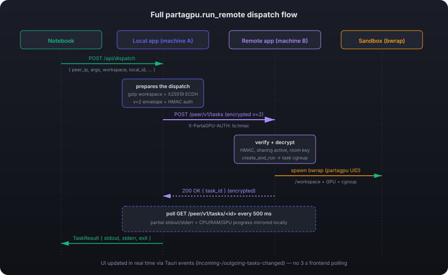

🇫🇷 [Version française](ARCHITECTURE.md)

# PartaGPU Architecture

This document explains **how PartaGPU works internally**: components, protocols, security, and how DDP orchestration plugs into the peer-to-peer infrastructure. For the user guide, see the [main README](../README.en.md) and the [Python package README](../python/README.en.md).

---

## Table of contents

1. [Big picture](#big-picture)
2. [The two HTTP servers](#the-two-http-servers)
3. [Peer authentication via HMAC](#peer-authentication-via-hmac)
4. [Peer-to-peer message encryption](#peer-to-peer-message-encryption)
5. [Execution sandbox](#execution-sandbox)
6. [`run_remote` task flow](#run_remote-task-flow)
7. [DDP orchestration with `distribute`](#ddp-orchestration-with-distribute)
8. [Multi-GPU per machine](#multi-gpu-per-machine)
9. [Task cancellation](#task-cancellation)
10. [UI dispatcher (single + DDP grouped)](#ui-dispatcher)
11. [Concurrent-task cap](#concurrent-task-cap)
12. [Streaming via Tauri events](#streaming-via-tauri-events)
13. [Real-time log streaming](#real-time-log-streaming)
14. [Per-task resource monitoring](#per-task-resource-monitoring)
15. [Task persistence](#task-persistence)
16. [Workspace compression](#workspace-compression)
17. [Per-task cgroup isolation](#per-task-cgroup-isolation)
18. [Managed peer-side venv](#managed-peer-side-venv)
19. [mDNS discovery](#mdns-discovery)
20. [Privileges and helper](#privileges-and-helper)
21. [Security model](#security-model)

---

## Big picture

PartaGPU is a Tauri application (Rust backend + React frontend) that turns a PC into a **shareable compute node** on a LAN. Once several PCs are in the same *room* (same shared secret), they form an ad-hoc cluster capable of running arbitrary code — typically PyTorch DDP — spread across every available GPU.

### Components



- **Frontend** (React + TypeScript, Vite): 4 tabs *My sharing* / *My usage* / *Fleet view* / *Guide*. Talks to the backend via Tauri `invoke`. Bilingual FR/EN, switchable via a flag in the header.
- **Rust backend** (`src-tauri/src/`): modules for auth, discovery, sandbox, sharing, monitoring, two HTTP servers, security log.
- **Privileged Rust helper** (`src-tauri/helper/`, separate binary): operations that need root (user creation, cgroups, firewall). Launched via `pkexec` with a dedicated PolicyKit rule.
- **Python package** (`python/src/partagpu/`): minimal client (`requests` only) that talks to the local API on `127.0.0.1:7654` to discover GPUs and dispatch tasks.

---

## The two HTTP servers

The app exposes **two** HTTP servers, hand-rolled in Rust with `tokio` (no framework, ~150 LOC each). This is deliberate: they have very different audiences and auth rules.

### `127.0.0.1:7654` — local API

**Audience**: Python clients on the same machine, plus the Tauri frontend (read-only).

**Auth**: none (loopback bind, only local processes can reach it).

**Routes**:
- `GET /api/peers` — list of peers discovered via mDNS (serialization of `Vec<Peer>`)
- `GET /api/gpu` — list of available GPUs, **one entry per CUDA device** (`device_index` field). Local: enumerated via `nvidia-smi`. Verified sharing peers: expanded based on `peer.gpu_count`.
- `GET /api/status` — local sharing state (Active/Paused/Disabled + limits)
- `POST /api/dispatch` — **submit a task to a peer**. Body:
  ```json
  {
    "peer_ip": "192.168.70.105",
    "args": ["python3", "-c", "..."],
    "timeout_secs": 60,
    "network": true,
    "workspace": [{"path": "train.py", "content_b64": "..."}],
    "local_id": "uuid-supplied-by-the-client"
  }
  ```
  The handler:
  1. Verifies the local app is in a room (returns 412 otherwise)
  2. Creates an `OutgoingTasks` entry with status `Queued` (UI sees it immediately). If `local_id` is provided, that's the id used; otherwise a UUID is generated.
  3. On a `spawn_blocking` thread: POSTs to `<peer_ip>:7655/peer/v1/tasks` with header `X-PartaGPU-AUTH` computed over (POST, /peer/v1/tasks, encrypted body)
  4. Reads `task_id` (from the peer), saves `(peer_ip, remote_task_id)` in `OutgoingTasks::remote_refs[local_id]` to enable later cancellation, flips OutgoingTask to `Running`
  5. Polls `<peer_ip>:7655/peer/v1/tasks/<task_id>` every 500 ms
  6. When the task reaches a terminal state (`Completed`/`Failed`/`Cancelled`), updates OutgoingTasks and **returns the full `Task`** to the client
  7. On timeout: marks failed and returns 502.

  This endpoint is **blocking by design**: the Python notebook just waits for the result. For long-running tasks we could go async (Phase 4 of the roadmap).

  The dispatch logic is extracted as `pub fn dispatch_task_blocking()`, reusable from any sync context (HTTP handler via spawn_blocking, or the `dispatch_task` Tauri command called by the UI dispatcher).

- `POST /api/cancel` — **cancel an outgoing task**. Body: `{"local_id": "..."}`. Looks up the matching `remote_ref`, computes the HMAC header for (DELETE, /peer/v1/tasks/<remote_id>, empty body), performs `DELETE http://<peer_ip>:7655/peer/v1/tasks/<remote_id>`, then marks the OutgoingTask `Cancelled`. If the peer is unreachable, marks it Cancelled locally anyway and returns 502 with `remote: false`.

### `0.0.0.0:7655` — peer-to-peer API

**Audience**: other PartaGPU machines on the LAN.

**Auth**: `X-PartaGPU-AUTH: <ts>:<hmac_hex>` header validated by `AuthManager::verify_request_auth`. The request is accepted when:
- The local app is `is_joined()` (in a room)
- Sharing is `Active`
- The timestamp is within ±30 s (`AUTH_WINDOW_SECS`)
- The HMAC `HMAC-SHA256(auth_key, "PartaGPU/auth-req/v1\n" || ts || "\n" || method || "\n" || path || "\n" || sha256(body))` matches in constant time

**Routes**:
- `GET /peer/v1/health` — no auth, returns `{hostname, version, in_room, sharing_active}`. Used as a probe.
- `POST /peer/v1/tasks` — **receive a task** from a verified peer. Body:
  ```json
  {
    "args": [...],
    "source_user": "alice",
    "timeout_secs": 60,
    "network_enabled": true,
    "workspace": [...]
  }
  ```
  Auth → resolve `source_machine` from the source TCP IP (lookup in `discovery.get_peers()`, preferring `display_name` then `hostname` then the raw IP) → `IncomingTasks::create_and_run(...)` which spawns the sandbox in a thread and returns a `task_id` immediately. The `source_machine` shows up in the "Who's using my resources?" table on the peer.
- `GET /peer/v1/tasks/<id>` — same auth, returns the full `Task` struct (status, output, error_output, exit_code).
- `DELETE /peer/v1/tasks/<id>` — **cancel** a running task. Same auth. Marks the task `Cancelled` in `IncomingTasks`, sends `SIGTERM` to the bwrap PID, then `SIGKILL` after 2 s if still alive. Logged in `SecurityLog` with `EventCategory::TaskRejected`.

Why a separate server from 7654? Because 7654 is **loopback** (security: not network-exposed), while 7655 must be reachable from the LAN. Mixing them would complicate auth (read-only no-auth on one side, write with HMAC auth on the other).

---

## Peer authentication via HMAC

The system is **shared-secret**: every member of a room derives the same keys from the 4-word passphrase. Auth relies on HMAC-SHA256 bound to the request body (method + path + sha256(body) + timestamp), not just to a timestamp — a captured header cannot be replayed against a different request.

### Room creation flow

1. The app generates a random 20-byte secret
2. The **first 4 bytes** index into a `WORDLIST` of 256 French words → the passphrase (4 words, ~4 billion combinations)
3. The passphrase is dictated aloud to classmates
4. On join, the app converts the passphrase back to bytes, then pads with `SHA1(seed)[..16]` to reconstruct the 20-byte canonical secret
5. The secret is saved to `~/.config/partagpu/room.json` (mode 0600)
6. On every load, the `auth_key` (32 bytes) is derived via `PBKDF2-HMAC-SHA256(secret, salt = "PartaGPU/auth-key-pbkdf2-v2", iters = 600 000)` — slow KDF for brute-force resistance (~100 ms in release), distinct from the AES `room_key` which stays on HKDF-SHA256

### Peer verification

No HMAC tag is broadcast in the mDNS TXT — verification is an active challenge-response over HTTP. `Discovery` spawns a thread per newly-seen peer that:
1. Generates a 16-byte random nonce
2. `GET http://<peer_ip>:7655/peer/v1/verify?nonce=<hex>`
3. The peer (if in a room) responds `{"hmac": "<HMAC-SHA256(auth_key, "PartaGPU/verify-resp/v1\n" || nonce_bytes) hex>"}`
4. The prober recomputes and constant-time compares → `verified=true` on match, `false` otherwise

A `start_reverify_loop` background loop re-probes every peer every 60 s to catch state changes (peer leaving the room, passphrase rotation, etc.).

The `/peer/v1/verify` route is **unauthenticated** (it IS the auth bootstrap), but the combination [slow KDF + full 256-bit non-truncated HMAC] makes mass tag collection useless for an attacker: each candidate passphrase costs ~100 ms of PBKDF2 regardless of how many tags they observe.

### HTTP request auth between peers

For `POST /peer/v1/tasks`, `GET /peer/v1/tasks/<id>` and `DELETE /peer/v1/tasks/<id>`, the client sends a header :

```
X-PartaGPU-AUTH: <unix_ts>:<HMAC-SHA256(auth_key, "PartaGPU/auth-req/v1\n" || ts || "\n" || method || "\n" || path || "\n" || sha256(body)) hex>
```

The server (`peer_api::handle_connection`) verifies auth **before** decryption, on the wire bytes (the encrypted JSON envelope for POST, empty for GET/DELETE):
1. Parses `<ts>:<hmac>` (otherwise 401 Malformed)
2. Verifies `|now - ts| ≤ 30 s` (otherwise 401 TimestampOutOfWindow)
3. Recomputes the HMAC, constant-time compares (otherwise 401 Mismatch)

The HMAC **binds the auth to the body** : a captured header cannot be replayed on a different request even within the 30 s window. And an attacker who doesn't know the `auth_key` never reaches the AES layer — auth is gated before decryption.

**HMAC auth only provides authenticity + envelope integrity + anti-replay**, not body confidentiality — an attacker eavesdropping in clear would see the ciphertext but not the plaintext (cf. next section on AES-256-GCM).

---

## Peer-to-peer message encryption

Every body exchanged on the peer-API (port 7655, except `/peer/v1/health`) is encrypted with **AES-256-GCM** keyed off the room secret.

### Two envelope versions

The wire format evolves by version. The server accepts both; the client prefers v=2 as soon as it knows the peer's ephemeral pubkey.

| Version | AES key derived from | Forward secrecy | When |
|---|---|---|---|
| **v=1** | HKDF(room_secret) only | no | fallback when the peer hasn't published an ephemeral pubkey yet |
| **v=2** | HKDF(room_secret \|\| ECDH(client_eph, server_eph)) | **yes** (10 min, see rotation) | default |

### v=1 key derivation (fallback)

```
key = HKDF-SHA256(
    ikm    = base32_decode(room_secret),     // already shared via the passphrase
    salt   = "PartaGPU/peer-api/v1",
    info   = "AES-256-GCM message key",
    length = 32 bytes,
)
```

### v=2 key derivation (forward-secret, default)

On the **server** side, every app start generates an X25519 keypair (`StaticSecret`, 32-byte public) kept **in RAM only**. The pubkey is announced via mDNS (TXT field `eph_pk`). Every 10 minutes, a background thread calls `EphemeralKey::rotate()` which generates a new keypair, demotes the old one to *previous* (still valid for ~60 s for in-flight requests), and re-publishes the new pubkey over mDNS.

On the **client** side, every request generates **its own** ephemeral X25519 pair, computes the shared secret `ECDH(client_eph_priv, server_eph_pub)` and derives the session key:

```
session_key = HKDF-SHA256(
    ikm    = ECDH_shared_secret,
    salt   = HKDF(room_secret),              // used as salt in v=2
    info   = "AES-256-GCM session key v2 (room|ecdh)",
    length = 32 bytes,
)
```

The same session key is used for both the request **and** the response (the server derives it identically via `ECDH(server_eph_priv, client_eph_pub)`).

### Envelope format

```json
{
  "v":      2,
  "nonce":  "<random 12 bytes, base64>",
  "ct":     "<ciphertext + GCM tag, base64>",
  "eph_pk": "<32-byte client X25519 pubkey, base64>"
}
```

`eph_pk` is absent in v=1 and in v=2 **responses** (the other side already has the session key). Content-Type in both cases: `application/x-partagpu-encrypted-v1`.

### Server-side operation order ([peer_api.rs](../src-tauri/src/peer_api.rs))

```
1. read_request                         # parse method/path/headers/body
2. if route ∈ /peer/v1/tasks* and body non-empty:
   - check Content-Type == ENCRYPTED_CONTENT_TYPE   (else 415)
   - check room_key available                       (else 415)
   - based on env.v:
       v=1: session_key = room_key
       v=2: session_key = HKDF(room|ECDH(server_eph, env.eph_pk))
            try current then previous (60 s grace window)
   - decrypt(body) -> plaintext JSON                (else 415)
   - replace req.body with plaintext
3. dispatch to handle_submit / handle_get_task / handle_cancel_task
4. if status 2xx AND route encrypted:
   - encrypt(response_body, session_key) -> envelope (eph_pk omitted)
   - write_response with Content-Type = ENCRYPTED_CONTENT_TYPE
5. else (4xx, 5xx): send plaintext
```

Errors (4xx, 5xx) stay plaintext because the client may not have the key (which is what generated the 4xx). An encrypted 401 body would be unreadable.

### Client-side operation order ([http_api.rs::run_remote_blocking](../src-tauri/src/http_api.rs))

```
1. derive_room_key from auth.get_secret()
2. lookup peer.eph_pk via Discovery (empty → fallback to v=1)
3. if v=2: (envelope, session_key) = encrypt_v2(room, peer_eph_pk, body)
   else  : envelope = encrypt(room_key, body) ; session_key = room_key
4. ureq::post(url, Content-Type: ENCRYPTED..., X-PartaGPU-AUTH: <ts>:<hmac>, body=envelope)
5. if 2xx: decrypt(response_body, session_key) -> Task JSON
   else: read response.text() in plaintext
```

### Properties

- **Confidentiality**: a LAN sniffer reads nothing (Python script, workspace data, stdout/stderr).
- **Integrity**: any flipped bit in the ciphertext fails decryption (GCM tag rejected). The server returns 415.
- **Room-level authenticity**: only secret holders can produce an envelope that decrypts cleanly. Combined with the `X-PartaGPU-AUTH` HMAC header, we get auth + integrity + anti-replay over the 30 s window.
- **Forward secrecy (v=2)**: the private half of the ephemeral keypairs never leaves RAM and is rotated every 10 min. An attacker who captures traffic and then steals the room passphrase **can no longer decrypt** sessions older than 10 minutes.

### Out of scope

- **Protection against an in-room attacker**: by construction, every room peer holds the room key. The threat model is "LAN attacker NOT in the room".

### Tests

- **Unit** (`cargo test --lib crypto::`): v=1 and v=2 round-trip, wrong key, tampered ciphertext, wrong server eph key, rotation grace window, forward secrecy after rotation, JSON round-trip.
- **Integration** (`cargo test --test peer_api_e2e`): plaintext refusal (415), refusal without an X-PartaGPU-AUTH header (401), refusal of an envelope encrypted with a wrong secret (415/401), full v=2 round-trip against a real localhost server, 404 on unknown cancel, two distinct instances mutually verifying and dispatching to each other.

---

## Execution sandbox

Every task received from a peer runs inside a **bubblewrap** sandbox (`bwrap`), executed via `IncomingTasks::create_and_run` → `Sandbox::execute_with_options` (cf. [src-tauri/src/sandbox.rs](../src-tauri/src/sandbox.rs)).

### bwrap flags applied

```
bwrap \
  --ro-bind /usr /usr  --ro-bind /lib /lib  --ro-bind /lib64 /lib64 \
  --ro-bind /bin /bin  --ro-bind /sbin /sbin  --ro-bind /etc /etc \
  --proc /proc \
  --dev /dev \
  --dev-bind /dev/nvidia0 /dev/nvidia0 \         # GPU passthrough
  --dev-bind /dev/nvidiactl /dev/nvidiactl \     # (loop for /dev/nvidia*)
  --dev-bind /dev/nvidia-uvm /dev/nvidia-uvm \
  --bind /tmp/partagpu-task-<uuid> /workspace \  # workspace host-bind
  --chdir /workspace \
  --tmpfs /tmp \
  [--unshare-net]                                # IF network_enabled=false
  --unshare-pid \
  --die-with-parent \
  --new-session \
  --uid <partagpu> --gid <partagpu> \
  -- <args>
```

### Security characteristics

- **Read-only filesystem** except `/workspace` and `/tmp` (tmpfs)
- **No network by default** (`--unshare-net`). Lifted only if `network_enabled=true` in the request (required for DDP).
- **Isolated PID namespace**: the task can't see / signal host processes
- **Runs as `partagpu` UID**: dedicated account with no access to other users' homes
- **partagpu cgroup**: CPU/RAM cap enforced by the UI sliders
- **No user `$HOME`**: the sandbox sees nothing of your home

### Workspace: file transfer

The client (Python or another peer) can send files to be materialized in `/workspace` before exec. Implemented as:

1. The client base64-encodes each file and sends `[{path, content_b64}, ...]` in the POST body
2. The server validates each path (relative, no `..`, no NUL)
3. Creates a temp dir on the host (`/tmp/partagpu-task-<uuid>`, mode 0777 so the partagpu UID can write)
4. Decodes and writes each file (mode 0666)
5. bwrap does `--bind <tempdir> /workspace`
6. When the task ends, the tempdir is removed (Drop on `TempWorkspace`)

Global cap: **16 MB** per task (configurable via `MAX_WORKSPACE_BYTES`). For larger datasets: peer-side pre-install or Phase 4 (file streaming).

### GPU passthrough

The sandbox binds every detected `/dev/nvidia*` at exec. CUDA + NCCL work normally inside, provided that the userspace libs (`libcuda.so`, `libcudart.so`, etc., `libnvidia-ml.so`) live under `/usr/lib` (which is r/o-bound).

### Allowlist

Only commands in `Sandbox::allowlist` can be launched. Defaults: `python3`, `python`, `nvidia-smi`, `bash`, `make`, `gcc`, `julia`, `Rscript`, etc. Managed from the UI (page *My sharing* → tab *Allowlist*) or via the Tauri commands `add_to_allowlist` / `remove_from_allowlist`.

---

## `run_remote` task flow



Step-by-step:

1. **Notebook → Local app**: `partagpu.run_remote(...)` POSTs to `127.0.0.1:7654/api/dispatch` with the args, the workspace, and a pre-allocated UUID `local_id` (used to propagate a possible cancellation).
2. **Local app prepares**: gzips each workspace file, derives the session key via X25519 ECDH (envelope v=2) using the peer's ephemeral pubkey from `Discovery`, computes the `X-PartaGPU-AUTH` header HMAC-SHA256(auth_key, ts || POST || /peer/v1/tasks || sha256(encrypted body)).
3. **Local app → Remote app**: encrypted POST to `<peer_ip>:7655/peer/v1/tasks` with `Content-Type: application/x-partagpu-encrypted-v1` and `X-PartaGPU-AUTH: <ts>:<hmac>`.
4. **Remote app validates + decrypts**: verifies the HMAC auth on the wire bytes (before decryption), that the machine is in the room, that sharing is active, then that the room key + ECDH unlock the envelope. Creates the task in `IncomingTasks::create_and_run` with a dedicated sub-cgroup `/sys/fs/cgroup/partagpu/task-<uuid>`.
5. **Sandbox spawn**: bwrap starts as `partagpu` UID, binds the `/dev/nvidia*` nodes, mounts a `/workspace` tmpfs with the POSTed files, applies the cgroup. If the `IncomingTasks::pending` queue is full (configurable cap), the task stays `Queued` and starts when a slot frees up.
6. **Encrypted 200 ACK**: the response `{ task_id }` is encrypted with the same session key, the client decrypts it and stores it in `OutgoingTasks::remote_refs`.
7. **Poll loop**: the local app does a `GET /peer/v1/tasks/<id>` every 500 ms, mirroring partial stdout/stderr + CPU/RAM/GPU progress to the local copy. This loop lives on the Rust backend; **the UI does not poll** — it listens for `outgoing-tasks-changed` Tauri events emitted on every mutation.
8. **Notebook gets the result**: when the peer returns a terminal status (Completed/Failed/Cancelled), `dispatch_task_blocking` returns the full `Task` and the Python client builds a `TaskResult`.

During execution, **machine A's UI** shows 1 outgoing task (page *My usage*), and **machine B's UI** shows 1 incoming task (page *My sharing*), both updated live via Tauri events.

---

## DDP orchestration with `distribute`

`partagpu.distribute(script, args=, ...)` ([python/src/partagpu/distributed.py](../python/src/partagpu/distributed.py)) builds on `run_remote`:

1. **Discovery**: `partagpu.discover()` → `world_size = len(gpus)`
2. **Master address**: rank 0's IP. If "local" with a loopback IP, replaced by the LAN IP (`_local_lan_ip()`)
3. **Workspace**: read `script` + `extra_files` → `dict[str, bytes]` (basename → content)
4. **For each rank `i`**:
   - `LOCAL_RANK_OF_HOST = position-among-host-workers` (computed by `_local_rank_map(gpus)`)
   - `CUDA_VISIBLE_DEVICES = gpu.device_index` (pin to a single physical GPU)
   - `LOCAL_RANK = 0` (consistent with the CVD pin)
   - `PARTAGPU_LOCAL_RANK = position-on-host` (informational, for logs)
   - Cmd: `["env", "MASTER_ADDR=…", …, "python3", script_name, *args]`
5. **Parallel launch**: `ThreadPoolExecutor(max_workers=world_size)` submits `run_remote(...)` for every rank. Each call is individually blocking but they all run concurrently.
6. **Wait**: `as_completed` collects the `TaskResult`s, sorts by RANK, returns `list[TaskResult]`.

### NCCL rendezvous

In each peer's sandbox:
- `--unshare-net` is **omitted** (because `network_enabled=true`)
- The sandbox uses the host's network namespace
- Rank 0 binds `0.0.0.0:MASTER_PORT` (firewall-opened by the helper)
- Other ranks TCP-connect to `MASTER_ADDR:MASTER_PORT`
- NCCL runs `init_process_group`, all-reduce kicks off

The default port is **29500** (range opened by the helper: 29500–29510). To run multiple concurrent trainings, pass `master_port=29501` etc.

---

## Multi-GPU per machine

A machine with N physical GPUs contributes **N distinct entries** to `discover()`: same `host`/`ip`, different `device_index` (0 to N-1).

### Announcement

`Discovery::register` adds `gpu_count` to the mDNS properties. Computed via `crate::resource::list_gpus().len()` which parses `nvidia-smi --query-gpu=index,name,...`. No cache (re-queried on every refresh, ~50 ms).

### Simulation env var

To test multi-GPU logic without the right hardware: `PARTAGPU_FORCE_GPU_COUNT=4 npm run tauri:dev`. `list_gpus()` then yields 4 synthetic `GpuDevice`s. Useful to confirm that `distribute()` produces the right env vars (cf. `examples/smoke_multi_gpu.py`).

### Dispatch

On the Python side (`distributed.py::distribute`):
- `_local_rank_map(gpus)` walks the list, counts workers per IP, gives each its position-on-host
- Each worker gets its own `CUDA_VISIBLE_DEVICES = device_index` → only sees one GPU inside
- `LOCAL_RANK = 0` everywhere (consistent with the CVD pin: a single visible GPU = index 0)
- The script uses `cuda:0`, regardless of the actual physical GPU

### Why `LOCAL_RANK = 0` instead of position-on-host?

If we pinned CVD to a single GPU **and** set `LOCAL_RANK = N`, a script that does `torch.cuda.set_device(LOCAL_RANK)` would crash (trying to set device N when only one is visible). Forcing `LOCAL_RANK = 0` keeps every torchrun-compatible pattern working. The actual position-on-host is still available via `PARTAGPU_LOCAL_RANK` for logging.

---

## Task cancellation

A running task can be cancelled at any time, and the cancellation propagates cleanly end-to-end: from the requesting client to the peer's sandbox process.

### PID tracking on the peer side

`IncomingTasks` keeps a `pids: HashMap<task_id, u32>` of in-flight bwrap PIDs. The PID is recorded via the `on_pid` callback of `Sandbox::execute_with_callbacks` (called right after `spawn`), and removed when the wait loop ends (process dead).

### `IncomingTasks::cancel(task_id)`

```
1. Mark the task `Cancelled` BEFORE SIGTERM (order matters — see below).
2. Send `kill -TERM <pid>` (shell command, not libc — avoids a direct
   libc dependency).
3. Spawn a thread that sleeps 2 s then sends `kill -KILL <pid>` if the
   task is still in the PID map (case where SIGTERM was ignored, e.g.
   a task with a custom signal handler).
4. The wait loop in the execution thread sees bwrap die, captures
   stdout/stderr/exit_code (typically exit 143 = 128+SIGTERM), invokes
   the completion handler.
5. The completion handler detects `task.status == Cancelled` (set in
   step 1) and does NOT override the status with Failed. It only updates
   the outputs and exit_code.
```

The (1)→(2) order is crucial: doing SIGTERM before marking Cancelled would let the wait loop come back BEFORE Cancelled is written, and the completion handler would write `Failed` (since exit != 0).

### Client-side cancellation

`OutgoingTasks::remote_refs: HashMap<local_id, RemoteRef>` where `RemoteRef = { peer_ip, remote_task_id }`. Filled in by `dispatch_task_blocking` after the peer accepted the task.

`http_api::cancel_outgoing_task(auth, outgoing, local_id)` (sync, reusable):
1. Look up the `remote_ref`; if missing → the task never reached the peer (or already finished), just mark `Cancelled` locally and return.
2. Compute the `X-PartaGPU-AUTH` header for (DELETE, /peer/v1/tasks/<remote_id>, empty body).
3. `ureq::delete("http://<peer_ip>:7655/peer/v1/tasks/<remote_id>", X-PartaGPU-AUTH: code)`.
4. If the peer answers 2xx → mark `Cancelled` locally, return `Ok(true)`.
5. If a network error → mark `Cancelled` locally anyway (the user expressed intent), return `Err`.

### Propagation from Python

For `Ctrl+C` in a notebook to cancel the remote task, the Python client must know the `local_id` BEFORE `requests.post(/api/dispatch)` returns. Solution: the client **pre-allocates** a UUID on the Python side and passes it in the dispatch body:

```python
local_id = str(uuid.uuid4())
try:
    requests.post("/api/dispatch", json={..., "local_id": local_id})
except KeyboardInterrupt:
    requests.post("/api/cancel", json={"local_id": local_id})
    raise
```

`partagpu.run_remote()` does exactly this internally. If `local_id` is provided in the body, the app uses it for the OutgoingTask instead of generating one.

### Sibling-rank cancellation in `distribute()`

When a rank crashes mid-DDP, the others stay blocked on `init_process_group` or an `all-reduce`, waiting for the dead rank, until they hit the NCCL timeout (~30 min by default). To avoid this, `distribute()`:

1. Pre-allocates a `local_id` per rank.
2. Launches the workers in parallel via `ThreadPoolExecutor`.
3. On the **first** rank that returns with `TaskResult.ok == False` or raises, calls `partagpu.cancel(local_id)` on every still-running rank.
4. On `KeyboardInterrupt` in the main thread: cancels **every** rank before re-raising.

Cancelled ranks return a `TaskResult` with `status="Cancelled"`. The caller therefore sees every result (one Failed, several Cancelled), not an exception.

### Stop button in the UI

The `TaskList` component renders a **Stop** button on every `Queued`/`Running` task. Depending on `direction`:
- `incoming` → calls the Tauri command `cancel_incoming_task(task_id)` which invokes `IncomingTasks::cancel()`.
- `outgoing` → calls `cancel_outgoing_task(local_id)` which invokes `http_api::cancel_outgoing_task()` (the same function as `POST /api/cancel`, just called directly without the HTTP layer).

---

## UI dispatcher

`src/components/TaskDispatcher.tsx` is a React form that lets you dispatch a command to a peer without going through the Python package. Visible in the *My usage* tab.

### Flow

1. The user picks a peer (dropdown filled from `getPeers`, filtered on `verified && sharing_enabled`), types a command (parsed into argv by a tiny shell-style parser handling `'…'`, `"…"`, `\\`), picks a timeout, optionally toggles "network allowed".
2. Click **Launch** → invokes the `dispatch_task` Tauri command.
3. The Tauri command calls `http_api::dispatch_task_blocking()` (same function as `POST /api/dispatch`, just without the HTTP layer). Sync (runs on the Tauri thread pool), so the JS `await` waits for the actual end of the task on the peer.
4. The final `Task` is rendered in the result panel: status badge, exit_code, stdout/stderr in collapsible `<pre>` blocks.

### Why a Tauri command and not a direct fetch to /api/dispatch?

To avoid a self-loopback HTTP call that would add latency and a useless error surface. Since the UI runs in the same process as `dispatch_task_blocking`, a direct invoke is cleaner.

### Workspace upload

The form includes a **Workspace files** section: a multi-file picker, plus a list of selected files with their sizes and a remove button. On launch, each file is read as `ArrayBuffer` on the JS side, base64-encoded (32 KB chunks to avoid the `String.fromCharCode.apply` stack overflow), and passed via the `workspace` param of the Tauri command. Capped at 16 MB total on the UI side (warning if exceeded) and on the sandbox side.

The user references a file in the command by basename: e.g. after uploading `train.py`, typing the command `python3 train.py` runs the pushed script.

### DDP Dispatcher (F4)

A second section on the same page, the [`DDPDispatcher`](../src/components/DDPDispatcher.tsx) component, lets you launch a **multi-machine** DDP training without Python. The user:
1. Ticks the target peers (a numeric field picks how many GPUs to use on each peer, max = `gpu_count` announced via mDNS).
2. Uploads a `.py` script + companion files.
3. Picks the backend (`nccl` / `gloo`), the master port (default 29500, helper opens 29500–29510), and a timeout.
4. Click **Launch**. The component computes `WORLD_SIZE` (= total selected GPUs), assigns a global `RANK` and a per-peer `LOCAL_RANK` (via a seen-per-IP map), builds the command `env MASTER_ADDR=… MASTER_PORT=… RANK=i WORLD_SIZE=N CUDA_VISIBLE_DEVICES=k python3 script.py args...`, and `dispatchTask`s every rank in parallel.
5. A per-rank progress table updates live via `outgoing-tasks-changed` Tauri events.

Sibling auto-cancel: if a rank fails (`status === Failed` or `dispatchTask` throws), every still-running rank is cancelled via `cancelOutgoingTask` so they don't stay stuck in an impossible NCCL rendezvous.

### Intentional limits

- **No directory tree in the UI workspace** (flat files only). To push a subfolder, use `partagpu.run_remote(..., workspace={"sub/file.py": "..."})` from Python.

---

## Real-time log streaming

Incremental stdout/stderr reading during execution, without waiting for process end. Lets you see `print()` calls of a long training scroll in the UI as they happen.

### Sandbox side

The sandbox reads stdout/stderr from bwrap via two dedicated **reader threads** (`drain_stream`) which consume 4 KB chunks and append them to shared `Arc<Mutex<String>>` buffers. These buffers are either:
- **Internal to the sandbox** if no observer is attached (stand-alone use case, equivalent to the old behavior).
- **Provided by the caller** via the `OutputSink { stdout, stderr }` struct passed to `execute_with_callbacks_and_sink(...)`.

The readers respect a cap (1 MB stdout, 256 KB stderr — configurable via `MAX_STDOUT_BYTES` / `MAX_STDERR_BYTES`) and handle UTF-8 multi-bytes split at chunk boundaries (carry-over to the next chunk).

At end of execution, after `wait_with_timeout`, the sandbox **joins** the reader threads to make sure every byte is captured before returning the `SandboxResult`.

### `IncomingTasks` side

Map `sinks: HashMap<task_id, OutputSink>`:
- `spawn_execution` creates an `OutputSink` BEFORE `execute_*`, registers it in the map, passes it to the sandbox.
- `get(id)` and `list()` read this sink (snapshot via `OutputSink::snapshot()`) if the task is still running, and overwrite `task.output` / `task.error_output` in the returned `Task`. If the task is already done (sink removed), the `Task` is returned as-is.
- The sink is removed from the map as soon as the wait loop returns.

Result: `GET /peer/v1/tasks/<id>` always returns the most up-to-date partial output, whether the task is running or done.

### `OutgoingTasks` side (launching machine)

`update_outputs(local_id, stdout, stderr)` mirrors the partial output from a remote task into the local copy. Called on every tick (~500 ms) of the poll loop in `run_remote_blocking`:

```
loop:
  GET /peer/v1/tasks/<remote_id>     # returns a full Task with partial output
  outgoing.update_outputs(local_id, task.output, task.error_output)
  if task.status == terminal: return task
  sleep 500ms
```

### UI side

The frontend does NOT poll tasks. The backend pushes changes via the `incoming-tasks-changed` and `outgoing-tasks-changed` Tauri events (cf. [Streaming via Tauri events](#streaming-via-tauri-events)):

1. On mount, the *My usage* / *My sharing* pages do a single initial fetch of `getOutgoingTasks` / `getIncomingTasks`.
2. They subscribe to the matching Tauri event via `listen<Task[]>(...)`.
3. Every backend mutation (add, update_progress, mirror_running, set_failed, etc.) calls `notify()` which emits the fresh list.
4. The `TaskDispatcher` component does the same but filters by `local_id` to track the in-flight task and feeds its `livePartial` state.

A `setInterval(3000ms)` remains for data that isn't pushed (mDNS peers, global resources, sharing config). It also acts as a safety net in case an event is missed.

### Why `dispatch_task` is `async`

If `dispatch_task` were sync, Tauri would run its logic on the main IPC thread — blocked for the entire task duration. While that blocked, the UI couldn't invoke anything (refreshes, cancel button, navigation), and `outgoing-tasks-changed` events wouldn't be processed on the front either. With async + `tokio::task::spawn_blocking` for the ureq part, the IPC thread stays free, events are consumed, and output streams live.

Same for `cancel_outgoing_task` which also does sync ureq to the peer.

### Python buffering caveats

In user scripts, `print()` is **block-buffered** by default when stdout is not a TTY (our case: pipe to bwrap). Everything is held in memory until a `flush()`, a newline in line-buffered mode, or process exit. To see `print()` scroll live:
- `print(..., flush=True)` on every call
- or `python3 -u` (unbuffered)
- or `PYTHONUNBUFFERED=1` in the environment (already passed by our sandbox)

The script `examples/ddp_train_demo.py` already uses `print(..., flush=True)`. The sandbox **also forces `PYTHONUNBUFFERED=1`** in every task's environment (cf. [sandbox.rs](../src-tauri/src/sandbox.rs)), so `print()` calls without `flush=True` still arrive live.

---

## Per-task resource monitoring

For the UI to show **progress** that advances and **real CPU/RAM/GPU values** while a task runs (instead of jumping 0% → 100% at the end), `IncomingTasks` spawns a **monitor thread** at startup that runs for the whole app lifetime.

### Loop

```
loop forever:
  sleep 1s
  sysinfo::System.refresh_processes(All)
  for each (task_id, bwrap_pid) in pids:
    tree = collect_descendants(sysinfo, bwrap_pid)
    cpu_total = sum of process.cpu_usage() in tree
    ram_total = sum of process.memory() in tree
    progress = clamp((elapsed / timeout) * 100, 0..99)
    if task.status == Running:
      task.cpu_usage = cpu_total
      task.ram_usage_mb = ram_total
      task.progress = progress
```

### Details

- **Process tree**: `bwrap` is the direct parent, but it's `python3` (and its own descendants) that consumes most CPU/RAM. A `collect_descendants` function BFS-walks sysinfo's process map and keeps everything descending from the bwrap PID. The sum thus includes bwrap + python + every grandchild.

- **Progress = elapsed/timeout**: no intrinsic "30% of the job" measure is possible for an arbitrary command, so we use the elapsed/timeout ratio, capped at 99% until the task actually reaches a terminal state. Imperfect but visible and useful.

- **GPU per-task**: on every monitor tick, `nvidia-smi pmon -c 1 -s u` is run to get per-PID SM utilization. For each task, utilizations are summed over the process tree (bwrap + python + descendants) and fed into `task.gpu_usage`. Falls gracefully to 0 if nvidia-smi is missing or fails, without affecting CPU/RAM tracking.

- **`task_starts` + `task_timeouts`**: two `HashMap<task_id, _>` in `IncomingTasks`, populated in `spawn_execution` when the task transitions to Running, and cleared at the end of the execution thread.

### Launching-machine side (OutgoingTasks)

`run_remote_blocking` polls the peer every 500 ms. On every tick, in addition to mirroring stdout/stderr, it also copies `progress`, `cpu_usage`, `ram_usage_mb`, `gpu_usage` from the remote Task into the local copy. Dedicated method: `OutgoingTasks::mirror_running(local_id, &peer_task)`.

Result: the launching machine's UI (page *My usage*) sees the same live values as the target machine's UI (page *My sharing*).

### Per-user breakdown

The *My sharing* page renders a **Per-user breakdown** panel that stacks current task CPU/RAM/GPU usage by `source_user`. With real-time monitoring, this panel is now populated live instead of staying at 0%. Distinct colors per user (up to 8). It's what a teacher looks at to see which student is saturating the machine.

---

<a id="concurrent-task-cap"></a>
## Concurrent-task cap

To prevent a peer (or a runaway script) from saturating a machine by submitting 100 tasks at once, `IncomingTasks` enforces a limit **N** on the number of `Running` tasks at the same time. Adjustable from the UI (page *My sharing* → "Maximum concurrent tasks" field), bounded 1–64, default 4.

Beyond the cap:
1. The task stays in `Queued` status in `IncomingTasks::tasks` (already visible in the peer panel).
2. Its `SandboxOptions` + timeout are stored in a FIFO queue `pending: VecDeque<PendingTask>`.
3. As soon as a task ends, the wait loop calls `try_start_pending()` which pops the next valid entry and `spawn_execution`s it.

The queue is purely in-memory: an app restart turns every `Queued` into `Cancelled` (via `load_from_disk` → matches `Running | Queued` → Cancelled). Acceptable given the threat model.

Exposed Tauri commands: `get_max_concurrent_tasks` / `set_max_concurrent_tasks`. Raising the cap immediately re-pulls from the queue (no need to wait for a task to end).

---

<a id="streaming-via-tauri-events"></a>
## Streaming via Tauri events

Instead of a 3 s frontend polling loop to refresh task lists, the backend **pushes** every mutation to the frontend via `incoming-tasks-changed` and `outgoing-tasks-changed` Tauri events. Architecture:

1. At startup, `lib.rs::run` injects the `AppHandle` into `IncomingTasks` and `OutgoingTasks` via `set_emitter()` (in the `setup` callback of `tauri::Builder`).
2. Every mutating method (`add`, `update_progress`, `mirror_running`, `set_failed`, `cancel`, `remove`...) calls `notify()` after releasing the lock on `tasks`.
3. `notify()` snapshots the fresh list and calls `app.emit("..-tasks-changed", &payload)`.
4. The `spawn_monitor` thread (1 s) also emits an event at the end of each cycle if a `Running` task saw its CPU/RAM/GPU/progress move.

On the frontend, pages just do an initial fetch then listen:
```typescript
listen<Task[]>("outgoing-tasks-changed", (e) => setTasks(e.payload));
```

A `setInterval(3000ms)` remains for data that isn't pushed (mDNS peers, global resources, sharing config) and acts as a safety net.

---

## Task persistence

To survive an app crash / kill / machine reboot, a background thread persists the `IncomingTasks` / `OutgoingTasks` state every 5 s into `~/.config/partagpu/{incoming,outgoing}-tasks.json` via an atomic write (`.tmp` file + `rename`).

On restart, `IncomingTasks::new`:
1. Loads the JSON if it exists.
2. For every task whose status was `Running` or `Queued`, sets it to `Cancelled` with an explanatory error message (the processes died with the app, can't recover them).
3. Keeps every `Completed` / `Failed` / `Cancelled` task as-is for history.

To avoid writing 100 MB of stdout into JSON across 100 chatty tasks, each `output` / `error_output` is truncated to `PERSIST_OUTPUT_CAP = 50 KB` at serialization time (`task_for_persist`). The in-memory copy is untouched.

The format is `HashMap<String, Task>` for `IncomingTasks`; for `OutgoingTasks` it's a `OutgoingPersisted { tasks, remote_refs }` struct, because we also want to reload `remote_refs` (to keep propagating cancels after a restart in the same session).

---

## Workspace compression

Workspace files go through AES-GCM (which produces incompressible ciphertext). So we **gzip before encryption** in `dispatch_task_blocking`:

```rust
if !workspace.is_empty() {
    crate::sandbox::compress_workspace(&mut workspace)?;
}
```

`compress_workspace` iterates each `WorkspaceFile`, encodes it as gzip via `flate2::write::GzEncoder`, and tags the file with `compression: Some("gzip")`. On the peer side, `peer_api` detects this tag and decompresses via `flate2::read::GzDecoder` before writing into the `/workspace` host-bind tempdir. Idempotent for clients that already pre-compressed (Python could gzip on its side).

Typical gain on text datasets: 60–90% on JSON/CSV/source code. Useless on already-compressed images / archives (gzip plateaus at 0% but doesn't hurt).

---

## Per-task cgroup isolation

Every received task runs in its own sub-cgroup `/sys/fs/cgroup/partagpu/task-<uuid>/` so one task that saturates RAM cannot OOM its neighbors:

1. At boot, the privileged helper (`partagpu-helper setup-cgroup`) initializes `/sys/fs/cgroup/partagpu/` with `subtree_control = "+cpu +memory +pids"` and chowns the dir to `partagpu:partagpu` so the user can create sub-cgroups without pkexec.
2. On every `Sandbox::execute`, we create the `task-<uuid>` sub-dir, duplicate the parent limits (`cpu.max`, `memory.max`, `pids.max`), launch `bwrap` with `--cgroup-bind`, wait for the end, then remove the sub-dir.
3. If sub-cgroup creation fails (kernel without cgroup v2, missing rights), we fall back to the parent cgroup — degraded but functional.

Current limit: no **sub-allocation** of limits (each sub-cgroup inherits 100% of the parent). As long as `max_concurrent` stays small (4 by default), it's not an issue in practice.

---

## Managed peer-side venv

PartaGPU can provision a Python venv pre-loaded with a classic **ML toolkit** on every machine, so the user doesn't need to do `sudo pip install --break-system-packages …` system-wide (which only works for the `partagpu` user, requires a sudo password, and pollutes the system Python).

Pre-installed package list (curated to cover 95% of ML / data-science classes without extra pip installs):

| Package | What for |
|---|---|
| `torch` | Deep learning, GPU compute |
| `torchvision` | Vision datasets / transforms / models |
| `numpy` | N-dim arrays, foundation of everything else |
| `scipy` | Statistics, FFT, optimization, sparse |
| `pandas` | Tabular data |
| `scikit-learn` | Classical ML (regression, clustering, metrics…) |
| `matplotlib` | Plots |
| `pillow` | Image I/O (transitive of torchvision) |

Total: ~3 GB installed. No `transformers` / `datasets` / HuggingFace by default — addable manually with `sudo /var/lib/partagpu/venv/bin/pip install <package>` while a dedicated UI is missing.

### Provisioning

The privileged helper exposes two subcommands:

```
sudo /usr/local/lib/partagpu/partagpu-helper setup-venv
sudo /usr/local/lib/partagpu/partagpu-helper remove-venv
```

`setup-venv`:
1. Creates `/var/lib/partagpu/venv` via `python3 -m venv`.
2. Updates pip in the venv.
3. Installs the toolkit (best effort — torch + torchvision are the heaviest, ~2.5 GB on their own).
4. `chown -R partagpu:partagpu /var/lib/partagpu/venv` so the sandbox UID can read it.

`remove-venv`: `rm -rf /var/lib/partagpu/venv`.

### UI side

Page *My sharing* → section *Python environment for incoming tasks*. Component [`ManagedVenvPanel`](../src/components/ManagedVenvPanel.tsx):
- Status (installed / not installed) + path
- **Install ML toolkit (~3 GB)** button → invokes `setup_managed_venv` async (which runs the helper via pkexec)
- **Update** button (re-runs the install for upgrading)
- **Remove** button → invokes `remove_managed_venv`

The Tauri commands are **async** (`tokio::task::spawn_blocking` around pkexec) because installing torch can block 5–10 minutes. Without that, the UI would freeze during the download (same lesson as for [dispatch_task](#ui-dispatcher)).

### Sandbox side

When `bwrap` launches a task, it:
1. **Bind-mounts `/var/lib/partagpu/venv` (host) → `/opt/partagpu-venv` (sandbox), read-only**, if the directory exists.
2. **Overrides `PATH`**: `/opt/partagpu-venv/bin:/usr/local/bin:/usr/bin:/bin`. Task arguments invoking `python3` (basename, not absolute path) resolve through PATH and find the venv binary first.
3. **Forces `PYTHONUNBUFFERED=1`** in env (useful for streaming, see previous section).

If the venv isn't installed, the sandbox falls back to system `python3` as before — backward-compatible behavior. Users who already installed torch in system Python keep using it.

### Why a venv rather than automatic `pip install --break-system-packages`?

- **No system Python pollution**. The user retains control of their `/usr/lib/python3/dist-packages` for their own tools.
- **Versionable**: someday we can move `torch==2.x` to `torch==2.y` cleanly, without risking breakage of another system tool that depends on a specific version.
- **Uninstallable in one `rm -rf`**, without breaking apt.
- **Multi-user**: every local user who launches PartaGPU shares the same venv (seen via the sandbox), not one per user.

### Current limits

- Fixed package list (cf. table above). To add (`transformers`, `jax`, `optuna`, `lightning`…), either edit the helper or run `sudo /var/lib/partagpu/venv/bin/pip install <package>` manually. No UI to add/remove a package — would land in a future iteration, possibly a "per-task requirements" mode for niche cases.
- No progress indicator during install (pkexec hides the helper's stdout). The UI shows a spinner; the `npm run tauri:dev` terminal shows pip output if you want to follow.
- No auto-update. If torch ships a new version, the user must click "Update".

---

## mDNS discovery

`mdns-sd` crate. Service type: `_partagpu._tcp.local.`, port 7654 (more for convention than relevance — what matters is the IP).

Announced properties:
- `hostname` (system)
- `display_name` (custom name from the UI, persisted)
- `sharing` (`true` if Active)
- `cpu_limit`, `ram_limit`, `gpu_limit` (slider limits)
- `gpu_count` (number of detected CUDA devices)
- `eph_pk` (ephemeral X25519 pubkey for v=2 forward-secret encryption, regenerated at every app start and rotated every 10 minutes)

No auth proof is broadcast in mDNS — verification is the active challenge-response on `/peer/v1/verify` (see *Peer verification*).

The browser (`Discovery::start_browsing`) consumes `ServiceResolved` / `ServiceRemoved` events and applies:
- **Per-peer rate limiting**: 1 update / 2 s (anti-flood)
- **Max peers**: 50 (anti-DoS)
- **Hostname conflict detection** (two IPs for the same hostname → `hostname_conflict` flag + alert log)
- **Async `/peer/v1/verify` probe** on every new peer → flips `verified` after a valid HMAC response
- **Periodic re-verification** (`start_reverify_loop`) every 60 s to catch peers that left the room

Periodic re-announcement (`start_mdns_refresh`) every 5 s **if state changed** (sharing status, limits, gpu_count, eph_pk) — avoids flooding when nothing moves.

---

## Privileges and helper

Operations needing root go through a separate `partagpu-helper` binary (workspace member at `src-tauri/helper/`), invoked via `pkexec` with a dedicated PolicyKit rule (`com.partagpu.policy`).

### Helper subcommands

| Cmd | When |
|---|---|
| `create-user` | First sharing activation: creates `partagpu` UID 997, shell `partagpu-shell` (rejects `-c`), blocks SSH/sudo, autostart desktop file |
| `set-password` | Set/update the password (reads stdin so the password never appears in CLI args) |
| `setup-cgroup <cpu> <ram>` | Creates/adjusts `/sys/fs/cgroup/partagpu/{cpu.max, memory.max}`. Subsequent adjustments are direct writes (the user UID can write into the cgroup once created). |
| `open-port` | Opens TCP 7654, **TCP 7655 (peer)**, **TCP 29500–29510 (DDP)**, UDP 5353 (mDNS) via `ufw` or `iptables` |
| `close-port` | Closes the same ports |
| `remove-user` | Fully removes `partagpu` + cgroup + SSH/sudo deny rules. Also wipes `/var/lib/partagpu` including the managed venv (via `userdel --remove`). Kills the user's processes first (`pkill -u partagpu`). Idempotent: no-op if the user doesn't exist. |
| `setup-venv` / `remove-venv` | Provisions / removes `/var/lib/partagpu/venv` with the ML toolkit (torch, torchvision, numpy, scipy, pandas, scikit-learn, matplotlib, pillow). |

### When is pkexec invoked?

Only for `create-user`, `set-password`, `setup-cgroup` (first call), `open-port`, `close-port`, `remove-user`, `setup-venv`, `remove-venv`. Slider adjustments and monitoring **never invoke pkexec** — everything is direct read/write.

### Pause vs Disable

The UI exposes two stop levels with different semantics:

| | Pause | Disable |
|---|---|---|
| Firewall | Closed | Closed (via `remove-user`) |
| `partagpu` account | Unchanged | **Removed** (`userdel --remove`) |
| Running tasks | Unchanged (but no new ones) | **Killed** (`pkill -u partagpu`) |
| Cgroup | Unchanged | **Removed** |
| Managed venv | Unchanged | **Removed** (with `/var/lib/partagpu`) |
| SSH/sudo deny rules | Unchanged | **Removed** |
| To resume | Click *Resume* (instant, no pkexec) | Click *Enable* (full re-create + pkexec, optional venv re-install, ~5 min) |
| Tauri action | `pause_sharing` → `close_port` + status Paused | `disable_sharing` → `remove_user` (via helper, UI confirmation) + status Disabled |

So *Pause* is the default for "I'm done for today but I'll be back tomorrow". *Disable* is for "I'm done with PartaGPU on this machine, full cleanup to free disk and system image".

---

## Security model

See [SECURITY.en.md](../SECURITY.en.md) for the full detail. In summary:

| Layer | Mechanism |
|---|---|
| Discovery | mDNS on the LAN. Rate limit + max peers + hostname conflict detection. |
| Authentication | Shared HMAC-SHA256 (4-word passphrase → 20-byte secret → 32-byte `auth_key` via HKDF). Verified via mDNS (truncated proof) + HTTP `X-PartaGPU-AUTH` header. |
| Incoming tasks | Refused if peer unverified OR sharing not Active OR HMAC invalid / out-of-window. Logged in `SecurityLog`. |
| Execution | bubblewrap: r/o FS, network unshare by default, PID unshare, `partagpu` UID, command allowlist |
| Limits | Cgroups v2 (CPU max, memory max). Outputs capped at 1 MB stdout / 256 KB stderr. Workspace capped at 16 MB. Configurable timeout. |
| Privileges | Separate Rust helper via pkexec, explicit PolicyKit rule. Inputs validated (integers, length, NUL/newline forbidden) before reaching the shell layer. |

### Known limits

- **Workspace reads/writes as the partagpu UID** — two tasks on the same peer each have their own dir but no strong isolation beyond the UUID dir and their respective sub-cgroup.
- **Forward secrecy bounded to ~10 min**: an attacker with RAM access **while a station is running** can decrypt the last 10 minutes of sessions (size of the `EphemeralKey` rotation window).
- See [SECURITY.en.md](../SECURITY.en.md) for the full list and rationale.

---

## Going further

- [Main README](../README.en.md) — overview + user guide
- [Python package README](../python/README.en.md) — Python API reference
- [TROUBLESHOOTING.en.md](TROUBLESHOOTING.en.md) — diagnosis of common errors
- [SECURITY.en.md](../SECURITY.en.md) — detail of security measures
- Source code:
  - Rust backend: [`src-tauri/src/`](../src-tauri/src/)
  - Privileged helper: [`src-tauri/helper/src/main.rs`](../src-tauri/helper/src/main.rs)
  - Python package: [`python/src/partagpu/`](../python/src/partagpu/)
  - Frontend: [`src/`](../src/)
