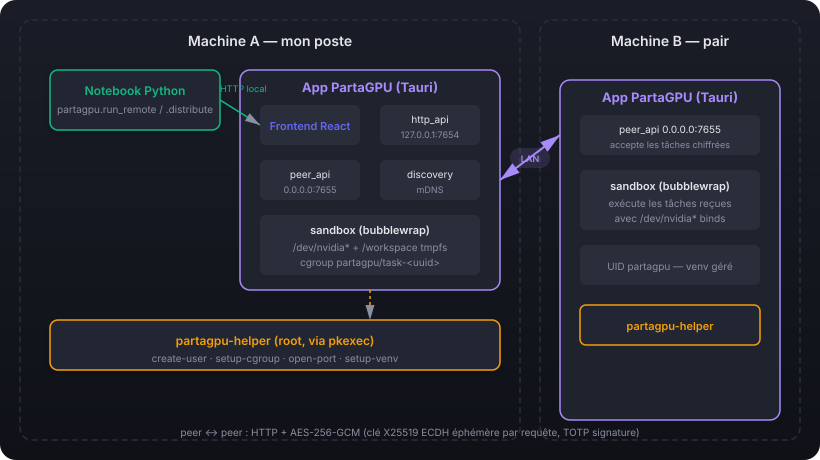
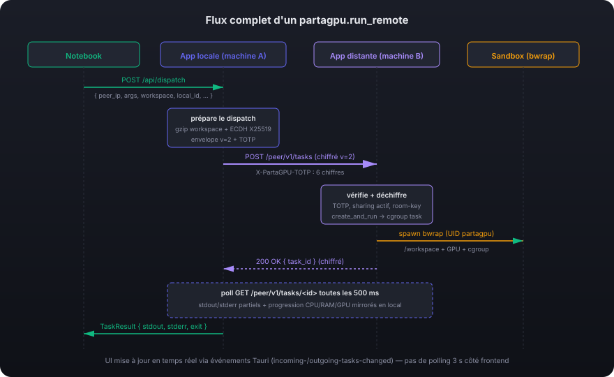

🇬🇧 [English version](ARCHITECTURE.en.md)

# Architecture de PartaGPU

Ce document explique **comment PartaGPU fonctionne en interne** : les composants, les protocoles, la sécurité, et comment l'orchestration DDP se branche sur l'infrastructure pair-à-pair. Pour le guide utilisateur, voir le [README principal](../README.md) et le [README du package Python](../python/README.md).

---

## Table des matières

1. [Vue d'ensemble](#vue-densemble)
2. [Les deux serveurs HTTP](#les-deux-serveurs-http)
3. [Authentification HMAC entre pairs](#authentification-hmac-entre-pairs)
4. [Chiffrement des messages pair-à-pair](#chiffrement-des-messages-pair-à-pair)
5. [Le sandbox d'exécution](#le-sandbox-dexécution)
6. [Flux d'une tâche `run_remote`](#flux-dune-tâche-run_remote)
7. [Orchestration DDP avec `distribute`](#orchestration-ddp-avec-distribute)
8. [Multi-GPU par machine](#multi-gpu-par-machine)
9. [Annulation des tâches](#annulation-des-tâches)
10. [UI dispatcher (single + DDP groupé)](#ui-dispatcher)
11. [Cap de tâches concurrentes](#cap-de-taches-concurrentes)
12. [Streaming via événements Tauri](#streaming-via-evenements-tauri)
13. [Streaming des logs en temps réel](#streaming-des-logs-en-temps-réel)
14. [Monitoring des ressources par tâche](#monitoring-des-ressources-par-tâche)
15. [Persistance des tâches](#persistance-des-taches)
16. [Compression du workspace](#compression-du-workspace)
17. [Per-task cgroup isolation](#per-task-cgroup-isolation)
18. [Venv géré côté pair](#venv-géré-côté-pair)
19. [Découverte mDNS](#découverte-mdns)
20. [Privilèges et helper](#privilèges-et-helper)
21. [Modèle de sécurité](#modèle-de-sécurité)

---

## Vue d'ensemble

PartaGPU est une application Tauri (backend Rust + frontend React) qui transforme un PC en **nœud de calcul partageable** sur un LAN. Une fois plusieurs PC dans la même *salle* (même secret partagé), ils forment un cluster ad-hoc capable d'exécuter du code arbitraire — typiquement du PyTorch DDP — réparti sur tous les GPU disponibles.

### Composants



- **Frontend** (React + TypeScript, Vite) : 4 onglets *Mon partage* / *Mon utilisation* / *Vue parc* / *Guide*. Communique avec le backend via Tauri `invoke`. Bilingue FR/EN, basculable via un drapeau dans l'en-tête.
- **Backend Rust** (`src-tauri/src/`) : modules pour auth, discovery, sandbox, sharing, monitoring, deux serveurs HTTP, journal de sécurité.
- **Helper Rust privilégié** (`src-tauri/helper/`, binaire séparé) : opérations qui demandent root (création d'utilisateur, cgroups, firewall). Lancé via `pkexec` avec règle PolicyKit dédiée.
- **Package Python** (`python/src/partagpu/`) : client minimal (`requests` only) qui parle à l'API locale `127.0.0.1:7654` pour découvrir les GPU et dispatcher des tâches.

---

## Les deux serveurs HTTP

L'application expose **deux** serveurs HTTP, écrits à la main en Rust avec `tokio` (pas de framework, environ 150 lignes de code chacun). C'est délibéré : ces deux API ont des audiences et des règles d'authentification très différentes.

### `127.0.0.1:7654` — API locale

**Audience** : les clients Python sur la même machine, et le frontend Tauri (lecture seule).

**Auth** : aucune (binding sur loopback uniquement, donc seuls les processus locaux y accèdent).

**Routes** :
- `GET /api/peers` — liste des pairs découverts via mDNS (sérialisation de `Vec<Peer>`)
- `GET /api/gpu` — liste des GPU disponibles, **une entrée par carte CUDA** (champ `device_index`). En local, l'énumération se fait via `nvidia-smi` ; pour les pairs vérifiés qui partagent, la liste est étendue selon `peer.gpu_count`.
- `GET /api/status` — état local du partage (Active/Paused/Disabled + limites)
- `POST /api/dispatch` — **soumission d'une tâche à un pair**. Corps de requête :
  ```json
  {
    "peer_ip": "192.168.70.105",
    "args": ["python3", "-c", "..."],
    "timeout_secs": 60,
    "network": true,
    "workspace": [{"path": "train.py", "content_b64": "..."}],
    "local_id": "uuid-fourni-par-le-client"
  }
  ```
  Le gestionnaire :
  1. vérifie que l'on est bien dans une salle (sinon 412) ;
  2. crée une entrée dans `OutgoingTasks` avec le statut `Queued` (immédiatement visible dans l'interface). Si `local_id` est fourni, il est utilisé comme identifiant ; sinon un UUID est généré ;
  3. sur un fil `spawn_blocking`, émet un POST vers `<peer_ip>:7655/peer/v1/tasks` avec un en-tête `X-PartaGPU-AUTH` calculé sur (POST, `/peer/v1/tasks`, corps chiffré) ;
  4. récupère le `task_id` retourné par le pair, enregistre `(peer_ip, remote_task_id)` dans `OutgoingTasks::remote_refs[local_id]` pour permettre une annulation ultérieure, et fait passer l'`OutgoingTask` en `Running` ;
  5. sonde `<peer_ip>:7655/peer/v1/tasks/<task_id>` toutes les 500 ms ;
  6. quand la tâche atteint un état terminal (`Completed`, `Failed` ou `Cancelled`), met à jour `OutgoingTasks` et **retourne le `Task` complet** au client ;
  7. en cas de dépassement du délai, marque la tâche comme échouée et retourne un code 502.

  Ce point d'entrée est **bloquant par conception** : le notebook Python attend simplement le résultat. Pour des tâches longues, on pourrait passer en mode asynchrone (phase 4 de la feuille de route).

  La logique de l'envoi est extraite dans `pub fn dispatch_task_blocking()`, réutilisable depuis n'importe quel contexte synchrone (gestionnaire HTTP via `spawn_blocking`, ou commande Tauri `dispatch_task` appelée par le lanceur de l'interface).

- `POST /api/cancel` — **annulation d'une tâche sortante**. Corps de requête : `{"local_id": "..."}`. La route recherche la `remote_ref` correspondante, calcule l'en-tête HMAC pour (DELETE, `/peer/v1/tasks/<remote_id>`, corps vide), exécute `DELETE http://<peer_ip>:7655/peer/v1/tasks/<remote_id>` puis marque l'`OutgoingTask` comme `Cancelled`. Si le pair est injoignable, l'`OutgoingTask` est tout de même marquée `Cancelled` localement et la route retourne un code 502 avec `remote: false`.

### `0.0.0.0:7655` — API pair-à-pair

**Audience** : les autres machines PartaGPU sur le LAN.

**Authentification** : en-tête `X-PartaGPU-AUTH: <ts>:<hmac_hex>` validé par `AuthManager::verify_request_auth`. La requête est acceptée si :

- l'application locale est `is_joined()` (dans une salle) ;
- le partage est `Active` ;
- l'horodatage est dans la fenêtre ±30 s (`AUTH_WINDOW_SECS`) ;
- le HMAC `HMAC-SHA256(auth_key, "PartaGPU/auth-req/v1\n" || ts || "\n" || method || "\n" || path || "\n" || sha256(body))` correspond en temps constant.

**Routes** :

- `GET /peer/v1/health` — sans authentification ; retourne `{hostname, version, in_room, sharing_active}`. Cette route sert de sonde de disponibilité.
- `POST /peer/v1/tasks` — **réception d'une tâche** d'un pair vérifié. Corps de requête :
  ```json
  {
    "args": [...],
    "source_user": "alice",
    "timeout_secs": 60,
    "network_enabled": true,
    "workspace": [...]
  }
  ```
  L'authentification est validée, puis le `source_machine` est résolu depuis l'IP TCP source (recherche dans `discovery.get_peers()`, en préférant `display_name`, puis `hostname`, puis l'IP brute), avant l'appel à `IncomingTasks::create_and_run(...)` qui lance le bac à sable dans un fil et retourne immédiatement un `task_id`. Le `source_machine` apparaît dans le tableau « Qui utilise mes ressources ? » côté pair.
- `GET /peer/v1/tasks/<id>` — authentification identique ; retourne la structure `Task` complète (statut, sortie, erreur, code de sortie).
- `DELETE /peer/v1/tasks/<id>` — **annulation** d'une tâche en cours. Authentification identique. La tâche est marquée `Cancelled` côté `IncomingTasks`, un `SIGTERM` est envoyé au PID du `bwrap`, puis un `SIGKILL` après 2 s si la tâche est toujours en vie. L'événement est journalisé dans le `SecurityLog` avec `EventCategory::TaskRejected`.

Pourquoi un serveur séparé du 7654 ? Parce que le 7654 reste sur la **boucle locale** (sécurité : non exposée au réseau), tandis que le 7655 doit être joignable depuis le LAN. Mélanger les deux dans un même serveur compliquerait l'authentification (lecture seule sans authentification d'un côté, écriture avec authentification HMAC de l'autre).

---

## Authentification HMAC entre pairs

Le système est **partagé-secret** : tous les membres d'une salle dérivent les mêmes clés à partir de la passphrase de 4 mots. L'auth s'appuie sur HMAC-SHA256 lié au corps de la requête (méthode + chemin + sha256(body) + timestamp), pas seulement à un timestamp — un header capté ne peut pas être rejoué sur une requête différente.

### Flux de création de salle

1. L'application génère un secret aléatoire de 20 octets.
2. Les **4 premiers octets** indexent un `WORDLIST` de 256 mots français, ce qui produit la passphrase (4 mots, environ 4 milliards de combinaisons).
3. La passphrase est dictée à l'oral aux camarades.
4. Lorsqu'un autre poste rejoint la salle, l'application reconvertit la passphrase en octets, puis complète avec `SHA1(seed)[..16]` pour reconstruire les 20 octets du secret canonique.
5. Le secret est sauvegardé dans `~/.config/partagpu/room.json` (mode 0600).
6. À chaque chargement, l'`auth_key` (32 octets) est dérivée via `PBKDF2-HMAC-SHA256(secret, salt = "PartaGPU/auth-key-pbkdf2-v2", iters = 600 000)` — une KDF lente résistante à l'attaque par force brute (environ 100 ms en *release*), distincte de la `room_key` AES, elle-même dérivée par HKDF-SHA256.

### Vérification des pairs

Aucun tag HMAC n'est diffusé par mDNS — la vérification se fait par défi-réponse (*challenge-response*) actif sur HTTP. `Discovery` lance un fil d'exécution par nouveau pair découvert via mDNS, qui :

1. génère un *nonce* aléatoire de 16 octets ;
2. émet une requête `GET http://<peer_ip>:7655/peer/v1/verify?nonce=<hex>` ;
3. attend que le pair (s'il est dans une salle) réponde par `{"hmac": "<HMAC-SHA256(auth_key, "PartaGPU/verify-resp/v1\n" || nonce_bytes) hex>"}` ;
4. recalcule la même valeur et la compare en temps constant : `verified=true` si elles correspondent, `false` sinon.

Une boucle `start_reverify_loop` resonde chaque pair toutes les 60 s pour détecter les changements (un pair qui a quitté la salle, qui a fait tourner la passphrase, etc.).

La route `/peer/v1/verify` n'est **volontairement pas authentifiée**, puisqu'elle sert à amorcer l'authentification elle-même. La combinaison [KDF lente + HMAC complet de 256 bits non tronqué] rend néanmoins la collecte massive de tags inutile pour un attaquant : chaque passphrase candidate coûte environ 100 ms de PBKDF2, indépendamment du nombre de tags observés.

### Auth des requêtes HTTP entre pairs

Pour `POST /peer/v1/tasks`, `GET /peer/v1/tasks/<id>` et `DELETE /peer/v1/tasks/<id>`, le client envoie un header :

```
X-PartaGPU-AUTH: <unix_ts_ms>:<HMAC-SHA256(auth_key, "PartaGPU/auth-req/v1\n" || ts || "\n" || method || "\n" || path || "\n" || sha256(body)) hex>
```

L'horodatage est exprimé en **millisecondes** (`AUTH_WINDOW_MS = 30_000`). C'est important : si on était resté à la seconde, le sondage du SDK à 250 ms produirait des en-têtes strictement identiques dans la même seconde et serait rejeté par le cache anti-rejeu du pair (qui mémorise les en-têtes déjà acceptés pendant `2 × AUTH_WINDOW_MS / 1000` secondes — voir `REPLAY_RETENTION_SECS` dans `peer_api`).

Le serveur (`peer_api::handle_connection`) vérifie l'authentification **avant** le déchiffrement, sur les octets reçus tels quels (l'enveloppe JSON chiffrée pour un POST, vide pour un GET ou un DELETE) :

1. il analyse `<ts>:<hmac>` (sinon 401 *Malformed*) ;
2. il vérifie que `|now - ts| ≤ 30_000 ms` (sinon 401 *TimestampOutOfWindow*) ;
3. il vérifie l'absence de l'en-tête dans le cache anti-rejeu (sinon 409 *Replay*) ;
4. il recalcule le HMAC et le compare en temps constant (sinon 401 *Mismatch*) ;
5. il insère l'en-tête dans le cache anti-rejeu pour la durée de rétention.

Le HMAC **lie l'authentification au corps** : un en-tête capturé ne peut pas être rejoué sur une requête différente, même dans la fenêtre de 30 s. Un attaquant qui ne connaît pas l'`auth_key` n'atteint jamais la couche AES — la barrière d'authentification est validée avant le déchiffrement.

**L'authentification HMAC n'apporte que l'authenticité, l'intégrité de l'enveloppe et l'anti-rejeu**, pas la confidentialité du corps — un attaquant qui écoute en clair verrait le texte chiffré (*ciphertext*) mais pas le texte clair (*plaintext*) (voir la section suivante sur le chiffrement AES-256-GCM).

---

## Chiffrement des messages pair-à-pair

Tous les corps de requête échangés sur le peer-API (port 7655, sauf `/peer/v1/health`) sont chiffrés en **AES-256-GCM** avec une clé dérivée du secret de salle.

### Deux versions d'enveloppes

Le format de l'enveloppe transmise sur le réseau évolue par version (interne au protocole peer-API, sans rapport avec la version de l'application). Le serveur accepte les deux ; le client préfère `v=2` dès qu'il connaît la clé publique éphémère du pair.

| Version | Clé AES dérivée de | Confidentialité persistante | Quand |
|---|---|---|---|
| **`v=1`** | `HKDF(room_secret)` seul | non | repli (*fallback*) lorsque le pair n'a pas encore publié sa clé publique éphémère |
| **`v=2`** | `HKDF(room_secret \|\| ECDH(client_eph, server_eph))` | **oui** (10 min, voir rotation) | par défaut |

### Dérivation de la clé `v=1` (mode de repli)

```
key = HKDF-SHA256(
    ikm    = base32_decode(room_secret),     // déjà partagé via la passphrase
    salt   = "PartaGPU/peer-api/v1",
    info   = "AES-256-GCM message key",
    length = 32 bytes,
)
```

### Dérivation de la clé `v=2` (à confidentialité persistante, par défaut)

Côté **serveur**, à chaque démarrage de l'application on génère une paire de clés X25519 (`StaticSecret`, partie publique de 32 octets) conservée **uniquement en RAM**. La clé publique est annoncée par mDNS (champ TXT `eph_pk`). Toutes les 10 minutes, un fil d'arrière-plan appelle `EphemeralKey::rotate()` qui génère une nouvelle paire de clés, rétrograde l'ancienne en *previous* (encore valide environ 60 s pour les requêtes en vol), et republie la nouvelle clé publique par mDNS.

Côté **client**, pour chaque requête on génère **une autre** paire X25519 éphémère, on calcule le secret partagé `ECDH(client_eph_priv, server_eph_pub)` et on dérive la clé de session :

```
session_key = HKDF-SHA256(
    ikm    = ECDH_shared_secret,
    salt   = HKDF(room_secret),              // utilisé comme salt en v=2
    info   = "AES-256-GCM session key v2 (room|ecdh)",
    length = 32 bytes,
)
```

La même clé de session sert pour la requête **et** la réponse (le serveur la dérive identiquement de son côté grâce à `ECDH(server_eph_priv, client_eph_pub)`).

### Format d'enveloppe

```json
{
  "v":      2,
  "nonce":  "<12 octets aléatoires, base64>",
  "ct":     "<texte chiffré + tag GCM, base64>",
  "eph_pk": "<32 octets, clé publique X25519 du client, base64>"
}
```

Le champ `eph_pk` est absent en `v=1` et dans les **réponses** `v=2` (l'autre côté a déjà la clé de session). Le `Content-Type` est dans les deux cas `application/x-partagpu-encrypted-v1`.

### Ordre d'opérations côté serveur ([peer_api.rs](../src-tauri/src/peer_api.rs))

```
1. read_request                         # parse method/path/headers/body
2. si route ∈ /peer/v1/tasks* et body non vide :
   - check Content-Type == ENCRYPTED_CONTENT_TYPE  (sinon 415)
   - check room_key disponible                     (sinon 415)
   - selon env.v :
       v=1 : session_key = room_key
       v=2 : session_key = HKDF(room|ECDH(server_eph, env.eph_pk))
             essaie current puis previous (grace window 60 s)
   - decrypt(body) -> plaintext JSON               (sinon 415)
   - replace req.body par plaintext
3. dispatch vers handle_submit / handle_get_task / handle_cancel_task
4. si status 2xx ET route encrypted :
   - encrypt(response_body, session_key) -> envelope (eph_pk omis)
   - write_response avec Content-Type = ENCRYPTED_CONTENT_TYPE
5. sinon (4xx, 5xx) : envoyer en clair
```

Les erreurs (4xx, 5xx) restent en clair parce que le client peut ne pas avoir la clé (c'est ça qui a généré le 4xx). Un body 401 chiffré serait illisible.

### Ordre d'opérations côté client ([http_api.rs::run_remote_blocking](../src-tauri/src/http_api.rs))

```
1. derive_room_key depuis auth.get_secret()
2. lookup peer.eph_pk via Discovery (vide → fallback v=1)
3. si v=2 : (envelope, session_key) = encrypt_v2(room, peer_eph_pk, body)
   sinon  : envelope = encrypt(room_key, body) ; session_key = room_key
4. ureq::post(url, Content-Type: ENCRYPTED..., X-PartaGPU-AUTH: <ts>:<hmac>, body=envelope)
5. si 2xx : decrypt(response_body, session_key) -> Task JSON
   sinon : lire response.text() en clair
```

### Propriétés

- **Confidentialité** : un attaquant qui écoute le trafic LAN ne peut rien lire (script Python, données du *workspace*, stdout et stderr).
- **Intégrité** : la moindre altération d'un bit dans le texte chiffré fait échouer le déchiffrement (tag GCM rejeté). Le serveur retourne un code 415.
- **Authenticité au niveau de la salle** : seul un détenteur du secret peut produire une enveloppe qui se déchiffre proprement. Combiné au HMAC de l'en-tête `X-PartaGPU-AUTH`, on obtient authentification, intégrité et anti-rejeu sur la fenêtre de 30 s.
- **Confidentialité persistante (`v=2`)** : la clé privée des paires de clés éphémères ne quitte jamais la RAM et est tournée toutes les 10 minutes. Un attaquant qui capture du trafic et obtient la passphrase de salle plus tard **ne peut plus déchiffrer** les sessions de plus de 10 minutes.

### Hors périmètre

- **Protection contre un membre de la salle** : par construction, tout pair dans la salle possède la clé de salle. Le modèle de menace vise un « attaquant LAN qui n'est PAS dans la salle ».

### Tests

- **Unitaires** (`cargo test --lib crypto::`) : aller-retour `v=1` et `v=2`, mauvaise clé, texte chiffré altéré, mauvaise clé éphémère côté serveur, fenêtre de tolérance lors d'une rotation, confidentialité persistante après rotation, aller-retour JSON.
- **Intégration** (`cargo test --test peer_api_e2e`) : rejet du texte clair (415), rejet sans en-tête `X-PartaGPU-AUTH` (401), rejet d'un en-tête HMAC signé avec un mauvais secret (401), aller-retour `v=2` complet contre un vrai serveur local, code 404 sur l'annulation d'une tâche inconnue, deux instances distinctes qui se vérifient mutuellement et qui s'envoient des tâches l'une à l'autre.

---

## Le sandbox d'exécution

Toute tâche reçue d'un pair tourne dans un sandbox **bubblewrap** (`bwrap`), exécuté via `IncomingTasks::create_and_run` → `Sandbox::execute_with_options` (cf. [src-tauri/src/sandbox.rs](../src-tauri/src/sandbox.rs)).

### Flags bwrap appliqués

```
bwrap \
  --ro-bind /usr /usr  --ro-bind /lib /lib  --ro-bind /lib64 /lib64 \
  --ro-bind /bin /bin  --ro-bind /sbin /sbin  --ro-bind /etc /etc \
  --proc /proc \
  --dev /dev \
  --dev-bind /dev/nvidia0 /dev/nvidia0 \         # GPU passthrough
  --dev-bind /dev/nvidiactl /dev/nvidiactl \     # (boucle pour /dev/nvidia*)
  --dev-bind /dev/nvidia-uvm /dev/nvidia-uvm \
  --bind /tmp/partagpu-task-<uuid> /workspace \  # workspace host-bind
  --chdir /workspace \
  --tmpfs /tmp \
  [--unshare-net]                                # SI network_enabled=false
  --unshare-pid \
  --die-with-parent \
  --new-session \
  --uid <partagpu> --gid <partagpu> \
  -- <args>
```

### Caractéristiques de sécurité

- **Système de fichiers en lecture seule**, sauf `/workspace` et `/tmp` (tmpfs).
- **Pas de réseau par défaut** (`--unshare-net`). L'isolation n'est levée que si `network_enabled=true` dans la requête (requis pour DDP). Quand le réseau est ouvert, on monte également `/run/systemd/resolve/` pour que la résolution DNS fonctionne sous Ubuntu et Debian modernes (`/etc/resolv.conf` y est un lien symbolique).
- **Espace de noms PID isolé** : la tâche ne peut ni voir ni signaler les processus de l'hôte.
- **Exécution sous l'UID `partagpu`** : un compte dédié sans accès aux dossiers personnels des autres utilisateurs.
- **Cgroup partagpu** : les limites CPU, RAM et PIDs sont imposées par les curseurs de l'interface. Le quota `cpu.max` est multiplié par `available_parallelism()` côté helper et `user_manager` : 50 % sur 16 cœurs = 8 cœurs effectifs, et non 1/16 de cœur. La limite de RAM par tâche est calculée comme la somme des champs non récupérables de `memory.stat` (`anon + kernel_stack + pagetables + slab + sock`), et non `memory.current` qui inclut le cache de pages (un jeu de données chargé en mémoire via `mmap` gonflerait alors le total, alors que `sysinfo` le considère comme mémoire disponible).
- **GPU SM via CUDA MPS** : si `nvidia-cuda-mps-control` est installé sur l'hôte, un daemon MPS est lancé sous l'UID `partagpu` au passage en *Actif*. Le bac à sable monte `/var/lib/partagpu/mps` par *bind* et exporte `CUDA_MPS_ACTIVE_THREAD_PERCENTAGE=<gpu_limit>` à chaque tâche — le driver CUDA plafonne réellement la part d'unités SM que la tâche peut utiliser. **L'injection MPS est conditionnée à un test de vie** (`pgrep nvidia-cuda-mps-control`) : si le daemon a échoué au démarrage ou s'est arrêté, le bac à sable ne pousse plus la variable d'environnement (sinon les tâches CUDA suivantes plantent avec l'erreur 805 « MPS client failed to connect »). On retombe alors silencieusement en mode purement indicatif ; l'interface affiche un avertissement (« indicative — CUDA MPS inactif ») sur la jauge GPU pour que l'utilisateur sache que son curseur n'est pas appliqué.
- **Pas de `$HOME` utilisateur** : le bac à sable ne voit rien du dossier personnel de l'utilisateur.

### Workspace : transfert de fichiers

Le client (Python ou un autre pair) peut envoyer des fichiers à matérialiser dans `/workspace` avant exec. Implémenté ainsi :

1. Le client encode chaque fichier en base64 et envoie `[{path, content_b64}, ...]` dans le body POST
2. Le serveur valide chaque path (relatif, pas de `..`, pas de NUL)
3. Crée un dir temporaire sur l'hôte (`/tmp/partagpu-task-<uuid>`, mode 0777 pour que l'UID partagpu puisse écrire)
4. Décode et écrit chaque fichier (mode 0666)
5. bwrap fait `--bind <tempdir> /workspace`
6. Quand la tâche se termine, le tempdir est supprimé (Drop sur `TempWorkspace`)

Limite globale : **16 Mo** par tâche (configurable via `MAX_WORKSPACE_BYTES`). Pour les datasets plus gros : pre-installation côté pair, ou Phase 4 (file streaming).

### GPU passthrough

Le sandbox bind tous les `/dev/nvidia*` détectés à l'exec. CUDA + NCCL fonctionnent normalement à l'intérieur, à condition que les libs userspace (`libcuda.so`, `libcudart.so`, etc., `libnvidia-ml.so`) soient sous `/usr/lib` (qui est r/o-bound).

### Allowlist

Seules les commandes dans `Sandbox::allowlist` peuvent être lancées. Defaults : `python3`, `python`, `nvidia-smi`, `bash`, `make`, `gcc`, `julia`, `Rscript`, etc. Géré depuis l'UI (page *Mon partage* → onglet *Allowlist*) ou via les Tauri commands `add_to_allowlist` / `remove_from_allowlist`.

### Récupération d'artefacts (`outputs=`)

Le client peut demander des fichiers à rapatrier depuis `/workspace` après l'exit de la tâche, avant la destruction du tempdir :

1. Le client passe `outputs=["model.pt", "metrics.csv"]` à `run_remote()` ou `distribute()`
2. Le SDK Python sérialise ça dans le body POST `/api/dispatch` (champ `outputs: Vec<String>`)
3. Le local app le propage tel quel au pair via `POST /peer/v1/tasks` (champ `outputs` dans `SubmitBody`)
4. Le pair l'attache à `SandboxOptions.outputs`, lance bwrap normalement
5. Après le `wait()` de bwrap (avant `drop(workspace_host)`), `collect_artifacts()` parcourt la liste : pour chaque chemin, `canonicalize()` puis `starts_with(workspace_root)` rejette les path traversal et symlinks pointant hors workspace ; le contenu est lu et encodé base64
6. Les artefacts sont retournés dans `SandboxResult.artifacts: Vec<Artifact>`, attachés au `Task` final, propagés au client via le poll
7. Le SDK Python décode la base64 et expose `result.artifacts: dict[str, bytes]`

Plafond agrégé `MAX_ARTIFACT_TOTAL_BYTES = 256 MiB` par tâche. Les fichiers qui dépasseraient le cumulatif sont skippés avec un avertissement dans `stderr`. Les artefacts ne sont **pas** persistés sur disque (truncate dans `task_for_persist`) : ils ne survivent pas à un restart de l'app, leur seul usage est d'être rapatriés tant que le client est connecté.

Note polling : le poll local `GET /peer/v1/tasks/<id>` lit le body via `into_reader().take(1 GiB)` plutôt que `into_string()` (capé à 10 MB par défaut) — sinon les artefacts un peu lourds saturent la limite et la cellule reste bloquée indéfiniment dans la boucle de polling.

---

## Flux d'une tâche `run_remote`



Étapes détaillées :

1. **Notebook → App locale** : `partagpu.run_remote(...)` envoie un POST sur `127.0.0.1:7654/api/dispatch` avec les args, le workspace et un `local_id` UUID préalloué (utilisé pour propager une éventuelle annulation).
2. **App locale prépare** : compresse chaque fichier du workspace en gzip, dérive la clé de session via ECDH X25519 (envelope v=2) en utilisant la pubkey éphémère du pair lue dans `Discovery`, calcule le header `X-PartaGPU-AUTH` HMAC-SHA256(auth_key, ts || POST || /peer/v1/tasks || sha256(body chiffré)).
3. **App locale → App distante** : POST chiffré sur `<peer_ip>:7655/peer/v1/tasks` avec `Content-Type: application/x-partagpu-encrypted-v1` et `X-PartaGPU-AUTH: <ts>:<hmac>`.
4. **App distante valide + déchiffre** : vérifie l'auth HMAC sur les bytes wire (avant déchiffrement), que la machine est dans la salle, que sharing est actif, puis que le room key + ECDH déverrouillent l'envelope. Crée la tâche dans `IncomingTasks::create_and_run` avec un sous-cgroup `/sys/fs/cgroup/partagpu/task-<uuid>` dédié.
5. **Sandbox spawn** : bwrap démarre comme UID `partagpu`, bind les `/dev/nvidia*`, monte un `/workspace` tmpfs avec les fichiers du POST, applique le cgroup. Si la file `IncomingTasks::pending` est pleine (cf. cap configurable), la tâche reste en `Queued` et démarre quand un slot se libère.
6. **ACK 200 chiffré** : la réponse `{ task_id }` est chiffrée avec la même clé de session, le client la déchiffre et l'enregistre dans `OutgoingTasks::remote_refs`.
7. **Poll loop** : l'App locale fait un `GET /peer/v1/tasks/<id>` toutes les 500 ms, reflète stdout/stderr partiels + progression CPU/RAM/GPU dans le miroir local. Cette boucle vit côté backend Rust ; **l'UI ne polle pas** — elle écoute les événements Tauri `outgoing-tasks-changed` poussés à chaque mutation.
8. **Notebook reçoit le résultat** : quand le pair retourne un statut terminal (Completed/Failed/Cancelled), `dispatch_task_blocking` retourne le `Task` complet, le client Python construit un `TaskResult`.

Pendant l'exécution, **l'UI de la machine A** affiche 1 outgoing task (page *Mon utilisation*), et **l'UI de la machine B** affiche 1 incoming task (page *Mon partage*), les deux mises à jour en temps réel via les événements Tauri.

---

## Orchestration DDP avec `distribute`

`partagpu.distribute(script, args=, ...)` ([python/src/partagpu/distributed.py](../python/src/partagpu/distributed.py)) bâtit sur `run_remote` :

1. **Découverte** : `partagpu.discover()` → `world_size = len(gpus)`
2. **Master address** : IP du rang 0. Si "local" avec IP loopback, remplace par l'IP LAN (`_local_lan_ip()`)
3. **Workspace** : lecture du `script` + `extra_files` → `dict[str, bytes]` (basename → contenu)
4. **Pour chaque rang `i`** :
   - `LOCAL_RANK_OF_HOST = position-among-host-workers` (calculé par `_local_rank_map(gpus)`)
   - `CUDA_VISIBLE_DEVICES = gpu.device_index` (filtre à un seul GPU physique)
   - `LOCAL_RANK = 0` (cohérent avec le filtre CVD)
   - `PARTAGPU_LOCAL_RANK = position-on-host` (informatif, pour les logs)
   - Cmd : `["env", "MASTER_ADDR=…", …, "python3", script_name, *args]`
5. **Lancement parallèle** : `ThreadPoolExecutor(max_workers=world_size)` qui submit `run_remote(...)` pour chaque rang. Chaque appel est bloquant individuellement, mais ils tournent tous en concurrent.
6. **Attente** : `as_completed` collecte les `TaskResult`, range par RANK, retourne `list[TaskResult]`.

### Rendez-vous NCCL

Dans le bac à sable de chaque pair :

- l'option `--unshare-net` est **omise** (puisque `network_enabled=true`) ;
- le bac à sable utilise donc l'espace de noms réseau de l'hôte ;
- le rang 0 ouvre une socket d'écoute sur `0.0.0.0:MASTER_PORT` (port ouvert dans le pare-feu par le helper) ;
- les autres rangs s'y connectent en TCP à `MASTER_ADDR:MASTER_PORT` ;
- NCCL exécute son `init_process_group`, puis l'opération de réduction collective (*all-reduce* — la primitive qui permet à tous les rangs d'agréger leurs gradients en une seule passe) démarre.

Le port par défaut est **29500** (la plage ouverte par le helper s'étend de 29500 à 29510). Pour lancer plusieurs entraînements en parallèle, passez `master_port=29501`, etc.

---

## Multi-GPU par machine

Une machine qui a N GPU physiques contribue **N entrées distinctes** à `discover()` : même `host`/`ip`, `device_index` différent (0 à N-1).

### Annonce

`Discovery::register` ajoute `gpu_count` aux propriétés mDNS. Calculé via `crate::resource::list_gpus().len()` qui parse `nvidia-smi --query-gpu=index,name,...`. Cache : aucun (re-query à chaque refresh, ~50 ms).

### Variable de simulation

Pour tester la logique multi-GPU sans matériel adéquat : `PARTAGPU_FORCE_GPU_COUNT=4 npm run tauri:dev`. La fonction `list_gpus()` génère alors 4 `GpuDevice` synthétiques. Utile pour vérifier que `distribute()` génère les bonnes env vars (cf. `examples/smoke_multi_gpu.py`).

### Dispatch

Côté Python (`distributed.py::distribute`) :
- `_local_rank_map(gpus)` parcourt la liste, compte les workers par IP, donne à chacun sa position-on-host
- Chaque worker reçoit son propre `CUDA_VISIBLE_DEVICES = device_index` → ne voit qu'un seul GPU à l'intérieur
- `LOCAL_RANK = 0` partout (cohérent avec le filtre CVD : un seul GPU visible = index 0)
- Le script utilise `cuda:0`, peu importe le GPU physique réel

### Pourquoi `LOCAL_RANK = 0` et pas la position-on-host ?

Si on filtrait CVD à un seul GPU **et** qu'on mettait `LOCAL_RANK = N`, un script qui fait `torch.cuda.set_device(LOCAL_RANK)` planterait (essaie de set device N alors qu'un seul est visible). En forçant `LOCAL_RANK = 0`, tous les patterns torchrun-compatibles fonctionnent. La vraie position-on-host reste accessible via `PARTAGPU_LOCAL_RANK` pour les besoins de logging.

---

## Annulation des tâches

Une tâche en cours peut être annulée à tout moment, et l'annulation se propage proprement bout-à-bout : du client qui demande au sandbox du pair qui doit s'arrêter.

### Tracking des PIDs côté pair

`IncomingTasks` maintient un map `pids: HashMap<task_id, u32>` des PIDs des bwrap en cours. Le PID est enregistré via le callback `on_pid` de `Sandbox::execute_with_callbacks` (appelé juste après le `spawn`), et retiré quand le wait loop se termine (process mort).

### `IncomingTasks::cancel(task_id)`

```
1. Marque la tâche `Cancelled` AVANT le SIGTERM (ordre important — voir
   ci-dessous).
2. Envoie `kill -TERM <pid>` (commande shell, pas libc — évite la
   dépendance directe à libc).
3. Spawn un thread qui dort 2 s puis fait `kill -KILL <pid>` si la tâche
   est toujours dans le map de PIDs (cas où SIGTERM est ignoré, ex:
   tâche avec un handler de signal).
4. Le wait loop dans le thread d'exécution voit le bwrap mourir,
   capture stdout/stderr/exit_code (typiquement exit 143 = 128+SIGTERM),
   appelle le completion handler.
5. Le completion handler détecte `task.status == Cancelled` (déjà mis
   en (1)) et n'override PAS le status avec Failed. Il met juste à
   jour les outputs et exit_code.
```

L'ordre (1)→(2) est crucial : si on faisait SIGTERM avant de marquer Cancelled, le wait loop pourrait revenir AVANT qu'on ait écrit Cancelled, et le completion handler écrirait `Failed` (puisqu'exit != 0).

### Annulation côté client

`OutgoingTasks::remote_refs: HashMap<local_id, RemoteRef>` où `RemoteRef = { peer_ip, remote_task_id }`. Renseigné par `dispatch_task_blocking` après que le pair a accepté la tâche.

`http_api::cancel_outgoing_task(auth, outgoing, local_id)` (fonction sync, réutilisable) :
1. Look up `remote_ref` ; si absent → la tâche n'a jamais atteint le pair (ou est déjà terminée), juste marquer `Cancelled` localement et retourner.
2. Calculer le header `X-PartaGPU-AUTH` pour (DELETE, /peer/v1/tasks/<remote_id>, body vide).
3. `ureq::delete("http://<peer_ip>:7655/peer/v1/tasks/<remote_id>", X-PartaGPU-AUTH: code)`.
4. Si le pair répond 2xx → marquer `Cancelled` côté local, retourner `Ok(true)`.
5. Si erreur réseau → marquer `Cancelled` localement quand même (le user a exprimé son intent), retourner `Err`.

### Propagation depuis Python

Pour que `Ctrl+C` dans un notebook annule la tâche distante, le client Python doit savoir le `local_id` AVANT que `requests.post(/api/dispatch)` ne retourne. Solution : le client **pré-alloue** un UUID côté Python et le passe dans le body de dispatch :

```python
local_id = str(uuid.uuid4())
try:
    requests.post("/api/dispatch", json={..., "local_id": local_id})
except KeyboardInterrupt:
    requests.post("/api/cancel", json={"local_id": local_id})
    raise
```

`partagpu.run_remote()` fait exactement ça en interne. Si `local_id` est fourni dans le body, l'app utilise cet id pour l'OutgoingTask au lieu d'en générer un.

### Annulation des rangs siblings dans `distribute()`

Quand un rang plante au milieu d'un entraînement DDP, les autres restent bloqués sur l'`init_process_group` ou un `all-reduce`, en attente du rang mort, jusqu'à atteindre le timeout NCCL (~30 min par défaut). Pour éviter ça, `distribute()` :

1. Pré-alloue un `local_id` par rang.
2. Lance les workers en parallèle via `ThreadPoolExecutor`.
3. Sur le **premier** rang qui retourne avec `TaskResult.ok == False` ou qui lève une exception, appelle `partagpu.cancel(local_id)` sur tous les autres rangs encore en cours.
4. Sur `KeyboardInterrupt` dans le main thread : annule **tous** les rangs avant de re-raise.

Les rangs annulés retournent un `TaskResult` avec `status="Cancelled"`. L'appelant voit donc tous les résultats (un Échouée, plusieurs Annulées) au lieu d'une exception.

### Bouton Stop dans l'UI

Le composant `TaskList` rend un bouton **Stop** sur chaque tâche en `Queued` ou `Running`. Selon `direction`:
- `incoming` → appelle la commande Tauri `cancel_incoming_task(task_id)` qui invoque `IncomingTasks::cancel()`.
- `outgoing` → appelle `cancel_outgoing_task(local_id)` qui invoque `http_api::cancel_outgoing_task()` (la même fonction que `POST /api/cancel`, juste appelée directement sans HTTP).

---

## UI dispatcher

`src/components/TaskDispatcher.tsx` est un formulaire React qui permet de dispatcher une commande sur un pair sans passer par le package Python. Visible dans l'onglet *Mon utilisation*.

### Flux

1. L'utilisateur sélectionne un pair (dropdown peuplé depuis `getPeers`, filtré sur `verified && sharing_enabled`), tape une commande (parsée en argv via un mini-parseur shell qui gère `'…'`, `"…"`, `\\`), choisit un timeout, optionnellement coche "réseau autorisé".
2. Click sur **Lancer** → invoke `dispatch_task` (commande Tauri).
3. La commande Tauri appelle `http_api::dispatch_task_blocking()` (la même fonction que `POST /api/dispatch`, juste sans la couche HTTP). C'est sync (s'exécute sur le thread pool Tauri), donc le `await` côté JS attend la fin réelle de la tâche côté pair.
4. Le `Task` final est rendu dans le panneau résultat : badge status, exit_code, stdout/stderr en `<pre>` collapsibles.

### Pourquoi une commande Tauri plutôt qu'un appel HTTP direct vers `/api/dispatch` ?

Pour éviter une boucle HTTP locale (l'interface ferait un *fetch* sur sa propre API loopback) qui ajouterait une latence et une surface d'erreur inutile. Comme l'interface tourne dans le même processus que `dispatch_task_blocking`, l'appel direct via Tauri (`invoke`) est plus propre.

### Téléversement du *workspace*

Le formulaire inclut une section **Fichiers du workspace** : un sélecteur de fichiers (*file picker*) multi-fichiers, accompagné d'une liste des fichiers sélectionnés avec leur taille et un bouton de suppression. Au lancement, chaque fichier est lu sous forme d'`ArrayBuffer` côté JS, encodé en base64 (par blocs de 32 Ko pour éviter le débordement de pile sur `String.fromCharCode.apply`) puis passé via le paramètre `workspace` de la commande Tauri. Le total est plafonné à 16 Mo côté interface (un avertissement s'affiche en cas de dépassement) et côté bac à sable.

L'utilisateur référence un fichier dans la commande par son nom de base : par exemple, après avoir téléversé `train.py`, il suffit de taper `python3 train.py` pour lancer le script.

### Lanceur DDP

Une seconde section sur la même page, le composant [`DDPDispatcher`](../src/components/DDPDispatcher.tsx), permet de lancer un entraînement DDP **multi-machines** sans passer par Python. L'utilisateur :

1. coche les pairs cibles (un champ numérique permet de choisir le nombre de GPU à utiliser sur chaque pair, jusqu'à la valeur `gpu_count` annoncée par mDNS) ;
2. téléverse un script `.py` accompagné de ses fichiers compagnons ;
3. choisit le backend (`nccl` ou `gloo`), le port maître (29500 par défaut ; la plage ouverte par le helper s'étend de 29500 à 29510) et un délai d'expiration ;
4. clique sur **Lancer**. Le composant calcule `WORLD_SIZE` (somme des GPU sélectionnés), assigne un `RANK` global et un `LOCAL_RANK` par pair (via un compteur des rangs déjà vus pour chaque IP), construit la commande `env MASTER_ADDR=… MASTER_PORT=… RANK=i WORLD_SIZE=N CUDA_VISIBLE_DEVICES=k python3 script.py args...`, puis appelle `dispatchTask` en parallèle pour chaque rang ;
5. un tableau de progression par rang se met à jour en direct via les événements Tauri `outgoing-tasks-changed`.

Annulation automatique des rangs frères : si un rang échoue (`status === Failed` ou `dispatchTask` lève une exception), tous les autres rangs encore en vie sont annulés via `cancelOutgoingTask` pour ne pas rester bloqués dans un rendez-vous NCCL impossible.

### Limites volontaires

- **Pas d'arborescence dans le workspace** depuis l'UI (uniquement des fichiers à plat). Pour pousser un sous-dossier, utilisez `partagpu.run_remote(..., workspace={"sub/file.py": "..."})` côté Python.

---

## Streaming des logs en temps réel

Lecture incrémentale de stdout/stderr pendant l'exécution, sans attendre la fin du process. Permet de voir les `print()` d'un long entraînement défiler dans l'UI au fur et à mesure.

### Côté bac à sable

Le bac à sable lit stdout et stderr du `bwrap` via deux **fils de lecture** dédiés (`drain_stream`), qui consomment des blocs de 4 Ko et les ajoutent à des tampons partagés `Arc<Mutex<String>>`. Ces tampons sont :

- soit **internes au bac à sable** si aucun observateur n'est branché (cas d'usage autonome, équivalent à l'ancien comportement) ;
- soit **fournis par l'appelant** via la structure `OutputSink { stdout, stderr }` passée à `execute_with_callbacks_and_sink(...)`.

Les fils de lecture respectent un plafond (1 Mo pour stdout, 256 Ko pour stderr — configurable via `MAX_STDOUT_BYTES` et `MAX_STDERR_BYTES`) et gèrent les caractères UTF-8 multi-octets coupés en fin de bloc (l'octet incomplet est reporté sur le bloc suivant).

À la fin de l'exécution, après `wait_with_timeout`, le bac à sable **rejoint** les fils de lecture pour garantir que tous les octets sont capturés avant de retourner le `SandboxResult`.

### Côté `IncomingTasks`

Une map `sinks: HashMap<task_id, OutputSink>` (un *sink* est ici la destination où atterrissent les octets de stdout/stderr — la structure qui reçoit les flux capturés par les fils de lecture) :

- `spawn_execution` crée un `OutputSink` AVANT l'appel à `execute_*`, l'inscrit dans la map et le passe au bac à sable ;
- `get(id)` et `list()` lisent ce *sink* (instantané des tampons via `OutputSink::snapshot()`) si la tâche est encore en cours, et écrasent `task.output` et `task.error_output` dans le `Task` retourné. Si la tâche est déjà terminée (le *sink* a été retiré de la map à la fin de l'exécution), on retourne le `Task` tel quel ;
- le *sink* est retiré de la map dès que la boucle d'attente revient.

Résultat : un `GET /peer/v1/tasks/<id>` retourne toujours l'output partiel le plus à jour, qu'il s'agisse d'une tâche en cours ou terminée.

### Côté `OutgoingTasks` (machine de lancement)

`update_outputs(local_id, stdout, stderr)` copie l'output partiel d'une tâche distante dans son miroir local. Appelée à chaque tick (~500 ms) du poll loop dans `run_remote_blocking` :

```
loop:
  GET /peer/v1/tasks/<remote_id>     # récupère un Task complet avec output partiel
  outgoing.update_outputs(local_id, task.output, task.error_output)
  if task.status == terminal: return task
  sleep 500ms
```

### Côté SDK Python (`live=True`)

Pour que la **cellule du notebook** voie aussi les logs en temps réel (et pas juste l'app native), le SDK expose `live=True` sur `run_remote()` / `distribute()`. Le mécanisme :

1. Le client génère son `local_id` côté Python avant le POST `/api/dispatch`
2. Un thread `_LivePoller` est démarré qui fait `GET /api/tasks/<local_id>/output?stdout_since=N&stderr_since=M` toutes les ~250 ms (endpoint local-only sur 127.0.0.1:7654)
3. L'app local répond avec un slice byte-wise du `output` / `error_output` courant de l'OutgoingTask (lui-même mis à jour par `mirror_running` à chaque tick du poll vers le pair)
4. Le poller maintient un buffer par stream, splitte sur `\n`, prefixe chaque ligne complète avec `live_prefix` (ex `[rank0] ` dans `distribute`), et écrit atomiquement via un `threading.Lock` partagé entre rangs (sinon les lignes de plusieurs rangs s'entremêlent caractère par caractère)
5. Sur final flush (POST `/api/dispatch` qui rend la main), le poller flush les `tail` éventuels (ligne sans `\n` final) et termine

L'endpoint polling est protégé par les mêmes garde-fous CSRF / DNS-rebinding que `/api/dispatch` (check du `Host` et absence d'`Origin`). Pas d'auth supplémentaire — c'est l'API locale, on est déjà en confiance loopback.

### Côté UI

Le frontend ne polle PAS les tâches. Le backend pousse les changements via les événements Tauri `incoming-tasks-changed` et `outgoing-tasks-changed` (cf. [Streaming via événements Tauri](#streaming-via-evenements-tauri)) :

1. Au mount, les pages *Mon utilisation* / *Mon partage* font un seul fetch initial de `getOutgoingTasks` / `getIncomingTasks`.
2. Elles s'abonnent à l'événement Tauri correspondant via `listen<Task[]>(...)`.
3. Chaque mutation côté backend (add, update_progress, mirror_running, set_failed, etc.) déclenche un `notify()` qui émet la liste fraîche.
4. Le composant `TaskDispatcher` fait pareil mais filtre par `local_id` pour suivre la tâche en cours et alimente son `livePartial` state.

Un `setInterval(3000ms)` reste pour rafraîchir les données qui ne sont pas poussées (peers mDNS, ressources globales, sharing config). Il sert aussi de filet de sécurité au cas où un événement serait perdu.

### Pourquoi `dispatch_task` est `async`

Si `dispatch_task` était sync, Tauri exécuterait sa logique sur le thread IPC principal — bloqué pour toute la durée de la tâche. Pendant ce temps, l'UI ne pourrait plus invoke quoi que ce soit (rafraîchissements, bouton cancel, navigation), et les événements `outgoing-tasks-changed` ne seraient pas non plus traités côté front. En async + `tokio::task::spawn_blocking` pour la partie ureq, le thread IPC reste libre, les events sont consommés, l'output défile en direct.

Idem pour `cancel_outgoing_task` qui fait aussi du ureq sync vers le pair.

### Buffering Python à connaître

Côté script utilisateur, `print()` est par défaut **block-buffered** quand stdout n'est pas un TTY (ce qui est notre cas : pipe vers le bwrap parent). Tout est gardé en mémoire jusqu'à un `flush()`, un newline en line-buffered mode, ou la fermeture du process. Pour voir les `print()` défiler en direct :
- `print(..., flush=True)` à chaque appel
- ou `python3 -u` (unbuffered)
- ou `PYTHONUNBUFFERED=1` dans l'environnement (déjà passé par notre sandbox… non, pas par défaut, à ajouter si on veut)

Le script `examples/ddp_train_demo.py` utilise déjà `print(..., flush=True)`. Le sandbox **force aussi `PYTHONUNBUFFERED=1`** dans l'environnement de chaque tâche (cf. [sandbox.rs](../src-tauri/src/sandbox.rs)), donc les `print()` sans `flush=True` arrivent quand même en direct.

---

## Monitoring des ressources par tâche

Pour que l'UI montre une **progression** qui avance et des **valeurs CPU/RAM** réelles pendant qu'une tâche tourne (au lieu d'un saut 0% → 100% à la fin), `IncomingTasks` lance un **thread monitor** au démarrage qui tourne toute la vie de l'app.

### Boucle

```
loop forever:
  sleep 1s
  sysinfo::System.refresh_processes(All)
  pour chaque (task_id, bwrap_pid) dans pids:
    tree = collect_descendants(sysinfo, bwrap_pid)
    cpu_total = somme des process.cpu_usage() du tree
    ram_total = somme des process.memory() du tree
    progress = clamp((elapsed / timeout) * 100, 0..99)
    si task.status == Running:
      task.cpu_usage = cpu_total
      task.ram_usage_mb = ram_total
      task.progress = progress
```

### Détails

- **Process tree** : `bwrap` est le parent direct, mais c'est `python3` (et ses propres enfants éventuels) qui consomme la majorité du CPU/RAM. Une fonction `collect_descendants` parcourt en BFS la map des processus de sysinfo et retient tout ce qui descend du PID bwrap. La somme inclut donc bwrap + python + tout petit-enfant.

- **Progression = elapsed/timeout** : pas de mesure intrinsèque "30% du job" possible pour une commande arbitraire ; on utilise donc le ratio temps écoulé / timeout, capé à 99 % jusqu'à ce que la tâche atteigne réellement un état terminal. Approximation imparfaite mais visible et utile.

- **GPU per-task** : à chaque tick de monitor, on lance `nvidia-smi pmon -c 1 -s u` pour obtenir la SM-utilization par PID. Pour chaque tâche, on somme les utilisations sur l'arbre de processus (bwrap + python + descendants) et on alimente `task.gpu_usage`. Tombe gracieusement à 0 si nvidia-smi est absent ou échoue, sans affecter le suivi CPU/RAM.

- **`task_starts` + `task_timeouts`** : deux maps `HashMap<task_id, _>` dans `IncomingTasks`, peuplées dans `spawn_execution` quand la tâche transitionne en Running, et nettoyées à la fin du thread d'exécution.

### Côté machine de lancement (OutgoingTasks)

`run_remote_blocking` poll le pair toutes les 500 ms. À chaque tick, en plus de mirror le stdout/stderr, il copie aussi `progress`, `cpu_usage`, `ram_usage_mb`, `gpu_usage` du Task distant dans le miroir local. Méthode dédiée : `OutgoingTasks::mirror_running(local_id, &peer_task)`.

Résultat : l'UI de la machine de lancement (page *Mon utilisation*) voit les mêmes valeurs live que l'UI de la machine cible (page *Mon partage*).

### Répartition par utilisateur

La page *Mon partage* affiche un panneau **Répartition par utilisateur** qui empile les conso CPU/RAM/GPU des tâches courantes par `source_user`. Avec le monitoring temps réel, ce panneau est désormais peuplé en direct au lieu de rester à 0 %. Couleurs distinctes par user (jusqu'à 8). C'est ce qu'un prof regarde pour voir quel élève saturate la machine.

---

<a id="cap-de-taches-concurrentes"></a>
## Cap de tâches concurrentes

Pour empêcher un pair (ou un script en boucle) de saturer une machine en submitant 100 tâches d'un coup, `IncomingTasks` impose une limite **N** sur le nombre de tâches en état `Running` simultanément. Réglable depuis l'UI (page *Mon partage* → champ "Tâches simultanées maximum"), borne 1–64, défaut 4.

Au-delà du cap :
1. La tâche reste en statut `Queued` dans `IncomingTasks::tasks` (déjà visible dans le panneau du pair).
2. Sa `SandboxOptions` + son timeout sont stockés dans une file FIFO `pending: VecDeque<PendingTask>`.
3. Dès qu'une tâche se termine, le wait loop appelle `try_start_pending()` qui dépile le prochain élément valide et `spawn_execution`.

La file est purement en mémoire : un redémarrage de l'app fait passer toutes les `Queued` en `Cancelled` (via le chemin `load_from_disk` → matches `Running | Queued` → Cancelled). Acceptable au vu du modèle de menace.

Tauri commands exposées : `get_max_concurrent_tasks` / `set_max_concurrent_tasks`. Lever le cap ré-amorce immédiatement un pull depuis la file (pas besoin d'attendre une fin de tâche).

---

<a id="streaming-via-evenements-tauri"></a>
## Streaming via événements Tauri

Plutôt qu'un polling 3 s côté frontend pour rafraîchir les listes de tâches, le backend **pousse** chaque mutation au frontend via les événements Tauri `incoming-tasks-changed` et `outgoing-tasks-changed`. Architecture :

1. Au démarrage, `lib.rs::run` injecte l'`AppHandle` dans `IncomingTasks` et `OutgoingTasks` via `set_emitter()` (dans le callback `setup` de `tauri::Builder`).
2. Chaque méthode mutatrice (`add`, `update_progress`, `mirror_running`, `set_failed`, `cancel`, `remove`...) appelle `notify()` après avoir libéré le lock sur `tasks`.
3. `notify()` snapshot la liste fraîche et appelle `app.emit("..-tasks-changed", &payload)`.
4. Le thread `spawn_monitor` qui tourne toutes les secondes émet aussi un événement à la fin de chaque cycle si une tâche `Running` a vu son CPU/RAM/GPU/progression bouger.

Côté frontend, les pages se contentent d'un fetch initial puis écoutent l'événement :
```typescript
listen<Task[]>("outgoing-tasks-changed", (e) => setTasks(e.payload));
```

Un `setInterval(3000ms)` reste pour les données qui ne sont pas poussées (peers mDNS, ressources globales, sharing config) et sert de filet de sécurité.

---

## Persistance des tâches

À la fermeture inopinée de l'application (plantage, processus tué, redémarrage), les listes `IncomingTasks` et `OutgoingTasks` seraient perdues. Pour l'éviter, un fil d'arrière-plan persiste leur état toutes les 5 s vers `~/.config/partagpu/{incoming,outgoing}-tasks.json` via une écriture atomique (fichier `.tmp` puis `rename`).

Au redémarrage, `IncomingTasks::new` :
1. Charge le JSON s'il existe.
2. Pour chaque tâche, si son statut était `Running` ou `Queued`, le passe à `Cancelled` avec un message d'erreur explicatif (les processus sont morts avec l'app, on ne peut pas les rattraper).
3. Garde toutes les tâches `Completed` / `Failed` / `Cancelled` telles quelles pour l'historique.

Pour ne pas écrire 100 Mo de stdout dans le JSON sur 100 tâches volubiles, on tronque chaque `output` / `error_output` à `PERSIST_OUTPUT_CAP = 50 KB` au moment de la sérialisation (`task_for_persist`). La copie en mémoire reste intacte.

Le format est `HashMap<String, Task>` pour `IncomingTasks` ; pour `OutgoingTasks` c'est un struct `OutgoingPersisted { tasks, remote_refs }` parce qu'on veut aussi recharger les `remote_refs` (pour pouvoir continuer à propager des cancels après redémarrage si jamais on garde la même session).

---

## Compression du workspace

Les fichiers du workspace passent par AES-GCM (qui produit du ciphertext incompressible). Donc on **gzip avant chiffrement** côté `dispatch_task_blocking` :

```rust
if !workspace.is_empty() {
    crate::sandbox::compress_workspace(&mut workspace)?;
}
```

`compress_workspace` itère chaque `WorkspaceFile`, encode en gzip via `flate2::write::GzEncoder`, et place une marque `compression: Some("gzip")` sur le fichier. Côté pair, `peer_api` détecte cette marque et décompresse via `flate2::read::GzDecoder` avant d'écrire dans le tempdir bind-monté en `/workspace`. Idempotent pour les clients qui ont déjà pré-compressé (Python pourrait gzip de son côté).

Gain typique sur des datasets texte : 60–90 % sur du JSON / CSV / code source. Inutile sur des images / archives déjà compressées (gzip plafonne à 0 % mais ne déteriore pas).

---

## Per-task cgroup isolation

Chaque tâche reçue tourne dans son propre sous-cgroup `/sys/fs/cgroup/partagpu/task-<uuid>/` pour qu'une tâche qui sature la RAM ne fasse pas OOM ses voisines.

1. Au boot, le helper privilégié (`partagpu-helper setup-cgroup`) initialise `/sys/fs/cgroup/partagpu/` avec `subtree_control = "+cpu +memory +pids"` et chowne le dossier en `partagpu:partagpu` pour permettre la création de sous-cgroups par l'utilisateur sans pkexec.
2. À chaque `Sandbox::execute`, on crée le sous-dir `task-<uuid>`, on duplique les limites parentes (`cpu.max`, `memory.max`, `pids.max`), on lance `bwrap` avec `--cgroup-bind`, on attend la fin, on supprime le sous-dir.
3. Si la création du sous-cgroup échoue (kernel sans cgroup v2, droits manquants), on fallback sur le cgroup parent — comportement dégradé mais fonctionnel.

Limite actuelle : pas de **sub-allocation** des limites (chaque sous-cgroup hérite de 100 % du parent). Tant que `max_concurrent` reste petit (4 par défaut), ça ne pose pas de problème en pratique.

---

## Venv géré côté pair

PartaGPU peut provisionner un venv Python pré-rempli avec une **toolkit ML** classique sur chaque machine, pour éviter à l'utilisateur de faire `sudo pip install --break-system-packages …` côté système (qui ne marche que pour le user `partagpu`, demande un mot de passe sudo, et pollue le Python système).

Liste des packages pré-installés (curatée pour couvrir 95 % des cours ML/data science sans pip install supplémentaire) :

| Package | Pour quoi |
|---|---|
| `torch` | Deep learning, GPU compute |
| `torchvision` | Datasets / transforms / modèles vision |
| `numpy` | Tableaux N-dim, fondation de tout le reste |
| `scipy` | Statistiques, FFT, optim, sparse |
| `pandas` | Données tabulaires |
| `scikit-learn` | ML classique (régression, clustering, métriques…) |
| `matplotlib` | Plots |
| `pillow` | Image I/O (transitive de torchvision) |

Total : ~3 Go installés. Pas de `transformers` / `datasets` / HuggingFace par défaut — ajoutables manuellement via `sudo /var/lib/partagpu/venv/bin/pip install <package>` ou en attendant une UI dédiée.

### Provisionnement

Le helper privilégié expose deux sous-commandes :

```
sudo /usr/local/lib/partagpu/partagpu-helper setup-venv
sudo /usr/local/lib/partagpu/partagpu-helper remove-venv
```

`setup-venv` :
1. Crée `/var/lib/partagpu/venv` via `python3 -m venv`.
2. Met à jour pip dans le venv.
3. Installe la toolkit (best effort — torch + torchvision sont les plus lourds, ~2.5 Go à eux seuls).
4. `chown -R partagpu:partagpu /var/lib/partagpu/venv` pour que la sandbox UID puisse y lire.

`remove-venv` : `rm -rf /var/lib/partagpu/venv`.

### Côté UI

Page *Mon partage* → section *Environnement Python pour les tâches reçues*. Composant [`ManagedVenvPanel`](../src/components/ManagedVenvPanel.tsx) :

- statut (installé ou non installé) et chemin ;
- un bouton **Installer la toolkit ML (~3 Go)** qui appelle (`invoke`) la commande `setup_managed_venv` en mode asynchrone, laquelle lance le helper via pkexec ;
- un bouton **Mettre à jour** qui relance l'installation pour mettre à niveau les paquets ;
- un bouton **Supprimer** qui appelle `remove_managed_venv`.

Les commandes Tauri sont **asynchrones** (`tokio::task::spawn_blocking` autour de pkexec) parce que l'installation de `torch` peut prendre 5 à 10 minutes. Sans cela, l'interface se figerait pendant le téléchargement (voir la même leçon pour [`dispatch_task`](#ui-dispatcher)).

### Côté sandbox

Quand `bwrap` lance une tâche, il :

1. **monte par *bind*** `/var/lib/partagpu/venv` (côté hôte) sur `/opt/partagpu-venv` (côté bac à sable), en lecture seule, si le dossier existe ;
2. **redéfinit le `PATH`** sur `/opt/partagpu-venv/bin:/usr/local/bin:/usr/bin:/bin`. Les arguments de la tâche qui invoquent `python3` (par son nom, pas par chemin absolu) sont résolus via le `PATH` et trouvent donc le binaire du venv en premier ;
3. **force `PYTHONUNBUFFERED=1`** dans l'environnement (utile pour la diffusion en direct, voir la section précédente).

Si le venv n'est pas installé, le bac à sable utilise le `python3` système. Les utilisateurs qui ont déjà installé `torch` dans le Python système continuent de l'utiliser.

### Pourquoi un venv plutôt que `pip install --break-system-packages` automatique

- **Pas de pollution** du Python système. L'utilisateur garde le contrôle de son `/usr/lib/python3/dist-packages` pour ses propres outils.
- **Versionnable** : on peut un jour décider de bouger `torch==2.x` à `torch==2.y` proprement, sans risquer de casser un autre outil système qui dépend d'une version particulière.
- **Désinstallable d'un seul `rm -rf`**, sans casser apt.
- **Multi-utilisateur** : tous les utilisateurs locaux qui lancent l'app PartaGPU partagent le même venv (vu via le sandbox), pas un par user.

### Limites actuelles

- Liste fixe de packages (cf. tableau plus haut). Pour ajouter (`transformers`, `jax`, `optuna`, `lightning`…), il faut soit éditer le helper, soit que l'utilisateur fasse `sudo /var/lib/partagpu/venv/bin/pip install <package>` à la main. Pas d'UI pour ajouter / retirer un package — viendrait dans une itération future, voire un mode "requirements par tâche" pour les cas niche.
- Pas d'indicateur de progression pendant l'install (pkexec masque le stdout du helper). L'UI affiche un spinner et le terminal de `npm run tauri:dev` montre la sortie pip si on veut suivre.
- Pas d'auto-update. Si torch sort une nouvelle version, l'utilisateur doit cliquer "Mettre à jour".

---

## Découverte mDNS

`mdns-sd` crate. Service type : `_partagpu._tcp.local.`, port 7654 (plus pour la convention que pour la pertinence — l'IP est ce qui compte).

Properties annoncées :
- `hostname` (système)
- `display_name` (nom personnalisé via UI, persisté)
- `sharing` (`true` si Active)
- `cpu_limit`, `ram_limit`, `gpu_limit` (limites des sliders)
- `gpu_count` (nombre de CUDA devices détectés)
- `eph_pk` (pubkey X25519 éphémère pour le chiffrement v=2 forward-secret, regénérée à chaque démarrage et tournée toutes les 10 min)

Aucune preuve d'auth n'est diffusée en mDNS — la vérification se fait via le challenge-response actif sur `/peer/v1/verify` (cf. *Vérification des pairs*).

Le module de découverte (`Discovery::start_browsing`) consomme les événements `ServiceResolved` et `ServiceRemoved`, et applique :

- une **limitation de débit** par pair : 1 mise à jour toutes les 2 s (protection contre l'inondation) ;
- un **nombre maximal de pairs** de 50 (protection contre le déni de service) ;
- la **détection des conflits de nom d'hôte** (deux adresses IP pour un même nom d'hôte font lever l'indicateur `hostname_conflict` et déclenchent un message d'alerte dans le journal) ;
- un **sondage `/peer/v1/verify` asynchrone** sur chaque nouveau pair, qui fait basculer `verified` après une réponse HMAC valide ;
- une **revérification périodique** (`start_reverify_loop`) toutes les 60 s pour détecter les pairs qui ont quitté la salle.

Une **réannonce périodique** (`start_mdns_refresh`) est faite toutes les 5 s **si l'état a changé** (statut de partage, limites, `gpu_count`, `eph_pk`), ce qui évite l'inondation quand rien ne bouge.

---

## Privilèges et helper

Les opérations qui demandent root passent par un binaire séparé `partagpu-helper` (workspace member sous `src-tauri/helper/`), invoqué via `pkexec` avec une règle PolicyKit dédiée (`com.partagpu.policy`).

### Sous-commandes du helper

| Cmd | Quand |
|---|---|
| `create-user` | Première activation du partage : crée `partagpu` UID 997, shell `partagpu-shell` (rejette `-c`), bloque SSH/sudo, autostart desktop |
| `set-password` | Définition du mot de passe (lit stdin pour ne pas exposer le mot de passe en CLI args) |
| `setup-cgroup <cpu> <ram>` | Crée/ajuste `/sys/fs/cgroup/partagpu/{cpu.max, memory.max}`. Les ajustements suivants se font en écriture directe (l'UID utilisateur peut écrire dans le cgroup une fois créé). |
| `open-port` | Ouvre TCP 7654, **TCP 7655 (peer)**, **TCP 29500–29510 (DDP)**, UDP 5353 (mDNS) via `ufw` ou `iptables` |
| `close-port` | Ferme les mêmes ports |
| `remove-user` | Supprime complètement `partagpu` + cgroup + règles SSH/sudo. Aussi vire `/var/lib/partagpu` y compris le venv géré (via `userdel --remove`). Tue d'abord les processus de l'utilisateur (`pkill -u partagpu`). Idempotent : no-op si l'utilisateur n'existe pas. |
| `setup-venv` / `remove-venv` | Provisionne / supprime `/var/lib/partagpu/venv` avec la toolkit ML (torch, torchvision, numpy, scipy, pandas, scikit-learn, matplotlib, pillow). |

### Quand pkexec est-il invoqué ?

Seulement pour `create-user`, `set-password`, `setup-cgroup` (premier appel), `open-port`, `close-port`, `remove-user`, `setup-venv`, `remove-venv`. Les ajustements de sliders et le monitoring **n'invoquent jamais pkexec** — tout se fait par lecture/écriture directe.

### Pause vs Désactiver

L'UI propose deux niveaux d'arrêt qui ont des sémantiques différentes :

| | Pause | Désactiver |
|---|---|---|
| Pare-feu | Fermé | Fermé (via `remove-user`) |
| Compte `partagpu` | Inchangé | **Supprimé** (`userdel --remove`) |
| Tâches en cours | Inchangées (mais plus de nouvelles) | **Tuées** (`pkill -u partagpu`) |
| Cgroup | Inchangé | **Supprimé** |
| Venv géré | Inchangé | **Supprimé** (avec `/var/lib/partagpu`) |
| Règles SSH/sudo deny | Inchangées | **Supprimées** |
| Pour reprendre | Cliquer *Reprendre* (instantané, pas de pkexec) | Cliquer *Activer* (re-création complète + pkexec, ré-install venv si voulu, ~5 min) |
| Action Tauri | `pause_sharing` → `close_port` + status Paused | `disable_sharing` → `remove_user` (via helper, demande confirmation côté UI) + status Disabled |

Donc *Pause* est le choix par défaut pour "j'ai fini ma session du jour mais je reviendrai demain". *Désactiver* est pour "j'ai fini d'utiliser PartaGPU sur cette machine, nettoyage complet pour libérer la place et l'image système".

---

## Modèle de sécurité

Voir [SECURITY.md](../SECURITY.md) pour le détail. En résumé :

| Couche | Mécanisme |
|---|---|
| Découverte | mDNS sur LAN. Rate-limit + max peers + détection conflict d'hostnames. |
| Authentification | HMAC-SHA256 sur secret partagé (passphrase 4 mots → secret 20 bytes → `auth_key` 32 bytes via HKDF). Vérifié par mDNS (preuve tronquée) + header HTTP `X-PartaGPU-AUTH`. |
| Tâches entrantes | Refusées si pair non vérifié OU sharing pas Active OU HMAC invalide / hors fenêtre 30 s. Logged dans `SecurityLog`. |
| Exécution | bubblewrap : FS r/o, network unshare par défaut, PID unshare, `partagpu` UID, allowlist de commandes |
| Limites | Cgroups v2 (CPU max, memory max). Outputs cappés à 1 Mo stdout / 256 Ko stderr. Workspace cappé à 16 Mo. Timeout configurable. |
| Privilèges | Helper Rust séparé via pkexec, règle PolicyKit explicite. Inputs validés (entiers, longueur, NUL/newline interdits) avant d'atteindre la couche shell. |

### Limites connues

- **Le workspace est lu et écrit sous l'UID `partagpu`** — deux tâches sur le même pair ont chacune leur répertoire, mais elles ne bénéficient pas d'une isolation forte au-delà de l'UUID du répertoire et de leur sous-cgroup respectif.
- **Forward secrecy bornée à ~10 min** : un attaquant qui accède à la RAM **pendant qu'un poste tourne** peut déchiffrer les sessions des 10 dernières minutes (taille de la fenêtre de rotation `EphemeralKey`).
- Cf. [SECURITY.md](../SECURITY.md) pour la liste complète et les justifications.

---

## Pour aller plus loin

- [README principal](../README.md) — vue d'ensemble + guide utilisateur
- [README du package Python](../python/README.md) — référence des APIs Python
- [TROUBLESHOOTING.md](TROUBLESHOOTING.md) — diagnostic des erreurs courantes
- [SECURITY.md](../SECURITY.md) — détail des mesures de sécurité
- Code source :
  - Backend Rust : [`src-tauri/src/`](../src-tauri/src/)
  - Helper privilégié : [`src-tauri/helper/src/main.rs`](../src-tauri/helper/src/main.rs)
  - Package Python : [`python/src/partagpu/`](../python/src/partagpu/)
  - Frontend : [`src/`](../src/)
